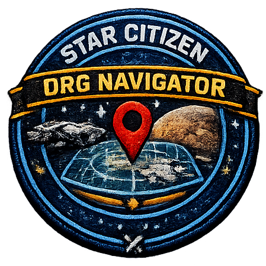
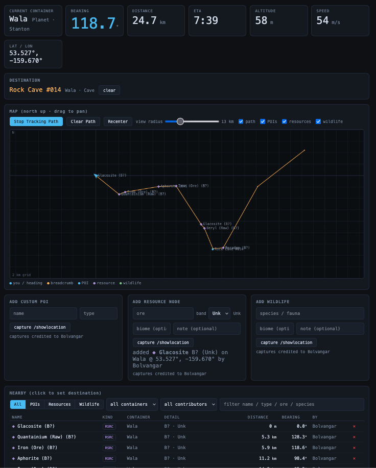
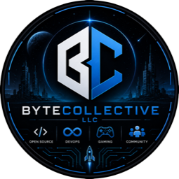

# SC Org Navigator

<div align="center">
  
</div>


**A self-hosted Star Citizen org companion suite.** A tiny watcher on your
gaming PC forwards your in-game `/showlocation` position to a small server,
which turns it into precise, glanceable navigation and logistics — bearing,
distance, ETA, route plans, and shared org data — pushed live over WebSocket to
a browser on a second device (a laptop or phone beside the game).

Around that navigator core has grown a **nine-app suite** in a single-file SPA,
behind Discord-OAuth org gating: cargo and trade route planners, an event
planner with fleet rosters, a group finder, a pirate danger board, org
inventory/goals, an aUEC marketplace, and guild analytics.

> Unofficial fan project. Not affiliated with Cloud Imperium Games. Strictly
> non-commercial under CIG's fan-content rules. Star Citizen®, Roberts Space
> Industries®, and Cloud Imperium® are trademarks of Cloud Imperium Rights LLC.

<div align="center">
  
  <br>
  <sub>The Resource Navigator — live readouts, map, and nearby POIs, refreshed on every <code>/showlocation</code>.</sub>
</div>

## How it works

```
watcher (Windows gaming PC) ──POST /api/position──▶ server (FastAPI + SQLite)
                                                          │
                                          live nav state ─┴─ WS ──▶ browser (laptop / phone)
```

You run `/showlocation` in-game (the game copies your coordinates to the
clipboard); the watcher notices within ~250 ms and POSTs them to the server. The
server computes which container you're in, your lat/lon/altitude, and the
bearing/distance/ETA to any POI or recorded resource node, then pushes it live
to every connected browser. Because the watcher and server share one contract
(the `/api/position` payload and coordinate conventions), they live in one repo
and version together.

## The apps

Nine apps in three themed launcher groups, plus account and admin surfaces. All
share one component language, one auth gate, and one live WebSocket.

> 📸 **Each app name below links to a full-size screenshot.**

**Out in the 'Verse** — solo tools for a live session:

| App | Route | What it does |
|---|---|---|
| [**Resource Navigator**](images/readme_images/sc-navigator-routes.png) | `#/nav` | Live position → bearing/distance/ETA to POIs; capture resource/fauna/harvestable observations; forecast, element finder, heatmaps; shard-aware, fresh-only markers; live teammate presence on the map |
| [**Cargo Planner**](images/readme_images/cargo_planner_screenshot.png) | `#/route` | Pickup-and-delivery route solver for hauling contracts; run mode with arrival detection; rewards, history, quick-picks, guild hauling leaderboards |
| [**Trade Route Planner**](images/readme_images/trade_route_planner.png) | `#/trade` | Buy-low/sell-high multi-leg planner on live commodity prices; run mode with live-position replan; realized-profit history/stats; saved routes; hazard-aware routing (ignore/warn/avoid + snare detours) |

**Rally the Org** — coordination:

| App | Route | What it does |
|---|---|---|
| [**Event Planner**](images/readme_images/event_planner_screenshot.png) | `#/events` | Post events (multi-type, roles/targets), signups, fill tracking; fleet rosters with ship seat templates; manifest → Discord |
| [**Group Finder**](images/readme_images/group_finder_screenshot.png) | `#/lfg` | LFG board (looking-for-members / looking-to-join), playstyle tags, suggested matches, promote-to-event, Discord announce |
| [**Danger Board**](images/readme_images/danger_board_screenshot.png) | `#/pirates` | Community pirate warnings (point/lane, PvP/PvE, severity, still-active confirms, age-off); feeds hazard volumes into both planners' detour routing; "organize hunt" → event |

**Run the Org** — logistics & management:

| App | Route | What it does |
|---|---|---|
| **Resource Manager** ([goals](images/readme_images/goals_screenshot.png), [inventory](images/readme_images/inventory_screenshot.png), [blueprints](images/readme_images/blueprint_inventory_screenshot.png))| `#/goals` · `#/inventory` · `#/blueprints` | Shared item catalog; procurement goals with allocations drawn from real holdings; per-member holdings ledger; personal craftable-blueprint library |
| [**Marketplace**](images/readme_images/marketplace_screenshot.png) | `#/market` | aUEC-only sale / auction / barter / **commission** board with dual-confirm handshake, search & filter, crafted-quality annotations, market-value hints, and a blueprint spec builder for craft requests |
| [**Org Intel**](images/readme_images/org_intel_screenshot.png) | `#/intel` | Guild analytics: leaderboards, capture/hauling/trading stats, member directory |

Plus a live **Who's Online** roster (`#/online`), Settings (identity, playstyle
profile, watcher tokens, org settings, branding, notifications), a Setup guide,
and legal pages.

## Highlights

- **No build step.** The entire frontend is one hash-routed file
  (`server/static/index.html`) served as-is — no bundler, no npm.
- **Live everything.** A single WebSocket fans out nav state, teammate presence
  (surface- and shard-aware), the online roster, LFG, and danger warnings.
- **Discord-native.** OAuth sign-in gated to one guild; opt-in webhook
  notifications per category (events, marketplace, goals, records, LFG,
  pirates). No bot required.
- **Pure, tested nav core.** All coordinate math and route/trade solvers live in
  `server/nav_core.py` with their own unit-test suite — straight-line quantum
  legs over a QT-marker graph, a 3-system gate chain (Stanton—Pyro—Nyx), and
  hazard-volume detour routing.
- **Offline-capable.** Reference datasets are snapshot-synced and committed, so a
  fresh clone runs (and tests pass) with no network.

## Quick start

Clone the repo to both machines and run only the part each one needs.

**Server** (a Linux box or anything that runs Docker) — see
[`server/README.md`](server/README.md) for the full walkthrough (Docker or bare
`uvicorn`/systemd):

```bash
docker compose up -d --build
curl http://localhost:8765/api/health    # expect {"ok": true, ...}
```

Set the Discord OAuth environment variables first (see **Configuration** below)
or sign-in will be disabled. Then open the server URL and sign in with Discord.

**Gaming PC** (Windows) — see [`watcher/README.md`](watcher/README.md). Install
Python 3.10+, generate a watcher token in the web app's Settings page, download
the pre-configured watcher from the Setup page, and double-click
`run_watcher.bat`. Then run `/showlocation` in-game and watch the readouts
appear on your laptop.

## Configuration

The server is configured entirely through environment variables. In Docker they
come from your orchestrator's env store — the committed root `.env` is an
**empty placeholder** whose only job is to let `docker compose`'s `${VAR}`
interpolation resolve without erroring; put real values in Portainer stack
env vars, a Compose `.env` you keep out of git, or your host's secret store.

| Variable | Required | What it is |
|---|---|---|
| `DISCORD_CLIENT_ID` | ✅ | Your Discord application's client id (not secret) |
| `DISCORD_CLIENT_SECRET` | ✅ | Discord application client secret — **keep private** |
| `OAUTH_REDIRECT_URI` | ✅ | Must exactly match a redirect registered on the Discord app, e.g. `https://nav.example.com/auth/callback` |
| `ORG_GUILD_ID` | ✅ | Discord server (guild) id — only members of this guild may sign in |
| `ADMIN_IDS` | recommended | Comma-separated Discord user ids granted root admin (more can be granted in-app afterward) |
| `SESSION_SECRET` | recommended | Random string used to sign session cookies. If unset, a new one is generated per boot — which logs everyone out on every restart |
| `SC_NAV_PUBLIC_URL` | recommended | Public base URL (e.g. `https://nav.example.com`); used to build absolute links in Discord notifications and the watcher download |
| `ORG_MEMBER_ROLE_ID` | optional | Restrict sign-in to holders of a specific guild role; empty = any guild member (editable in-app afterward) |
| `COOKIE_SECURE` | optional | `true` (default) issues HTTPS-only cookies; set `false` only for plain-HTTP local dev |
| `CLOUDFLARE_TUNNEL_TOKEN` | optional | Only for the bundled `cloudflared` sidecar (see *Hosting it publicly*) |

Advanced/rarely-changed overrides (dataset URLs, cache dir, offline mode) are
documented in [`server/README.md`](server/README.md): `SC_NAV_DATA`,
`SC_NAV_OFFLINE`, `SC_NAV_OC_URL`, `SC_NAV_POI_URL`, and the uexcorp feed URLs.

### Setting up Discord sign-in

Auth uses Discord OAuth with **no bot** — the scopes `identify`, `guilds`, and
`guilds.members.read` are enough to verify guild membership and read the user's
roles.

1. Create an application at the [Discord Developer Portal](https://discord.com/developers/applications).
2. Under **OAuth2 → Redirects**, add your callback URL — the same value you'll
   set as `OAUTH_REDIRECT_URI` (e.g. `https://nav.example.com/auth/callback`, or
   `http://localhost:8765/auth/callback` for local dev).
3. Copy the **Client ID** and **Client Secret** into `DISCORD_CLIENT_ID` /
   `DISCORD_CLIENT_SECRET`.
4. In Discord, enable **Settings → Advanced → Developer Mode**, then right-click
   your server → **Copy Server ID** → `ORG_GUILD_ID`. Right-click your own name
   → **Copy User ID** → `ADMIN_IDS`.
5. (Optional) Right-click a role → **Copy Role ID** → `ORG_MEMBER_ROLE_ID` to
   gate access to that role.

## Hosting it publicly

Because sign-in relies on OAuth and secure cookies, a public deployment must be
served over **HTTPS**, and it must run as a **single process**: the live layer
is an in-process `Hub`, so multiple workers would each hold a partial view of
WebSocket state. The Docker image already runs one Uvicorn worker — don't add
`--workers`.

Two common ways to put it on the internet:

- **Cloudflare Tunnel (bundled).** `docker-compose.yml` includes a
  `cloudflared` sidecar that makes an **outbound-only** connection — no inbound
  ports, nothing exposed on your LAN. Create a tunnel in the Cloudflare Zero
  Trust dashboard, point its public hostname at `http://sc-nav:8765`, and set
  `CLOUDFLARE_TUNNEL_TOKEN`. This is how the reference instance runs.
- **Your own reverse proxy.** Caddy, nginx, or Traefik in front of the app on
  port 8765 works just as well. Terminate TLS there, keep `COOKIE_SECURE=true`,
  and set `OAUTH_REDIRECT_URI` + `SC_NAV_PUBLIC_URL` to the public URL.

Either way, the app itself listens on plain HTTP inside the container; the proxy
or tunnel provides TLS. Make sure `OAUTH_REDIRECT_URI` matches both the Discord
app's registered redirect **and** your real public URL, or the OAuth callback
will fail.

## Repo layout

```
server/    FastAPI backend + the single-file SPA
  app.py            HTTP/WS routes
  nav_core.py       pure nav / route / trade logic (fully unit-tested)
  db.py             SQLite schema + queries
  static/index.html the whole frontend (one file)
  version.py        SemVer, surfaced at /api/health + footer
watcher/   Windows gaming-PC script: reads /showlocation, POSTs position + shard
poi/       committed dataset seeds (POIs, containers, quantum, blueprints, …)
           + the runtime SQLite volume
tools/     data-sync scripts (sync_quantum.py, sync_blueprints.py, …)
docs/      design docs — see docs/README.md for the index
```

Full code-navigation conventions are in [`CLAUDE.md`](CLAUDE.md); the consolidated
product map is [`docs/product-overview.md`](docs/product-overview.md).

## Data sources & attribution

Reference data is **snapshot-synced and committed**, never fetched live from
third parties on the request path.

| Source | Used for | Terms |
|---|---|---|
| [starmap.space](https://starmap.space) | POI / container catalog | Community dataset |
| [UEXcorp](https://uexcorp.space) | Commodity & terminal prices, vehicles, equipment | Used with attribution |
| [Star Citizen Wiki API](https://api.star-citizen.wiki) | Quantum fuel/range, blueprints, starmap positions, amenities | CC BY-SA 4.0 — attribution required |
| Your own `Game.log` (via the watcher) | Position, shard id | Your own game client |

## Development

```bash
python3 server/test_nav_core.py     # pure nav / route / trade logic
python3 server/test_app.py          # endpoint behavior (FastAPI TestClient)
python3 watcher/test_parse.py       # /showlocation coordinate parsing
```

- **Backend:** Python 3.10+, FastAPI, SQLite (stdlib `sqlite3`), Uvicorn.
- **Frontend:** one hand-written HTML/CSS/JS file — no framework, no build.
- **Watcher:** single Python file, standard library only.
- **Versioning:** SemVer in `server/version.py`, surfaced at `/api/health` and
  the site footer.

## License

Code in this repository is released under the [MIT License](LICENSE) © 2026
ByteCollective LLC.

This is an **unofficial fan project** and is **not affiliated with, endorsed by,
or sponsored by Cloud Imperium Games**. It is provided for non-commercial use
under CIG's fan-content guidelines. Star Citizen®, Roberts Space Industries®,
and Cloud Imperium® are trademarks of Cloud Imperium Rights LLC. Game data is
used under the terms of its respective sources (see *Data sources* above); those
datasets are **not** covered by the MIT license.

## AI disclosure

This project was developed with the assistance of Claude Code, an AI coding
assistant by Anthropic — used to help write, refactor, and debug portions of the
codebase. All code has been reviewed by the project maintainer(s), but users
should be aware of AI involvement in development and are encouraged to review the
code themselves before use in production or security-sensitive contexts.

---

<p align="center">
  
  &nbsp;&nbsp;&nbsp;&nbsp;&nbsp;
  
</p>

<p align="center"><sub>Built by <b>ByteCollective&nbsp;LLC</b> · Made by the Community — an unofficial Star&nbsp;Citizen fan project</sub></p>
