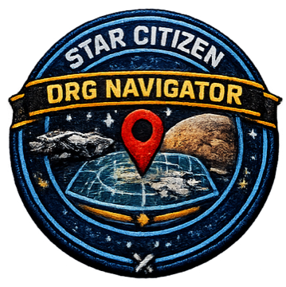
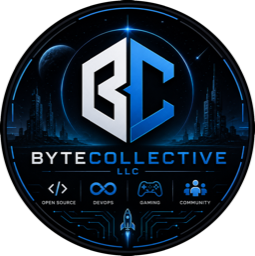

# SC Org Navigator

<div align="center">
  
</div>


**A self-hosted Star Citizen org companion suite.** A tiny watcher on your
gaming PC forwards your in-game `/showlocation` position to a small server,
which turns it into precise, glanceable navigation and logistics — bearing,
distance, ETA, route plans, and shared org data — pushed live over WebSocket to
a browser on a second device (a laptop or phone beside the game).

Around that navigator core has grown an **eleven-app suite** in a single-file
SPA, behind Discord-OAuth org gating: cargo and trade route planners,
**Prospector** (the org's survey atlas for planets, moons and belts, plus drop
planning), an event planner with templates and fleet rosters, **Ops** (run a
mission, split the take, roll the loot, keep the record), a group finder, a
pirate danger board, org goals and inventory with item quality, an aUEC
marketplace, and guild analytics.

> 📖 **Each app has a full showcase & how-to guide** in
> [`docs/apps/`](docs/apps/README.md) — screenshots, walkthroughs, and tips.

> Unofficial fan project. Not affiliated with Cloud Imperium Games. Strictly
> non-commercial under CIG's fan-content rules. Star Citizen®, Roberts Space
> Industries®, and Cloud Imperium® are trademarks of Cloud Imperium Rights LLC.

<div align="center">
  
  <br>
  <sub>The launcher — eleven tools grouped by what you're up to, one org, one sign-in.</sub>
</div>

## How it works

```
watcher (Windows gaming PC) ──POST /api/position──▶ server (FastAPI + SQLite)
                                                          │
                                          live nav state ─┴─ WS ──▶ browser (laptop / phone)
```

You run `/showlocation` in-game (the game copies your coordinates to the
clipboard); the watcher notices within ~250 ms and POSTs them to the server. The
server computes which container you're in, your lat/lon/altitude, and the
bearing/distance/ETA to any POI or recorded resource node, then pushes it live
to every connected browser. Because the watcher and server share one contract
(the `/api/position` payload and coordinate conventions), they live in one repo
and version together.

## The apps

Eleven apps in three themed launcher groups, plus account and admin surfaces. All
share one component language, one auth gate, and one live WebSocket.

> 📖 **Each app name below links to its showcase & how-to guide** (screenshots,
> walkthroughs, tips) — the whole set lives in [`docs/apps/`](docs/apps/README.md).

**Out in the 'Verse** — solo tools for a live session:

| App | Route | What it does |
|---|---|---|
| [**Resource Navigator**](docs/apps/navigator.md) | `#/nav` | Live position → bearing/distance/ETA to any POI, resource node or wildlife; capture ore (with 0–1000 quality and quality lines), harvestable and fauna sightings; forecast scoped to the named area you're standing in; element finder, heatmaps, ore value badges, NEARBY pins + mark-mined; live teammate presence. The core the rest is built on. |
| [**Cargo Planner**](docs/apps/cargo-planner.md) | `#/route` | Pickup-and-delivery route solver for hauling contracts under your ship's capacity — including A↔B round trips, jump gates costed as time, quantum fuel and range, danger detours; run mode with arrival detection; rewards, history, guild hauling boards. |
| [**Trade Route Planner**](docs/apps/trade-planner.md) | `#/trade` | Multi-leg buy→sell planner on live prices with an org price overlay: stop kinds for dock-only ships, legality, best-return sort and a return floor, cargo-container sizing from the kiosks' own menus, mixed loads; run mode with live re-plan, mid-run top-ups and watcher-reported transactions; stock reports; saved routes; realized-profit stats. |
| [**Prospector**](docs/apps/prospector.md) | `#/halo` | The org's survey atlas — named areas on planets and moons (ore, harvestables and fauna, each valued on its own) and in the belts, ranked by value and by how well they're known — plus RS-signature lookup, survey marks and a pocket radar in the field, and drop planning into unmarked rock space. ATLAS · FIELD · DROP. |

**Rally the Org** — coordination:

| App | Route | What it does |
|---|---|---|
| [**Event Planner**](docs/apps/event-planner.md) | `#/events` | Events with roles, capacity and an auto-promoting waitlist; templates (six built-ins plus your org's own); mission details, contracts and payout rules; fleet rosters with seat templates; a Discord announcement that keeps its crew counts current; clone, day-of attendee tools, past-events calendar. |
| [**Ops**](docs/apps/ops.md) | `#/ops` | Run a mission and keep its record: attendance and guests, a ledger that splits the take and lists the fewest payments, confirmed by whoever receives them; contracts checklist; verifiable loot rolls with Need / Want / Pass; a standalone loot-roll tool; the closed record posted to Discord. |
| [**Group Finder**](docs/apps/group-finder.md) | `#/lfg` | LFG board (need players / want to join), playstyle tags, suggested matches, promote-to-event, Discord announce; live Who's Online roster. |
| [**Danger Board**](docs/apps/danger-board.md) | `#/pirates` | Community pirate warnings (location or lane, players or NPCs, severity, still-active confirms, age-off); both planners route around them by default; "organize hunt" → event. |

**Run the Org** — logistics & management:

| App | Route | What it does |
|---|---|---|
| [**Resource Manager**](docs/apps/resource-manager.md) | `#/goals` · `#/inventory` · `#/blueprints` | Goals of three kinds — gather materials (with quality floors), unlock blueprints across the org, survey an area; a holdings ledger that tracks each lot's quality; a blueprint library table that knows what you can craft from free stock, and an org readiness view. |
| [**Marketplace**](docs/apps/marketplace.md) | `#/market` | aUEC-only sale / auction / barter / commission / buy-order board with a dual-confirm handshake; list straight from your inventory with lot quality; crafter storefronts and directed requests; org price memory, trends, availability and pickup. |
| [**Org Intel**](docs/apps/org-intel.md) | `#/intel` | Guild analytics: mapping, hauling, trading, surveying and market; contributor, earner and op-attendance leaderboards; member directory (admins). |

Plus a live **Who's Online** roster (`#/online`), Settings (identity, playstyle
profile, watcher tokens, org settings, branding, notifications), a Setup guide,
and legal pages.

## Highlights

- **No build step.** The entire frontend is one hash-routed file
  (`server/static/index.html`) served as-is — no bundler, no npm.
- **Live everything.** A single WebSocket fans out nav state, teammate presence
  (surface- and shard-aware), the online roster, LFG, and danger warnings.
- **Discord-native.** OAuth sign-in gated to one guild; webhook notifications
  per category (events, ops, marketplace, goals, records, LFG, pirates,
  survey) as color-coded embed cards with deep links — auction outcomes,
  outbid alerts, event reminders and reschedules, waitlist promotions, op
  records, survey milestones and more. A new-event post updates its own crew
  counts as people sign up. Admins can reword the announcements from
  templates with a live preview, and add an org thumbnail or a per-event
  banner image. Delivery health surfaces in org settings, sends are paced
  under Discord's rate limit, mention paging reaches rosters past 50 people,
  and every member has a personal "don't @-ping me" opt-out. No bot required.
- **Pure, tested nav core.** All coordinate math and route/trade solvers live in
  `server/nav_core.py` with their own unit-test suite — straight-line quantum
  legs over a QT-marker graph, a 3-system gate chain (Stanton—Pyro—Nyx), and
  hazard-volume detour routing.
- **Offline-capable.** Reference datasets are snapshot-synced and committed, so a
  fresh clone runs (and tests pass) with no network.

## Quick start

Clone the repo to both machines and run only the part each one needs.

**Server** (a Linux box or anything that runs Docker) — see
[`server/README.md`](server/README.md) for the full walkthrough (Docker or bare
`uvicorn`/systemd):

```bash
docker compose up -d --build
curl http://localhost:8765/api/health    # expect {"ok": true, ...}
```

Set the Discord OAuth environment variables first (see **Configuration** below)
or sign-in will be disabled. Then open the server URL and sign in with Discord.

**Gaming PC** (Windows) — see [`watcher/README.md`](watcher/README.md). Install
Python 3.10+ (leave the installer's "tcl/tk and IDLE" box ticked if you want the
optional in-game overlay), generate a watcher token in the web app's Settings
page, download the pre-configured watcher from the Setup page, and double-click
`run_watcher.bat`. It asks for your handle and whether you want the overlay, then
remembers both. Run `/showlocation` in-game and watch the readouts appear on your
laptop — or, with the overlay on, in a small always-on-top window over the game
showing target, distance and ETA.

## Configuration

The server is configured entirely through environment variables. For a local
`docker compose` run, copy the committed [`.env.example`](.env.example) to
`.env` (gitignored) and fill it in — Compose picks it up for `${VAR}`
interpolation automatically. In a managed deployment, set the same variables
in your orchestrator's env store instead (e.g. Portainer stack env vars or
your host's secret store).

| Variable | Required | What it is |
|---|---|---|
| `DISCORD_CLIENT_ID` | ✅ | Your Discord application's client id (not secret) |
| `DISCORD_CLIENT_SECRET` | ✅ | Discord application client secret — **keep private** |
| `OAUTH_REDIRECT_URI` | ✅ | Must exactly match a redirect registered on the Discord app, e.g. `https://nav.example.com/auth/callback` |
| `ORG_GUILD_ID` | ✅ | Discord server (guild) id — only members of this guild may sign in |
| `ADMIN_IDS` | recommended | Comma-separated Discord user ids granted root admin (more can be granted in-app afterward) |
| `SESSION_SECRET` | recommended | Random string used to sign session cookies. If unset, a new one is generated per boot — which logs everyone out on every restart |
| `SC_NAV_PUBLIC_URL` | recommended | Public base URL (e.g. `https://nav.example.com`); used to build absolute links in Discord notifications and the watcher download |
| `ORG_MEMBER_ROLE_ID` | optional | Restrict sign-in to holders of a specific guild role; empty = any guild member (editable in-app afterward) |
| `COOKIE_SECURE` | optional | HTTPS-only cookies, **on by default**. `1`/`true`/`yes`/`on` enable, `0`/`false`/`no`/`off` disable (set one only for plain-HTTP local dev); blank or unrecognized stays on |
| `CLOUDFLARE_TUNNEL_TOKEN` | optional | Only for the bundled `cloudflared` sidecar (see *Hosting it publicly*) |

Advanced/rarely-changed overrides (dataset URLs, cache dir, offline mode) are
documented in [`server/README.md`](server/README.md): `SC_NAV_DATA`,
`SC_NAV_OFFLINE`, `SC_NAV_OC_URL`, `SC_NAV_POI_URL`, and the uexcorp feed URLs.

### Setting up Discord sign-in

Auth uses Discord OAuth with **no bot** — the scopes `identify`, `guilds`, and
`guilds.members.read` are enough to verify guild membership and read the user's
roles.

1. Create an application at the [Discord Developer Portal](https://discord.com/developers/applications).
2. Under **OAuth2 → Redirects**, add your callback URL — the same value you'll
   set as `OAUTH_REDIRECT_URI` (e.g. `https://nav.example.com/auth/callback`, or
   `http://localhost:8765/auth/callback` for local dev).
3. Copy the **Client ID** and **Client Secret** into `DISCORD_CLIENT_ID` /
   `DISCORD_CLIENT_SECRET`.
4. In Discord, enable **Settings → Advanced → Developer Mode**, then right-click
   your server → **Copy Server ID** → `ORG_GUILD_ID`. Right-click your own name
   → **Copy User ID** → `ADMIN_IDS`.
5. (Optional) Right-click a role → **Copy Role ID** → `ORG_MEMBER_ROLE_ID` to
   gate access to that role.

## Hosting it publicly

Because sign-in relies on OAuth and secure cookies, a public deployment must be
served over **HTTPS**, and it must run as a **single process**: the live layer
is an in-process `Hub`, so multiple workers would each hold a partial view of
WebSocket state. The Docker image already runs one Uvicorn worker — don't add
`--workers`.

Two common ways to put it on the internet:

- **Cloudflare Tunnel (bundled).** `docker-compose.yml` includes a
  `cloudflared` sidecar that makes an **outbound-only** connection — no inbound
  ports, nothing exposed on your LAN. Create a tunnel in the Cloudflare Zero
  Trust dashboard, point its public hostname at `http://sc-nav:8765`, and set
  `CLOUDFLARE_TUNNEL_TOKEN`. This is how the reference instance runs.
- **Your own reverse proxy.** Caddy, nginx, or Traefik in front of the app on
  port 8765 works just as well. Terminate TLS there, keep `COOKIE_SECURE=true`,
  and set `OAUTH_REDIRECT_URI` + `SC_NAV_PUBLIC_URL` to the public URL.

Either way, the app itself listens on plain HTTP inside the container; the proxy
or tunnel provides TLS. Make sure `OAUTH_REDIRECT_URI` matches both the Discord
app's registered redirect **and** your real public URL, or the OAuth callback
will fail.

## Repo layout

```
server/    FastAPI backend + the single-file SPA
  app.py            HTTP/WS routes
  nav_core.py       pure nav / route / trade logic (fully unit-tested)
  db.py             SQLite schema + queries
  static/index.html the whole frontend (one file)
  version.py        SemVer, surfaced at /api/health + footer
watcher/   Windows gaming-PC script: reads /showlocation + Game.log, POSTs position,
           shard, handle and kiosk transactions; optional in-game overlay
poi/       committed dataset seeds (POIs, containers, quantum, blueprints, …)
           + the runtime SQLite volume
tools/     data-sync scripts (sync_quantum.py, sync_blueprints.py, …)
docs/      design docs (index: docs/README.md) + per-app guides in docs/apps/
```

Full code-navigation conventions are in [`CLAUDE.md`](CLAUDE.md); the consolidated
product map is [`docs/product-overview.md`](docs/product-overview.md); as-built
per-feature detail is in [`docs/implementation-notes.md`](docs/implementation-notes.md).

## Data sources & attribution

Third-party reference data is **snapshot-synced and committed** (the starmap
catalog only changes through a reviewed `tools/sync_containers.py` diff), never
fetched live on the request path. UEX prices are the one live feed, refreshed on
a schedule.

| Source | Used for | Terms |
|---|---|---|
| [starmap.space](https://starmap.space) | POI / container catalog | Community dataset |
| [UEXcorp](https://uexcorp.space) | Commodity & terminal prices and stock, vehicles, equipment (refreshed every few hours) | Used with attribution |
| [Star Citizen Wiki API](https://api.star-citizen.wiki) | Quantum fuel/range, blueprints, locations (POIs, QT radii, amenities) | CC BY-SA 4.0 — attribution required |
| [Strata (CELD)](https://strata.celd.space) | Ore radar (RS) signatures in Prospector — optional, needs an API key; synced per deployment, not committed | Attribution shown in-app |
| [Cornerstone](https://cstone.space) (CaptSheppard) | Aaron Halo density-band survey powering Prospector | Community dataset — credited in-app |
| Your own `Game.log` (via the watcher) | Position, shard, game build, your handle, commodity-kiosk transactions | Your own game client |

## Development

```bash
python3 server/test_nav_core.py     # pure nav / route / trade logic
python3 server/test_app.py          # endpoint behavior (FastAPI TestClient)
python3 watcher/test_parse.py       # /showlocation coordinate parsing
```

- **Backend:** Python 3.10+, FastAPI, SQLite (stdlib `sqlite3`), Uvicorn.
- **Frontend:** one hand-written HTML/CSS/JS file — no framework, no build.
- **Watcher:** single Python file, standard library only.
- **Versioning:** SemVer in `server/version.py`, surfaced at `/api/health` and
  the site footer.

## License

Code in this repository is released under the [PolyForm Noncommercial License
1.0.0](LICENSE) © 2026 ByteCollective LLC. You are free to use, modify, and
share this software **for any noncommercial purpose** — run it for your org,
fork it, tinker with it. What you may **not** do is use it commercially, such as
hosting or reselling it for profit.

This is a **source-available** license, not an OSI-approved open-source one: the
one thing it withholds is commercial use. (Older versions of this project
released under the MIT License remain available under those terms.)

This is an **unofficial fan project** and is **not affiliated with, endorsed by,
or sponsored by Cloud Imperium Games**. Independent of the license above, CIG's
fan-content guidelines restrict this project — and anything built on CIG IP — to
**non-commercial use only**. Star Citizen®, Roberts Space Industries®, and Cloud
Imperium® are trademarks of Cloud Imperium Rights LLC. Game data is used under
the terms of its respective sources (see *Data sources* above); those datasets
are **not** covered by this repository's license.

## AI disclosure

This project was developed with the assistance of Claude Code, an AI coding
assistant by Anthropic — used to help write, refactor, and debug portions of the
codebase. All code has been reviewed by the project maintainer(s), but users
should be aware of AI involvement in development and are encouraged to review the
code themselves before use in production or security-sensitive contexts.

---

<p align="center">
  
  &nbsp;&nbsp;&nbsp;&nbsp;&nbsp;
  
</p>

<p align="center"><sub>Built by <b>ByteCollective&nbsp;LLC</b> · Made by the Community — an unofficial Star&nbsp;Citizen fan project</sub></p>
