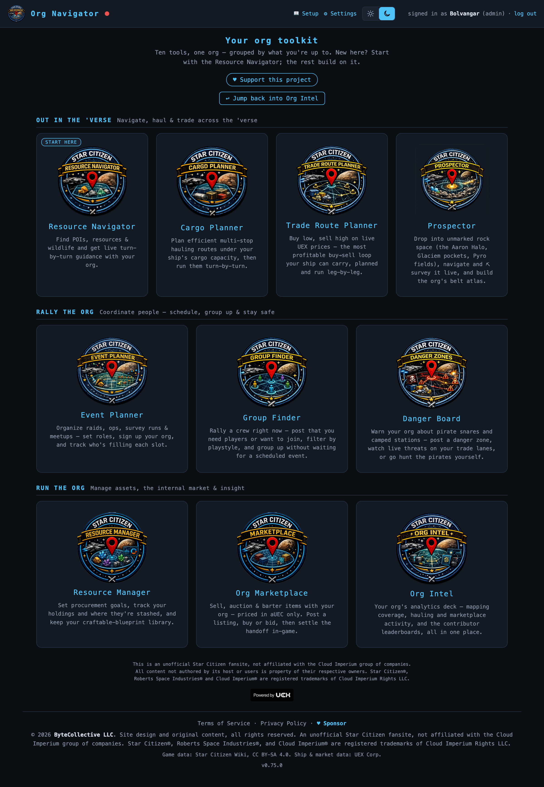

# The SC Org Navigator app suite

**Ten apps in one org companion suite** — a single-file SPA behind Discord-OAuth
org gating, fed by a live WebSocket and a tiny watcher on your gaming PC. This
folder is the **showcase & how-to guide** for every app: what each one does, how
to use it step by step, and how they fit together.

> New here? Read the repo's [main README](../../README.md) first for how the
> watcher → server → browser loop works and how to stand up your own instance.

  
   
  The launcher — ten tools grouped by what you're up to, one org, one sign-in.

## Out in the 'Verse — solo tools for a live session

| App | Route | What it does |
|---|---|---|
| [**Resource Navigator**](navigator.md) | `#/nav` | Live position → bearing/distance/ETA to any POI, resource node, or wildlife; observation capture; forecast, element finder, heatmaps; live teammate presence. The core the rest is built on. |
| [**Cargo Planner**](cargo-planner.md) | `#/route` | Pickup-and-delivery route solver for hauling contracts under your ship's capacity; run mode with arrival detection; rewards, history, guild hauling boards. |
| [**Trade Route Planner**](trade-planner.md) | `#/trade` | Buy-low/sell-high multi-leg planner on live UEX prices; run mode with live-position replan; realized-profit stats; saved routes; stock reports; hazard-aware routing. |
| [**Prospector**](prospector.md) | `#/halo` | Drop into unmarked rock space (Aaron Halo, Glaciem pockets, Pyro fields), verify and ⛏ survey it live, and build the org's shared belt atlas. DROP · FIELD · ATLAS. |

## Rally the Org — coordination

| App | Route | What it does |
|---|---|---|
| [**Event Planner**](event-planner.md) | `#/events` | Post events (multi-type, roles/targets), signups, fill tracking; fleet roster with ship seat templates; manifest → Discord. |
| [**Group Finder**](group-finder.md) | `#/lfg` | LFG board (looking-for-members / looking-to-join), playstyle tags, suggested matches, promote-to-event, Discord announce; live Who's Online roster. |
| [**Danger Board**](danger-board.md) | `#/pirates` | Community pirate warnings (point/lane, PvP/PvE, severity, still-active confirms, age-off); feeds hazard-volume detours into both planners; "organize hunt" → event. |

## Run the Org — logistics & management

| App | Route | What it does |
|---|---|---|
| [**Resource Manager**](resource-manager.md) | `#/goals` · `#/inventory` · `#/blueprints` | Shared item catalog; procurement goals with allocations from real holdings; per-member holdings ledger; craftable-blueprint library. |
| [**Marketplace**](marketplace.md) | `#/market` | aUEC-only sale / auction / barter / commission board with dual-confirm handshake, search & filter, crafted-quality annotations, and a blueprint spec builder. |
| [**Org Intel**](org-intel.md) | `#/intel` | Guild analytics deck: mapping, hauling, trading, surveying, market, contributor leaderboards, and the member directory — all derived automatically. |

---

Every page above is a user-facing showcase + how-to. For the internal design
specs (the reference for exactly what shipped), see the
[docs index](../README.md). This is an unofficial, non-commercial Star Citizen
fan project — not affiliated with Cloud Imperium Games.
