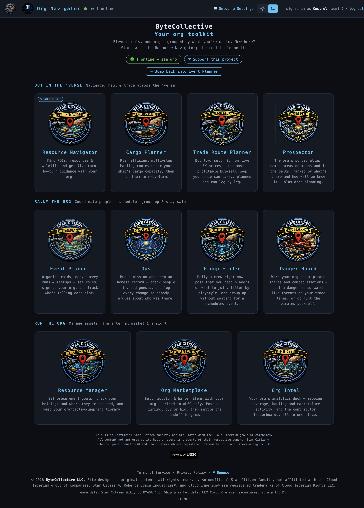

# The SC Org Navigator app suite

**Eleven apps in one org companion suite** — a single-file SPA behind Discord-OAuth
org gating, fed by a live WebSocket and a tiny watcher on your gaming PC. This
folder is the **showcase & how-to guide** for every app: what each one does, how
to use it step by step, and how they fit together.

> New here? Read the repo's [main README](../../README.md) first for how the
> watcher → server → browser loop works and how to stand up your own instance.

  
   
  The launcher — eleven tools grouped by what you're up to, one org, one sign-in.

## Out in the 'Verse — solo tools for a live session

| App | Route | What it does |
|---|---|---|
| [**Resource Navigator**](navigator.md) | `#/nav` | Live position → bearing/distance/ETA to any POI, resource node or wildlife; capture ore (with 0–1000 quality and quality lines), harvestable and fauna sightings; forecast scoped to the named area you're standing in; element finder, heatmaps, ore value badges, NEARBY pins + mark-mined; live teammate presence. The core the rest is built on. |
| [**Cargo Planner**](cargo-planner.md) | `#/route` | Pickup-and-delivery route solver for hauling contracts under your ship's capacity — including A↔B round trips, jump gates costed as time, quantum fuel and range, danger detours; run mode with arrival detection; rewards, history, guild hauling boards. |
| [**Trade Route Planner**](trade-planner.md) | `#/trade` | Multi-leg buy→sell planner on live prices with an org price overlay: stop kinds for dock-only ships, legality, best-return sort and a return floor, cargo-container sizing from the kiosks' own menus, mixed loads; run mode with live re-plan, mid-run top-ups and watcher-reported transactions; stock reports; saved routes; realized-profit stats. |
| [**Prospector**](prospector.md) | `#/halo` | The org's survey atlas — named areas on planets and moons (ore, harvestables and fauna, each valued on its own) and in the belts, ranked by value and by how well they're known — plus RS-signature lookup, survey marks and a pocket radar in the field, and drop planning into unmarked rock space. ATLAS · FIELD · DROP. |

## Rally the Org — coordination

| App | Route | What it does |
|---|---|---|
| [**Event Planner**](event-planner.md) | `#/events` | Events with roles, capacity and an auto-promoting waitlist; templates (six built-ins plus your org's own); mission details, contracts and payout rules; fleet rosters with seat templates; a Discord announcement that keeps its crew counts current; clone, day-of attendee tools, past-events calendar. |
| [**Ops**](ops.md) | `#/ops` | Run a mission and keep its record: attendance and guests, a ledger that splits the take and lists the fewest payments, confirmed by whoever receives them; contracts checklist; verifiable loot rolls with Need / Want / Pass; a standalone loot-roll tool; the closed record posted to Discord. |
| [**Group Finder**](group-finder.md) | `#/lfg` | LFG board (need players / want to join), playstyle tags, suggested matches, promote-to-event, Discord announce; live Who's Online roster. |
| [**Danger Board**](danger-board.md) | `#/pirates` | Community pirate warnings (location or lane, players or NPCs, severity, still-active confirms, age-off); both planners route around them by default; "organize hunt" → event. |

## Run the Org — logistics & management

| App | Route | What it does |
|---|---|---|
| [**Resource Manager**](resource-manager.md) | `#/goals` · `#/inventory` · `#/blueprints` | Goals of three kinds — gather materials (with quality floors), unlock blueprints across the org, survey an area; a holdings ledger that tracks each lot's quality; a blueprint library table that knows what you can craft from free stock, and an org readiness view. |
| [**Marketplace**](marketplace.md) | `#/market` | aUEC-only sale / auction / barter / commission / buy-order board with a dual-confirm handshake; list straight from your inventory with lot quality; crafter storefronts and directed requests; org price memory, trends, availability and pickup. |
| [**Org Intel**](org-intel.md) | `#/intel` | Guild analytics: mapping, hauling, trading, surveying and market; contributor, earner and op-attendance leaderboards; member directory (admins). |

---

Every page above is a user-facing showcase + how-to. For the internal design
specs (the reference for exactly what shipped), see the
[docs index](../README.md). This is an unofficial, non-commercial Star Citizen
fan project — not affiliated with Cloud Imperium Games.
