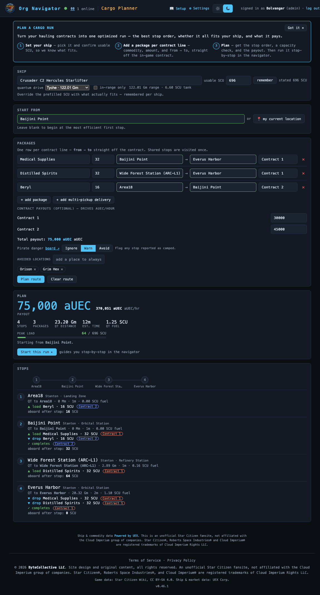

# Cargo Planner

> Pickup-and-delivery route solver for hauling contracts — plan the most efficient multi-stop run under your ship's cargo capacity, then run it turn-by-turn. **Route:** `#/route` · **Launcher group:** Out in the 'Verse

  
   
  Plan output: feasibility summary, ordered stops with per-leg detail, and the run/clear actions.

## What it is

You've picked up a handful of hauling contracts — each one a commodity, an
amount, a pickup, and a dropoff. Star Citizen never tells you the *order* to
run them in, or whether they even fit in your hold together. Work it out by
hand and you end up backtracking across a system, or loading a stack that
overflows your grid halfway through the run.

Cargo Planner takes the pickups and dropoffs straight off your contract
screen and solves for the best visiting order under your ship's real cargo
capacity — respecting that a package can't be delivered before it's picked
up, and that your hold can never carry more than it holds. It tells you up
front whether everything fits and what the run costs in quantum distance and
time, then walks you stop by stop with live arrival detection off your own
in-game position, so you always know where to go next and what to load or
drop when you get there.

It's a planner, not a market tool — it doesn't find or price contracts for
you (that's the in-game contract manager and UEX). It picks up once you
already have contracts in hand and turns them into a route.

## How to use it

### Set up the run

1. Open **Cargo Planner** from the launcher (`#/route`).
2. Under **SHIP**, type your ship's name to prefill usable SCU from the
   catalog. Override it if what actually fits differs (box-tiling rarely
   matches the stated grid exactly), then `remember` it for next time.
3. If your ship has a known quantum-drive profile, a **quantum drive**
   dropdown appears — pick your equipped drive for live fuel/range figures.
   Check `in-range only` to make the solver reject any leg your tank can't
   cover in one jump (off by default; otherwise it's just a warning).
4. Under **START FROM**, type a station/POI you're at, click `📍 my current
   location`, or leave it blank to let the solver pick the best first stop.
5. Under **PACKAGES**, click `+ add package` per contract line — commodity,
   SCU, `from` → `to` (type-to-search POI pickers). For a contract that gives
   only a commodity *total* across several pickup points, use `+ add
   multi-pickup delivery` instead: enter the total once and list the pickups.
6. Optionally fill in **CONTRACT PAYOUTS** — one aUEC reward per contract.
7. Leave **Pirate danger** on `Avoid` (default) to route around active Danger
   Board warnings, or switch to `Warn` / `Ignore`.
8. Click `Plan route`.

### Read the plan

The result shows, before anything else, whether the whole bundle **fits**:
peak load vs. your usable SCU, and — if it doesn't fit — the minimum capacity
that *would* work, so you know whether to drop a contract or split it across
two trips. Below that is the ordered stop list: each stop's QT marker or jump
gate, distance, ETA, any "via parent planet" or cross-system gate hop, and
your running onboard SCU after each stop. If a drive is selected, per-leg
quantum-fuel burn and a `⚠ over range` badge appear wherever a jump would
drain more than a full tank.

### Run it

1. From a feasible plan, click `Start this run ▸`. The run persists
   server-side (survives a reload or a phone switch) and sets your live
   destination to the first stop.
2. The rest of the SPA guides you there like the Resource Navigator —
   bearing, distance, ETA, nearest QT marker — off your watcher's
   `/showlocation` feed.
3. On arrival, the stop's package checklist appears. Loading/dropping is a
   manual in-game action (the freight elevator), so the app never
   auto-completes a stop — check off each package as you move it. A checked
   pickup adds its SCU to the live "cargo aboard" readout; a checked dropoff
   frees it.
4. Once every package at a stop is resolved, the run auto-advances. Use
   `skip to next stop ▸` to force an advance, or `abandon` to drop the run.
5. Finishing the last stop shows a **ROUTE COMPLETE** card. `Plan another
   route` clears the form (keeping ship + usable SCU) for the next batch.

### Recent hauls & history

The **RECENT HAULS** panel speeds up entry the more you use the app:
**FREQUENT LANES** — your most-run `from → to` pairs as one-click chips that
add a prefilled row; **LAST RUNS** — recent completed runs with a `clone`
button that refills the whole form; your most-hauled commodities also float
to the top of the commodity picker. A **Session ⇄ Recent** toggle switches
the stat cards between *this play session* (reset with `↻ start new
session`) and your rolling recent-runs window — runs, aUEC/hr, SCU moved, QT
distance, time.

## Features

- **Precedence + capacity solver** — every pickup lands before its dropoff;
  onboard SCU never exceeds usable capacity at any point, computed with
  exact travel distances including the parent-planet two-hop rule and
  cross-system jump gates.
- **Multi-pickup deliveries** — a commodity total across several unlabeled
  pickup points, without guessing a split; plans conservatively so it never
  under-budgets capacity.
- **Quantum fuel & range overlay** — for ships with a known drive profile:
  per-leg fuel burn, a fuel total, an advisory over-range warning, and an
  opt-in hard `in-range only` constraint. Unmatched ships plan as before —
  no fabricated numbers.
- **Live start position** — a chosen POI, your live position, or the
  solver's own best-first-stop pick.
- **Turn-by-turn run mode** — the navigator's live guidance loop, arrival
  detection, a per-package checklist, live cargo-aboard readout. Runs
  persist per-member, so a restart or device switch resumes where you left
  off.
- **Reward tracking** — per-contract aUEC payouts summed into a run total
  and aUEC/hour, on the plan summary and your run history.
- **History & quick-picks** — every run logged; frequency-ranked lanes,
  commodities, and ships surface as shortcuts, and any run can be cloned.
- **Guild hauling analytics** — `GUILD HAULING` (`#/cargo-leaderboard`) and
  `GUILD HAULING OVERVIEW` (`#/cargo-stats`), off Org Intel: top earners and
  aUEC/hr leaderboards, guild totals, top commodities / lanes / ships.

## Works with the rest of the suite

Route planning honors the **Danger Board** (`#/pirates`): active pirate
warnings feed hazard volumes into the solver, so an `Avoid`-mode plan detours
a live threat automatically and `Warn` still flags any leg that passes near
one. Ship/commodity/quantum-drive data ride on the same reference feeds used
elsewhere in the suite, and completed runs feed both your `#/route` history
and the guild-wide hauling boards under **Org Intel**.

## Tips

- `remember` your usable SCU per ship once — it prefills every future plan
  for that ship, no re-entry needed.
- If a bundle comes back infeasible, check the **min capacity** figure: it's
  exactly how much SCU you'd need, so you know whether to drop a contract or
  split the run.
- Turn on `in-range only` before a Pyro run on a small-tank ship — the
  difference between a warning you might miss and a route guaranteed to
  never strand you mid-jump.
- A multi-pickup group holds its entire declared total onboard from first
  pickup to drop — plan your usable SCU with that margin in mind.

---
Part of the <a href="./README.md">SC Org Navigator app suite</a>. Design/reference spec: <a href="../cargo-hauling-planner.md">docs/cargo-hauling-planner.md</a>.
