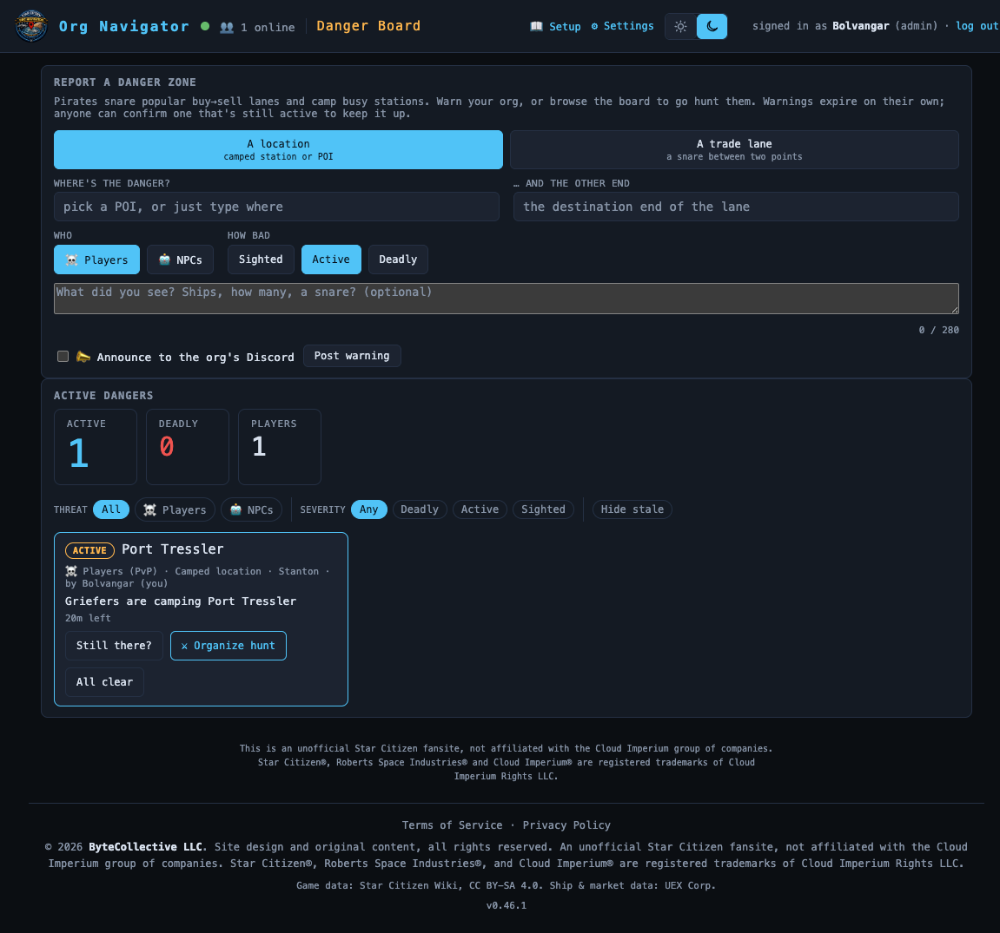

# Danger Board

> Warn your org about pirate snares and camped stations — post a danger zone,
> watch live threats on your trade lanes, or organize a hunt.
> **Route:** `#/pirates` · **Launcher group:** Rally the Org

  

## What it is

Star Citizen piracy isn't random — it's predictable. Pirates set quantum
snares along the same popular buy→sell lanes over and over, and campers sit
on the same handful of busy stations. That predictability is exactly what
makes a community warning layer worth having: the first org member snared at
Baijini Point or camped at CRU-L1 can tell everyone else in fifteen seconds,
and the tool does the rest.

The Danger Board is that layer. Any member can post a time-bound warning —
around one location or along a trade lane — tagged by who's doing it and how
bad it is. Warnings show up live for the whole org, age off on their own, and
can be refreshed by anyone who confirms the danger is still active. It's not
just a bulletin, either: the same warnings feed straight into the **Cargo
Planner** and **Trade Route Planner**, which can automatically detour your
route around a reported danger before you fly into it.

And because not every member wants to run *from* a pirate, every warning card
doubles as a recruiting post — one tap turns a danger report into a prefilled
event for hunting it down.

## How to use it

### Posting a warning

1. Open the app launcher and pick **Danger Board** under *Rally the Org*, or
   go straight to `#/pirates`.
2. In **REPORT A DANGER ZONE**, choose the type: `A location` (a camped
   station or POI) or `A trade lane` (a snare between two points).
3. Fill in **where it is**. A location uses one POI field; a lane uses two
   (the buy end, then the other end), using the same free-text-tolerant
   picker as the rest of the suite: pick a real POI for a routing-actionable
   warning, or just type what you remember ("Between Baijini and Orison") if
   you're mid-escape. An unresolved warning still posts and shows on the
   board — it just can't feed the planners' routing.
4. Set **Who** (`☠️ Players` / `🤖 NPCs`) and **How bad** (`Sighted` /
   `Active` / `Deadly`) — severity drives the card color and how wide a
   berth the planners give it.
5. Optionally add a note (up to 280 characters), and check **📣 Announce to
   the org's Discord** if a `pirates` webhook is configured.
6. Click **Post warning**. It appears on the board and both planners' live
   danger set immediately.

### Reading and working the board

**ACTIVE DANGERS** leads with a glance strip — `ACTIVE`, `DEADLY`, `PLAYERS`
— then filter chips for Threat (All / Players / NPCs), Severity (Any /
Deadly / Active / Sighted), and a **Hide stale** toggle. Cards sort deadliest
and freshest first, and each shows severity, location (a lane names both
ends with `↔`), reporter, threat, system, note, and a countdown to expiry.
From a card:

- **`Still there?`** confirms the danger is still active — the
  community-refresh mechanism. It resets the warning's clock and adds you to
  its confirm count, so "✓ 3 confirmed" is a real credibility signal, not one
  person's word. Confirming flips the button to `Confirmed ✓`.
- **`⚔ Organize hunt`** — see below.
- **`All clear`**, visible to the poster and admins, removes the warning
  immediately instead of waiting for it to age off.

Warnings clean themselves up: a fresh one counts down normally, flips to
**stale** (`⏳ stale · <time left>`) near expiry, and drops off if nobody
confirms it before age-off (defaults 40/60 minutes, admin-tunable in ORG
SETTINGS' **DANGER BOARD** panel). Whenever at least one warning is active, a
`☠️ N dangers` badge appears by the app launcher, linking to `#/pirates`.

### Organizing a hunt

Click **⚔ Organize hunt** on any card and the app jumps to `#/events/new`
with a **Create Event** already filled in: a title built from the danger's
location, a description summarizing the reported severity/threat and your
note, category set to `PvP`/`PvE` and type set to `Combat Patrol` (players)
or `Bounty Hunt` (NPCs) to match, the location field, and a starting `Combat
(Ship)` role request for 3. You still review it, set the date/time, and
confirm before it posts.

## Features

- **Two warning shapes** — a `point` warning covers one location; a `lane`
  warning covers the corridor between two anchor POIs.
- **Threat and severity tagging** (`pvp`/`pve`,
  `sighted`/`active`/`deadly`) shown on the card and used by the planners'
  routing.
- **Community-refreshable, self-ageing** — anyone can confirm; stale reports
  vanish on their own with no admin curation needed.
- **Glance-read stats strip** — active/deadly/player counts, reflecting the
  whole board regardless of the current filter.
- **Filterable, deadliest-first board** — by threat, severity, and hide-stale.
- **Opt-in Discord announce** to the org's `pirates` webhook category, same
  pattern as the Group Finder and Event Planner.
- **Free-text-tolerant location** — type a description instead of hunting
  for the exact POI; it still posts, it just isn't routing-actionable
  without a resolved anchor.
- **Poster/admin lifecycle control** — clear a warning early with
  `All clear`; admins tune age-off/stale windows and the routing berth in
  ORG SETTINGS.

## Works with the rest of the suite

This is the board's biggest payoff: it's live input to routing, not just a
bulletin. Every active, anchored warning becomes a **hazard volume** — a
sphere around a point warning, or a capsule along a lane's corridor, sized by
severity and a shared, admin-tunable base radius (ORG SETTINGS **DANGER
BOARD** → "Route trade & cargo runs around a danger within `N` km"). Both the
**Trade Route Planner** (`#/trade`) and the **Cargo Planner** (`#/route`)
read this hazard set through a `Pirate danger` control: `Ignore` flies the
direct route regardless; `Warn` plans normally but badges any touched leg;
`Avoid` (the default in both) actively routes around hazards — a leg that
merely flies past a danger gets a detour waypoint ("dodge via `<POI>`, +N
km"), while a leg whose endpoint sits inside a hazard (a camped destination)
can't be geometrically fixed, so it's flagged `blocked` instead — dropped as
a candidate by the trade solver, escalated in the UI by the cargo planner
(whose stops are contractual). Each planner also layers in a personal
avoid-list shared between the two, and nudges you to re-plan if a fresh
warning lands on a route you're actively running.

The other direction runs through the Event Planner: **⚔ Organize hunt**
prefills a Create Event using the same seed mechanism the Group Finder uses
to promote an LFG post, so danger reports and player-organized hunts share
one path into the calendar.

## Tips

- Post a lane warning, not just a point, when you can — a snare only becomes
  detour-routable once both anchors are set.
- Mid-escape with no time to pick exact POIs? Just type the location — it
  still posts and still helps.
- `Still there?` matters: a well-confirmed warning is far more trustworthy
  than a lone aging report, and it keeps a real danger from quietly expiring.
- Leave `Pirate danger` on `Avoid` in both planners — it's the only mode
  that actually changes your route.
- Use severity honestly: `Deadly` gives a wider berth than `Sighted`, so
  overusing it makes routes longer than they need to be.

---
Part of the <a href="./README.md">SC Org Navigator app suite</a>. Design/reference spec: <a href="../pirate-warnings.md">docs/pirate-warnings.md</a>.
