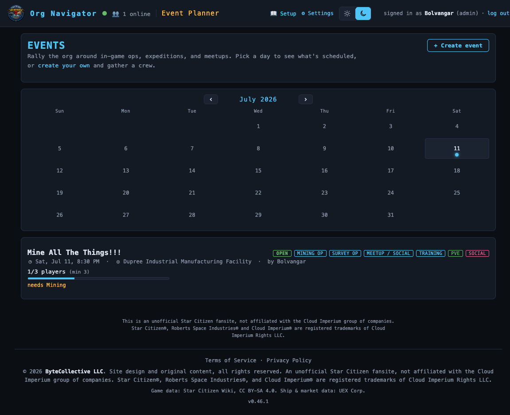

# Event Planner

> Organize raids, ops, survey runs & meetups — set roles/targets, sign up your org, and track who's filling each slot; build a full fleet roster and post the manifest to Discord. **Route:** `#/events` · **Launcher group:** Rally the Org

  

## What it is

Getting a dozen-plus org members to the same place, in the same ships, at the
same time is its own logistics problem — separate from anything else this
suite does. A Discord message with "raid Saturday 8pm, need medics" gets lost
in scroll, nobody knows if the roster is actually full, and by the time
everyone's online it's still unclear who's flying what.

Event Planner is a shared board for scheduling in-game activity and turning a
pile of "I'm in" replies into an operational plan. An organizer creates an
event — type, category, start time, rally point, and a target roster like
`2 medics, 5 escorts` — and the rest of the org signs up for the role(s)
they'll fill. Every event tracks its fill live: a headline player count and a
per-role bar, so the organizer (and everyone else) can see at a glance whether
the op is ready to fly. On top of signups sits the **Fleet roster**: an
organizer sorts the "going" pool into named squads, squadrons, or ship crews,
assigns members to seats, and exports the whole thing as a manifest ready to
post to your Discord channel.

It's built specifically for this org, not a generic calendar. The `Survey Op`
and `Exploration` event types map their roles directly onto the rest of the
suite's data — a `Surveyor` signup is someone who'll grow the resource/ore
dataset that day, a `Cartographer` someone dropping POIs — so running one of
these events is how the org's own map actually gets better.

## How to use it

### Create an event

1. Open **Event Planner** from the launcher (`#/events`) and click
   `+ Create event`.
2. Give it a **title** and optional description.
3. Pick one or more **Type** chips — the activity/game loop: `Raid`,
   `Mining Op`, `Salvage Op`, `Cargo Haul`, `Bounty Hunt`, `Survey Op`,
   `Exploration`, `Racing`, `Combat Patrol`, `Medical Op`, `Industrial`,
   `Meetup / Social`, or `Training`. An event can be more than one — a mixed
   raid-and-salvage op is both.
4. Pick one or more **Category** chips — the flavor, used for filtering:
   `PvP`, `PvE`, `Social`, `Logistics`, `Mixed`, `Event` (special/seasonal),
   or `Race`. Both Type and Category are "choose 1 or more."
5. Set the **Date** and **Time** (entered in your local time, stored and
   shared as UTC so every member sees it converted to their own clock) and an
   optional **duration**.
6. Enter a **rally point** (where the org forms up) and, if different, an
   **event location** (where the activity actually happens) — both are
   type-to-search POI pickers that also accept freeform text.
7. Set **min / max players** if you want a floor and/or a cap (leave max
   blank for unlimited).
8. Build the **target roster**: repeatable role + needed-count rows, picked
   from the grouped role list — `Combat & Security` (Combat Ship, Combat FPS,
   Escort, Medical), `Industrial` (Mining, Salvage, Cargo / Hauling),
   `Survey & Exploration` (Surveyor, Naturalist, Cartographer,
   Pathfinder / Scout), and `Support` (Support / Logistics, Command). This is
   a soft target, not a hard cap — extra signups on a role show as surplus,
   never rejected.
9. Save. The event appears on the board's calendar and card list immediately.

### Sign up

1. Open an event card from the board (`#/events`) or the calendar.
2. Under **Sign up**, pick the role(s) you'll fill (a multi-select over the
   same grouped role list) and a status — `Going` or `Maybe` — then click
   `Join event`.
3. Your name appears under each role you picked in the roster, grouped by
   role with a fill bar per role. If you change your mind, reopen the event
   and click `Update signup` to change roles/status, or `Withdraw` to drop
   out entirely.
4. The headline count (`3/5 players`) always reflects distinct people, even
   if someone double-covers two roles — the per-role bars reflect coverage,
   the headline reflects headcount, and neither over- nor under-counts you.

### Build the Fleet roster

Once people are signed up, the organizer (or an admin) turns the flat "going"
pool into an actual plan on the same event detail page, under **Fleet
roster**:

1. Click `+ Add unit` to create a squad, squadron, crew, section, or wing —
   give it a **name**, pick its **kind**, and optionally a **ship** (a
   type-to-search picker over the full UEX vehicle list — picking a known
   hull auto-fills the unit's crew size) and a target **size**. You can also
   set a **leader** from anyone currently in the going pool.
2. In the **Unassigned** pool, use the assign row: pick a member, pick the
   unit to put them in, optionally type a **seat** (the field offers that
   unit's known ship seats — Pilot, Co-Pilot, a role-flavored specialist
   seat, Turret 1/2/…), then click `Assign`.
3. Each unit card shows its current fill (`3/4`) and every assigned member's
   seat; click the `✕` next to a name to send them back to Unassigned, or
   `Edit` / `Delete` on the unit itself.
4. Every signed-up member sees their own **Your assignment** callout at the
   top of the section — which unit, which seat — the moment they're placed.
5. Reusing a structure across events? Open `Templates`, name the current set
   of units, and `Save current units` (structure only, no members) to your
   org's shared template library. On a future event's Fleet roster, open
   `Templates` again and apply a saved one to stamp the same units onto the
   new plan.
6. When the roster's set, click `Manifest` to render the whole plan as
   Discord-flavored markdown — units, seats, and names, ready to read at a
   glance. Copy it manually, or, if your org has the Discord `events` webhook
   configured, click `Post to Discord` to push it straight to your event
   channel.

## Features

| Area | What you get |
|---|---|
| Taxonomy | Three independent axes — multi-select **Type**, multi-select **Category**, and grouped **Roles** — so combinations like a PvP+PvE mixed raid stay expressible without forcing a single label. |
| Board | Month **calendar** with dots on event days, above a scrollable, filterable list of event cards (fill bars + type/category chips). |
| Fill math | A pure, unit-tested `derive_event_fill`: headline count = distinct going signups; per-role bars count every role a signup lists — a dual-role signup fills both bars without inflating the headcount. |
| Roster grouping | The event detail roster is grouped **by target role**, each with its own fill bar and member list, rather than one flat name list. |
| Fleet roster | Organizer-owned squads/squadrons/crews/sections/wings, nested seat assignment, per-unit capacity tracking against the target roster, and a live "your assignment" callout for every member. |
| Ship-aware seats | Picking a known ship on a unit auto-fills its crew size and offers that hull's real seat layout (Pilot, Co-Pilot, specialist, Turret N) when assigning members. |
| Saved templates | Snapshot a unit structure (names/kinds/ships/capacities, no members) into an org-shared template and stamp it onto a future event in one click. |
| Manifest export | One-click Discord-flavored markdown export of the full plan, copyable or pushed straight to your configured Discord channel. |
| Ownership | Any signed-in member can create an event and sign up; only the organizer or an org admin can edit, cancel, or manage the Fleet roster/manifest for that event. |
| Survey/Exploration roles | `Surveyor`, `Naturalist`, `Cartographer`, and `Pathfinder / Scout` map 1:1 onto the navigator's own capture domains — running one of these events is how the org grows its shared map. |

## Works with the rest of the suite

Event Planner sits inside the same auth-gated org — "the guild" is the
attendee pool with no separate invite step, and organizer/attendee names
resolve through the shared member directory used across the whole SPA. The
Fleet roster's ship picker and seat suggestions draw on the same UEX vehicle
feed the Cargo Planner and Trade Route Planner use, so a ship's crew size and
seats are consistent everywhere it appears. The **Post to Discord** button on
the manifest rides the same per-category webhook notification system used
elsewhere in the suite (Danger Board warnings, Trade Planner stock reports,
Group Finder posts) — it only appears once your org has configured a Discord
webhook for the `events` category.

## Tips

- A signup carries a *list* of roles, not one — if you're covering both
  Medical and Escort, pick both; it counts once toward the headline but fills
  both role bars.
- `needed` on the target roster is a soft target. A fully "surplus" role
  still shows green/complete — nobody gets turned away for over-signing up.
- Cancelling an event keeps its record and roster (recoverable) instead of
  deleting it, so an accidental cancel or a "wait, it's back on" doesn't lose
  the signup list.
- Save a **template** the first time you build a squadron structure you like
  (e.g. a standard 3-squad raid layout) — every future event of that shape is
  then one `Apply` click instead of rebuilding units from scratch.
- The assign row's seat suggestions only populate once the target unit has a
  **ship** set — add the ship first, then assign members, to get the real
  seat list instead of a blank text field.

---
Part of the <a href="./README.md">SC Org Navigator app suite</a>. Design/reference spec: <a href="../event-planner.md">docs/event-planner.md</a>.
