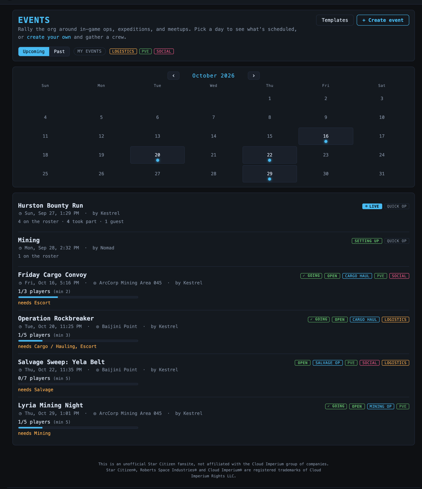
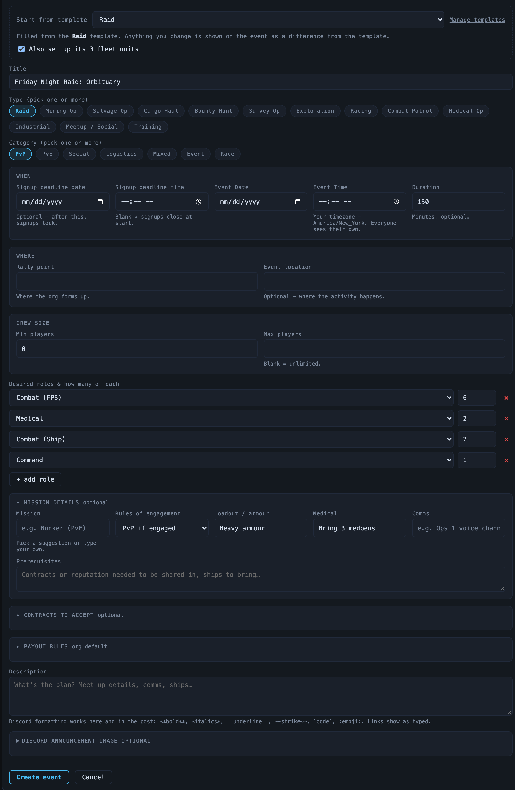
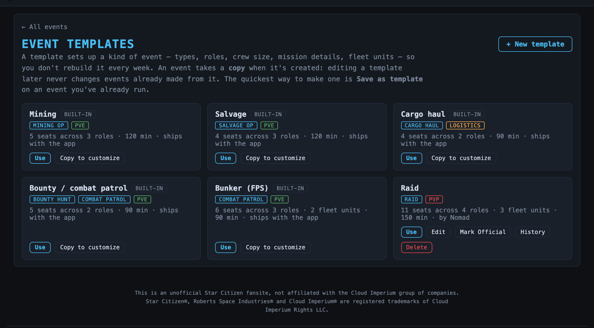
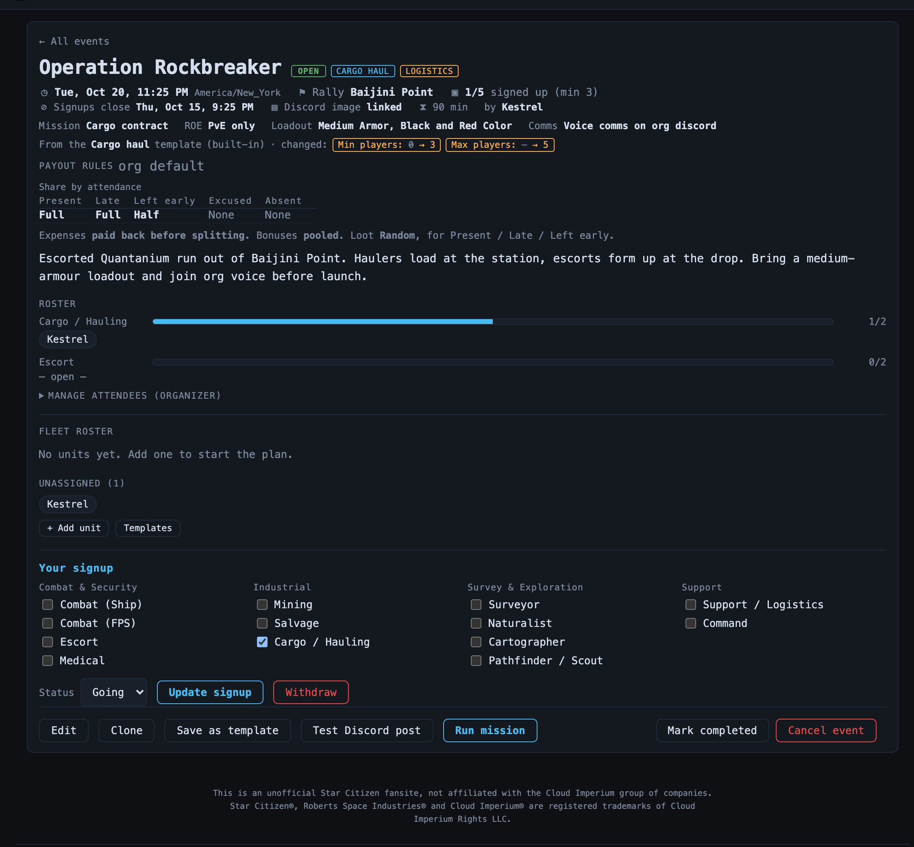

# Event Planner

> Organize raids, ops, survey runs & meetups — set roles/targets, sign up your
> org, and track who's filling each slot; build a fleet roster, start from a
> template, and hand the event to Ops when it's time to fly.
> **Route:** `#/events` · **Launcher group:** Rally the Org

  

## What it is

Getting a dozen-plus org members to the same place, in the same ships, at the
same time is its own logistics problem. A Discord message with "raid Saturday
8pm, need medics" gets lost in scroll, nobody knows if the roster is actually
full, and by the time everyone's online it's still unclear who's flying what.

Event Planner is a shared board for scheduling in-game activity and turning a
pile of "I'm in" replies into an operational plan. An organizer creates an
event — type, category, start time, rally point, a target roster like
`2 medics, 5 escorts`, and optionally the mission briefing and how the money
will be split — and the rest of the org signs up for the role(s) they'll fill.
Every event tracks its fill live: a headline player count and a per-role bar.
On top of signups sits the **Fleet roster**: the organizer sorts the "going"
pool into squads, squadrons, or ship crews and exports a manifest for Discord.

When the op actually starts, **Run mission** hands the event to the
[Ops](ops.md) app, which checks people in, splits the money and rolls the loot,
then keeps the record. Events that recur don't need retyping: start from a
built-in or org **template**, or **Clone** last week's.

It's built for this org, not a generic calendar. The `Survey Op` and
`Exploration` types map their roles onto the rest of the suite — a `Surveyor`
signup is someone who'll grow the resource dataset that day, a `Cartographer`
someone dropping POIs — so running one is how the org's own map gets better.

## How to use it

### Create an event

  

1. Open **Event Planner** from the launcher (`#/events`) and click
   `+ Create event`.
2. Optional: pick a template under **Start from template** — grouped
   `Official`, `Built-in` and `Org templates`. It fills the form, keeping any
   title and date you'd already typed. If the template carries fleet units,
   tick **Also set up its N fleet units** to stamp them onto the event.
3. Give it a **Title** and pick one or more **Type** chips (`Raid`,
   `Mining Op`, `Salvage Op`, `Cargo Haul`, `Bounty Hunt`, `Survey Op`,
   `Exploration`, `Racing`, `Combat Patrol`, `Medical Op`, `Industrial`,
   `Meetup / Social`, `Training`) and one or more **Category** chips (`PvP`,
   `PvE`, `Social`, `Logistics`, `Mixed`, `Event`, `Race`).
4. Under **When**, set the **Event Date** and **Event Time** in your own
   timezone (everyone sees it on their own clock), an optional **Duration**,
   and an optional **signup deadline** — after it, signups lock.
5. Under **Where**, enter a **Rally point** (where the org forms up) and,
   if different, an **Event location** — both are POI pickers that also take
   free text.
6. Set **Min players** / **Max players** (blank max = unlimited) and build
   **Desired roles & how many of each** with `+ add role`. Roles come from
   four groups: `Combat & Security` (Combat (Ship), Combat (FPS), Escort,
   Medical), `Industrial` (Mining, Salvage, Cargo / Hauling),
   `Survey & Exploration` (Surveyor, Naturalist, Cartographer,
   Pathfinder / Scout) and `Support` (Support / Logistics, Command). A role
   count is a soft target: extra signups show as surplus, never rejected.
7. Optional cards, each collapsed until you need it:
   - **Mission details** — **Mission** (pick a suggestion like
     `Bunker (PvE)` or `Bounty — VHRT`, or type your own), **Rules of
     engagement** (`PvE only`, `PvP if engaged`, `PvP hunt`),
     **Loadout / armour**, **Medical**, **Comms** and **Prerequisites**.
   - **Contracts to accept** — the contracts everyone should accept or have
     shared before the op, with what each pays. The game pays these in equal
     cuts to everyone who has them, so they're a checklist, never split here.
   - **Payout rules** — how the op's own income is shared: a share per
     attendance (`Present`, `Late`, `Left early`, `Excused`, `Absent` — each
     Full, Half or None), whether expenses are paid back first, whether
     achievement bonus cash is pooled or kept, and how loot is rolled. It
     starts on your org's defaults and its summary says how many changes
     you've made from them.
8. Write the **Description**. Discord formatting works here and in the post:
   `**bold**`, `*italics*`, `__underline__`, `~~strike~~`, `` `code` ``,
   `:emoji:`. Links show as typed.
9. Optional: **Discord announcement image** — paste an https link to an image
   on imgur, ibb, postimg, X or RSI and click `Use link`. Use one at least
   400 × 225 px (800 × 450 stays sharp); Discord never enlarges a small
   image. Discord attachment links are refused because they expire within a
   day.
10. Click `Create event`. It lands on the board and, if your org has an
    events Discord channel set up, posts there.

### The Discord announcement

The new-event post is a full card: the description, then one line each for
start time and length, rally point, location, crew, roles, signups-close,
organizer and type, then a **Mission briefing** block when mission details are
filled in. Empty facts are left out. Your image, if any, sits full-width under
it.

The post **keeps itself current**: as people join or withdraw, the organizer
changes attendees, or the event is edited, the same Discord message is updated
(at most about once a minute) with the new crew and role counts and a
"Signups updated" footer. Cancelling the event turns the post red and marks
it `🚫 Cancelled`. Moving the time or place pings every signup and re-arms the
"starting soon" reminder, which pings the whole roster.

Admins get a `Test Discord post` button on the event page that sends the
announcement to the events channel marked TEST.

### Sign up

1. Open an event from the board or the calendar. Narrow the board with the
   `Upcoming | Past` tabs, the category chips, or the **My events** toggle.
   Cards you've joined carry `✓ going`, `? maybe` or `⏳ waitlisted`; an
   event with a running op shows `● mission live`, and one with a closed op
   `✓ record`.
2. Read the facts at the top — time, rally point, crew count, the mission
   line (mission, ROE, loadout, medical, comms, prerequisites), the
   **Contracts to accept** and **Payout rules** — so you know the deal
   before you commit.
3. Under **Sign up**, pick your role(s) and `Going` or `Maybe`, then
   `Join event`.
4. **If the event is full**, the button reads `Join waitlist`: Going puts you
   on a first-come waitlist, shown in order on the event page. When a spot
   opens you're promoted automatically and pinged on Discord. `Maybe` never
   waitlists.
5. Change your mind with `Update signup`, or `Withdraw` (which promotes the
   first person waiting).

The headline count (`3/5 players`) counts distinct people; the per-role bars
count every role a signup lists, so covering two roles fills both bars without
counting you twice.

### Build the Fleet roster

The organizer (or an admin) turns the "going" pool into a plan under
**Fleet roster** on the event page:

1. Click `+ Add unit` for a squad, squadron, crew, section, or wing — a
   **name**, a **kind**, optionally a **ship** (picking a known hull fills in
   its crew size), a target **size** and a **leader**.
2. In **Unassigned**, pick a member, pick the unit, optionally a **seat** (the
   field offers the ship's known seats — Pilot, Co-Pilot, Turret 1/2/…), then
   `Assign`.
3. Each unit card shows its fill (`3/4`) and every member's seat; `✕` sends a
   member back to Unassigned. Members see a **Your assignment** callout the
   moment they're placed.
4. To reuse a structure, click `Templates` to open **Group templates**,
   then `Save current units` (structure only, no members). On another event,
   open it again and `Apply` a saved one.
5. Click `Manifest` to render the plan as Discord-ready markdown (start time
   in each reader's own timezone, units, seats, names). Copy it, or
   `Post to Discord` — big fleets split across several messages on unit
   boundaries.

### Event templates

  

A template sets up a *kind* of event — types, roles, crew size, mission
details, contracts, payout rules, fleet units, the Discord image — so you don't
rebuild it every week. Open it from `Templates` on the board (`#/events/templates`).

- **Built-in starters** ship with the app: Mining, Salvage, Cargo haul,
  Bounty / combat patrol, Bunker (FPS) and Raid. `Use` one as-is, or
  `Copy to customize` to make an org copy you can edit (the built-in then
  drops out of the picker). An admin can turn the built-ins off in Settings ›
  Apps (**EVENT TEMPLATES**).
- **Org templates**: `+ New template` builds one from the event form (no date
  or time — those are per event; the title is an optional default). The
  quickest way is **Save as template** on an event you've already run: it
  takes the setup, mission details and, if you tick
  **Include this event's fleet units**, the units. Date, time and signups
  stay behind.
- The creator or an admin can `Edit` or `Delete` a template. Each content
  edit makes a new version; `History` lists who created, edited, renamed or
  marked it, and when.
- Admins can `Mark Official` — Official templates sort first in the picker.
- **An event takes a copy.** Editing a template later never changes events
  already made from it. The event page says which template it came from
  (and if that template has since been updated or deleted) and shows a chip
  for each thing changed from it — "used as-is" when nothing was.

### Day-of and after

  

- **Run mission** (organizer/admin) opens the event's op in [Ops](ops.md),
  with everyone signed up (going, waitlisted, maybe) and the organizer already
  on its roster, and the event's contracts and payout rules carried over.
  The event page then links to it with `Open the op →`, or
  `View the record →` once it's closed. Closing the op marks the event
  completed.
- **Manage attendees (organizer)**: `Seat now` a walk-up or a maybe, or
  `Drop` a no-show — even after signups lock. Dropping someone promotes the
  first person waiting.
- **Clone** creates the next run: the form arrives pre-filled — mission
  details, contracts, payout rules and image included — with a past start
  rolled forward a week at a time until it's in the future.
- **Mark completed** moves the event to the **Past** tab without running an
  op. **Cancel event** keeps its signups and leaves it on the board with a
  `Cancelled` badge.
- The calendar shows on both tabs and includes quick ops; a day holding a
  closed mission record is ringed with a `✓` instead of a dot.

## Features

| Area | What you get |
|---|---|
| Taxonomy | Multi-select **Type**, multi-select **Category**, and grouped **Roles** — a PvP+PvE mixed raid stays expressible without forcing one label. |
| Board | Month calendar on both tabs (events and quick ops; ✓ on days with a mission record), `Upcoming | Past`, category chips, **My events**, and signup / mission-state badges on cards. |
| Mission details | Mission, rules of engagement, loadout, medical, comms and prerequisites, shown on the event page and in the Discord briefing. |
| Money, decided up front | Contracts to accept and payout rules on the event, shown to everyone before they sign up, carried into the op. |
| Templates | Six built-in starters, org templates with versions and history, Official templates first, and deviation chips on every event made from one. |
| Capacity & waitlist | `Max players` is enforced: a full event waitlists first-come, auto-promotes when a spot opens, and pings the promoted member. |
| Discord | A full-card announcement with an optional linked image that updates itself as signups change; reschedule and waitlist pings; a "starting soon" reminder that reaches every signup even past Discord's 50-mention cap. |
| Fleet roster | Squads/squadrons/crews/sections/wings with ship-aware seats, a "your assignment" callout, saved group templates, and a manifest you can post to Discord. |
| Ops hand-off | **Run mission** opens the event's op with the signups, contracts and rules already in place. |
| Ownership | Any member can create an event and sign up; only the organizer or an admin can edit, cancel, complete, run the mission, or manage attendees and the fleet roster. |

## Works with the rest of the suite

The attendee pool is the signed-in org — no separate invite step — and names
resolve through the shared member directory. The fleet roster's ship picker
uses the same vehicle data as the Cargo and Trade Route planners. Group Finder
posts and Danger Board warnings can each be promoted into a pre-filled event.
Discord posts go through the org's per-category webhooks; the event ones only
appear once an admin has set up the events channel. Running the event hands
off to [Ops](ops.md), whose closed records feed the Attendance leaderboard in
Org Intel.

## Tips

- A signup carries a *list* of roles — covering Medical and Escort, pick
  both; it counts once toward the headline but fills both bars.
- Joining a full event as `Going` is worth it: promotion is automatic and you
  get pinged. Don't downgrade to `Maybe` just because it's full.
- Running the same op every week? Run it once, then **Save as template** —
  next time it's one pick from **Start from template**.
- Fill in the **Payout rules** before people sign up. Once the op starts, any
  change is a logged amendment everyone sees.
- The fleet roster's seat suggestions only appear once a unit has a **ship**
  set — add the ship first, then assign members.
- For the announcement image, link the image itself, not the post it's in
  (from X, copy the image's address).

---
Part of the <a href="./README.md">SC Org Navigator app suite</a>. Design/reference specs: <a href="../event-planner.md">docs/event-planner.md</a>, <a href="../event-operations.md">docs/event-operations.md</a>.
