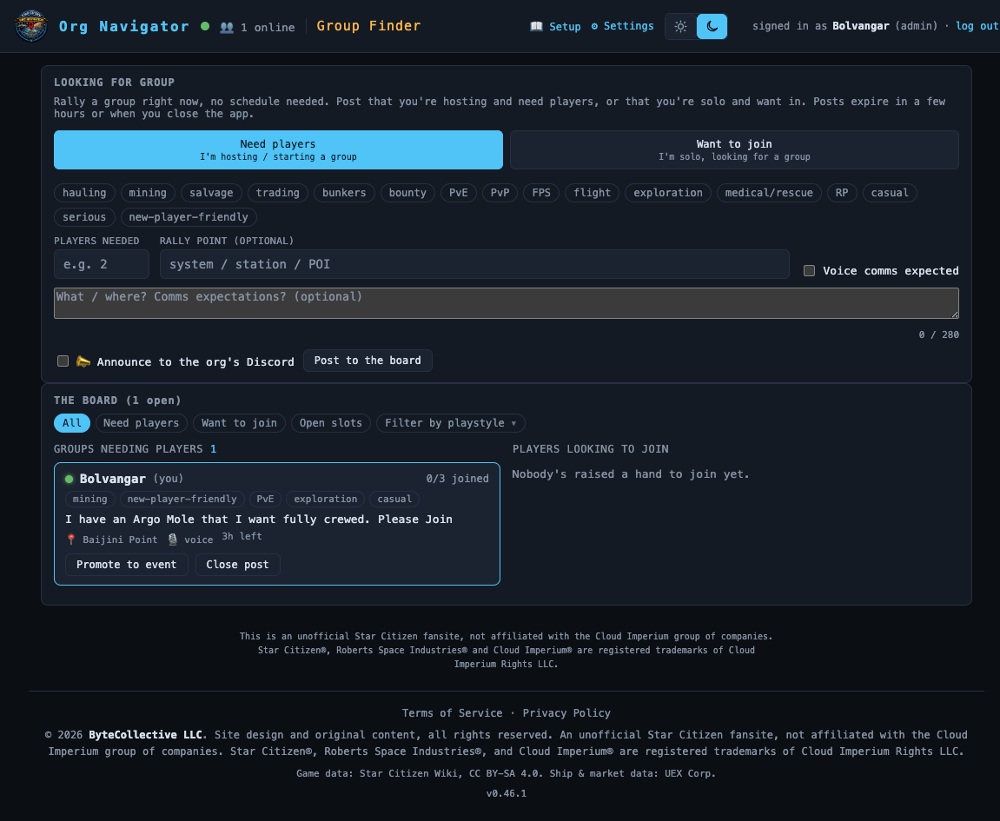
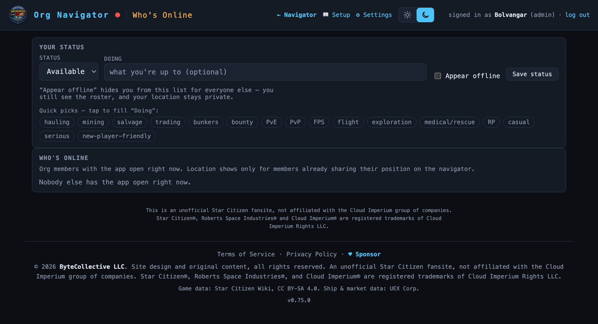

# Group Finder

> Rally a crew right now — post that you need players or want to join, filter
> by playstyle, and group up without waiting for a scheduled event.
> **Route:** `#/lfg` · **Launcher group:** Rally the Org

  

## What it is

Half the fun of an org is the run nobody planned — someone's short two guns
for a bunker, someone else just logged in solo and wants to tag along on
*anything*. None of that fits the Event Planner, built for things scheduled
hours or days out with roles and sign-up sheets. It doesn't fit Discord
either — a message in `#looking-for-group` scrolls away in minutes, with no
way to see who's actually online and free right now.

Group Finder is built for that gap: grouping up **right now**. It sits next
to a live **Who's Online** roster — who has the app open this second, what
they're doing, and whether they're free — plus its own board where members
post either "I'm hosting, need players" or "I'm solo, want in on something."
Posts are short-lived by design: they show green while fresh, fade to a stale
warning, and drop off the board on their own, because a "need 2 for a bounty"
post from three hours ago is just noise.

The two sides get matched for you: if your post shares a playstyle tag with
someone posting the opposite direction, their card gets called out on the
board, so the soloist and the host both spot each other without
cross-referencing anything. And when an impromptu group wants more structure
— a real time, a role list — one click promotes it straight into the Event
Planner.

## How to use it

### Set your status on Who's Online

1. Click the `🟢 N online` badge in the masthead, or go straight to
   `#/online`.
2. In **YOUR STATUS**, set **Status** (`Available`, `Busy`, or `AFK`) and,
   optionally, what you're **Doing** — type it or tap a quick-pick chip (the
   same playstyle vocabulary used across the suite).
3. Want to be invisible for a bit? Check **Appear offline** — it hides you
   from the roster for everyone else. You still see the full roster
   yourself, and your location stays private either way.
4. Click **Save status**. Your entry updates live for every member with the
   app open.
5. Below, **WHO'S ONLINE** lists every visible member — name, status chip,
   activity, and, only for members already sharing position on the Resource
   Navigator, a location. Available members sort first.

  

 YOUR STATUS controls (status, activity, playstyle quick-picks, Appear
offline) sit above the live WHO'S ONLINE roster.

These tags come from the same shared vocabulary as your member profile in
**Settings** — set your usual playstyles there once and they resurface as
quick-picks everywhere the app asks, including the Group Finder composer.

### Post to the board

1. Open **Group Finder** from the launcher (*Rally the Org*) or go to
   `#/lfg`.
2. In **LOOKING FOR GROUP**, pick a direction: **Looking for members**
   (you're hosting, set **Players needed** up to 40) or **Looking to join**
   (you're solo — a raised hand, no slot count).
3. Tap up to 6 playstyle tags that describe the run — `PvE`, `PvP`,
   `hauling`, `bunkers`, `bounty`, `exploration`, `new-player-friendly`, and
   more.
4. Optionally set a **rally point**, check **Voice comms expected**, and add
   a short note (up to 280 characters).
5. If your org has a Discord webhook set for Group Finder, tick
   **📣 Announce to the org's Discord** to also push a channel broadcast.
6. Click **Post to the board**. Your card lands in the matching column:
   **Groups needing players** (LFM) or **Players looking to join** (LFJ).

### Work the board

- Filter by direction, one playstyle tag, or **open slots only**.
- **Join**/**Leave** on an LFM card fills or frees a slot; **Ping** reaches
  out on an LFJ card. You can't respond to your own post.
- A post that shares a tag with one of yours, in the opposite direction,
  gets a `✨ matches you` badge and floats toward the top of its column — a
  `✨ My matches` filter chip appears once you have an active post.
- Your own post carries **Close post** and **Promote to event**, which
  prefills the Event Planner's create form (title, description, rally point
  as location, LFM slots become max players). Nothing is created until you
  submit the event form yourself; your LFG post is untouched until you close
  it.

## Features

- **Two-direction board** — LFM (needs players, carries a slot count) and
  LFJ (wants in, a raised hand) shown side by side, so a host and a soloist
  both see the whole picture at a glance.
- **Shared playstyle vocabulary** — one tag set drives your member profile
  (Settings), Who's Online activity quick-picks, and Group Finder post tags,
  so "what I usually do" and "what I want right now" speak the same
  language throughout the suite.
- **Suggested matches** — an opposite-direction post sharing a tag with your
  own active post is flagged `✨ matches you` and floats toward the top of
  its column, computed live off the board you already see.
- **Green → stale → age-off lifecycle** — a post shows green while fresh,
  turns amber once stale, and drops off the board automatically at age-off.
  Both windows are admin-tunable in ORG SETTINGS. Deliberately ephemeral —
  for anything planned further out, use the Event Planner instead.
- **Opt-in Discord announce** — pushes a channel broadcast to the org's
  configured Group Finder webhook, no @-mentions (it's an open call; replies
  funnel back through a deep link to the board). Rate-limited per member.
- **Promote to event** — one click carries an LFG post's title, note, rally
  point, and slot count into a prefilled Event Planner form.
- **Privacy-respecting roster** — "Appear offline" removes you from Who's
  Online for everyone else while you keep full visibility yourself; location
  only ever shows for members already sharing position on the navigator.
- **Live everywhere** — the roster and board update over the app's existing
  WebSocket, and the launcher's `🟢 N online` / `🔎 N looking for group`
  badges stay live even off those views.

| Direction | Meaning | Carries | Action from others |
|---|---|---|---|
| Looking for members (LFM) | "I'm hosting, need people" | slots needed / filled | Join / Leave |
| Looking to join (LFJ) | "I'm solo, want in" | — | Ping |

## Works with the rest of the suite

Playstyle tags are the connective tissue: the same vocabulary populates your
profile in **Settings**, your Who's Online activity chips, and every Group
Finder post and filter — set it once and it follows you. **Promote to
event** hands off directly into the **Event Planner**'s create form, and the
opt-in Discord announce reuses the same per-category webhook dispatcher that
powers notifications across the suite, configured once in ORG SETTINGS.

## Tips

- Set your status and a quick activity tag on Who's Online *before* opening
  Group Finder — it takes ten seconds and seeds the picture others see.
- Posts are meant to be short-lived. If a run is still forming in a few
  hours, promote it to a real event instead of re-posting.
- Watch for the `✨ matches you` badge before scrolling the whole board —
  it's usually the fastest way to your actual match.
- "Appear offline" is a separate, lighter toggle from the navigator's
  position-sharing setting — hide from the roster independently of whether
  you're sharing your live location.
- Only one active post per direction per member — posting again replaces
  your existing post rather than stacking a second card.

---
Part of the <a href="./README.md">SC Org Navigator app suite</a>. Design/reference spec: <a href="../who-is-online-lfg.md">docs/who-is-online-lfg.md</a>.
