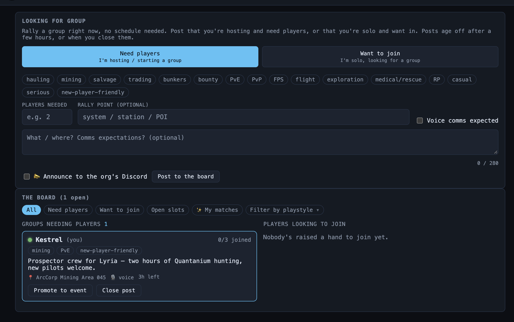
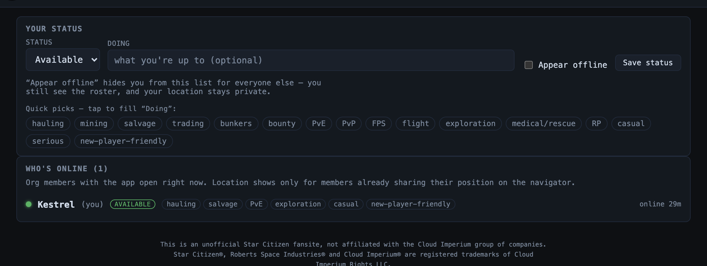

# Group Finder

> Rally a crew right now — post that you need players or want to join, filter
> by playstyle, and group up without waiting for a scheduled event.
> **Route:** `#/lfg` · **Launcher group:** Rally the Org

  

## What it is

Half the fun of an org is the run nobody planned — someone's short two guns
for a bunker, someone else just logged in solo and wants to tag along on
*anything*. None of that fits the Event Planner, built for things scheduled
hours or days out with roles and sign-up sheets. It doesn't fit Discord
either — a message in `#looking-for-group` scrolls away in minutes, with no
way to see who's actually online and free right now.

Group Finder is built for that gap: grouping up **right now**. It sits next
to a live **Who's Online** roster — who has the app open this second, what
they're doing, and whether they're free — plus its own board where members
post either "I'm hosting, need players" or "I'm solo, want in on something."
Posts are short-lived by design: they show green while fresh, fade to a stale
warning, and drop off the board on their own, because a "need 2 for a bounty"
post from three hours ago is just noise.

The two sides get matched for you: if your post shares a playstyle tag with
someone posting the opposite direction, their card gets called out on the
board, so the soloist and the host both spot each other without
cross-referencing anything. And when an impromptu group wants more structure
— a real time, a role list — one click promotes it straight into the Event
Planner.

## How to use it

### Set your status on Who's Online

1. Click the `🟢 N online — see who` badge on the app launcher, or go
   straight to `#/online`.
2. In **YOUR STATUS**, set **Status** (`Available`, `Busy`, or `AFK`) and,
   optionally, what you're **Doing** — type it or tap a quick-pick chip (the
   same playstyle vocabulary used across the suite). Pressing Enter in the
   Doing box saves too.
3. Want to be invisible for a bit? Check **Appear offline** — it hides you
   from the roster for everyone else. You still see the full roster
   yourself, and your location stays private either way.
4. Click **Save status**. Your entry updates live for every member with the
   app open.
5. Below, **WHO'S ONLINE** lists every visible member — name, status chip,
   what they're doing, their profile playstyle chips, how long they've been
   online, and, only for members already sharing position on the Resource
   Navigator, a location.

  
   YOUR STATUS controls (status, activity, playstyle quick-picks, Appear
  offline) sit above the live WHO'S ONLINE roster, where each member's profile
  playstyles show as chips.

The chips on each roster row are that member's profile playstyles — pick up
to 6 in **Settings → Profile** and they follow your name onto the roster and
the admin member directory. It's the same vocabulary the quick-picks and the
Group Finder composer use.

### Post to the board

1. Open **Group Finder** from the launcher (*Rally the Org*) or go to
   `#/lfg`.
2. In **LOOKING FOR GROUP**, pick a direction: **Need players** (you're
   hosting — set **Players needed**, up to 40) or **Want to join** (you're
   solo — a raised hand, no slot count).
3. Tap up to 6 playstyle tags that describe the run — `PvE`, `PvP`,
   `hauling`, `bunkers`, `bounty`, `exploration`, `new-player-friendly`, and
   more.
4. Optionally set a **Rally point** (it autocompletes from POIs, but free
   text is fine), check **Voice comms expected**, and add a short note (up to
   280 characters — a live counter shows how much room is left).
5. If your org has a Discord channel set up for Group Finder, a
   **📣 Announce to the org's Discord** checkbox appears — tick it to also
   post the call to that channel.
6. Click **Post to the board**. A post needs at least a tag, a note, a rally
   point, or a slot count so people know what you're after. Your card lands
   in the matching column of **THE BOARD**: **Groups needing players** or
   **Players looking to join**.

### Work the board

- Filter with the chips along the top: **All**, **Need players**, **Want to
  join**, **Open slots**, or open **Filter by playstyle** to narrow to one
  tag.
- Each card shows the poster's live status dot, their tags and note, the
  rally point, `🎙 voice` if comms are expected, and how long the post has
  left.
- **Join**/**Leave** on a "need players" card fills or frees a slot (a full
  group shows **Full**); on a "want to join" card, **I'm interested** lets the
  poster know you'd take them along. Names of who joined or is interested
  appear on the card. You can't respond to your own post.
- A post that shares a tag with one of yours, in the opposite direction,
  gets a `✨ matches you` badge and floats toward the top of its column — a
  `✨ My matches` filter chip appears once you have an active post.
- Your own post carries **Close post** and **Promote to event**. Close post
  asks you to confirm, then offers a short **Undo** in case you change your
  mind. Promote to event prefills the Event Planner's create form (title,
  description, event types guessed from your tags, rally point as location,
  players needed plus you as max players). Nothing is created until you
  submit the event form yourself; your LFG post is untouched until you close
  it.

## Features

- **Two-direction board** — "Need players" (carries a slot count) and "Want
  to join" (a raised hand) shown side by side, so a host and a soloist
  both see the whole picture at a glance.
- **Shared playstyle vocabulary** — one tag set drives your member profile
  (Settings), Who's Online activity quick-picks, and Group Finder post tags,
  so "what I usually do" and "what I want right now" speak the same
  language throughout the suite.
- **Suggested matches** — an opposite-direction post sharing a tag with your
  own active post is flagged `✨ matches you` and floats toward the top of
  its column, computed live off the board you already see.
- **Green → stale → age-off lifecycle** — a post shows green while fresh,
  turns amber (`⏳ stale`) once stale, and drops off the board automatically
  at age-off (three hours by default). Both windows are admin-tunable in
  **Settings → Apps** (GROUP FINDER (LFG)). Deliberately ephemeral —
  for anything planned further out, use the Event Planner instead.
- **Opt-in Discord announce** — posts a tidy embed card to the org's Group
  Finder channel: who's looking, their note, then seats needed, playstyles,
  rally point, and comms, with a link back to the board. No @-mentions (it's
  an open call). If your admins have turned on the org image, it rides along
  as the card's thumbnail, and they can reword the post in **Settings →
  Announcements**. One announced post per member every ten minutes.
- **Promote to event** — one click carries an LFG post's title, note, rally
  point, and slot count into a prefilled Event Planner form.
- **Privacy-respecting roster** — "Appear offline" removes you from Who's
  Online for everyone else while you keep full visibility yourself; location
  only ever shows for members already sharing position on the navigator.
- **Live everywhere** — the roster and board update over the app's existing
  WebSocket, and the launcher's `🟢 N online` / `🔎 N looking for group`
  badges stay live even off those views.

| Direction | Meaning | Carries | Action from others |
|---|---|---|---|
| Need players | "I'm hosting, need people" | slots needed / filled | Join / Leave |
| Want to join | "I'm solo, want in" | interested count | I'm interested |

## Works with the rest of the suite

Playstyle tags are the connective tissue: the same vocabulary populates your
profile in **Settings**, your Who's Online activity chips, and every Group
Finder post and filter — set it once and it follows you. **Promote to
event** hands off directly into the **Event Planner**'s create form, and the
opt-in Discord announce uses the same per-channel webhooks as the rest of the
suite's Discord posts, set up once by an admin in **Settings → Discord
channels**.

## Tips

- Set your status and a quick activity tag on Who's Online *before* opening
  Group Finder — it takes ten seconds and seeds the picture others see.
- Posts are meant to be short-lived. If a run is still forming in a few
  hours, promote it to a real event instead of re-posting.
- Watch for the `✨ matches you` badge before scrolling the whole board —
  it's usually the fastest way to your actual match.
- "Appear offline" is a separate, lighter toggle from the navigator's
  position-sharing setting — hide from the roster independently of whether
  you're sharing your live location.
- Only one active post per direction per member — posting again replaces
  your existing post rather than stacking a second card.
- Closed a post by mistake? Hit **Undo** on the toast that pops up — it
  re-posts the same content.

---
Part of the <a href="./README.md">SC Org Navigator app suite</a>. Design/reference spec: <a href="../who-is-online-lfg.md">docs/who-is-online-lfg.md</a>.
