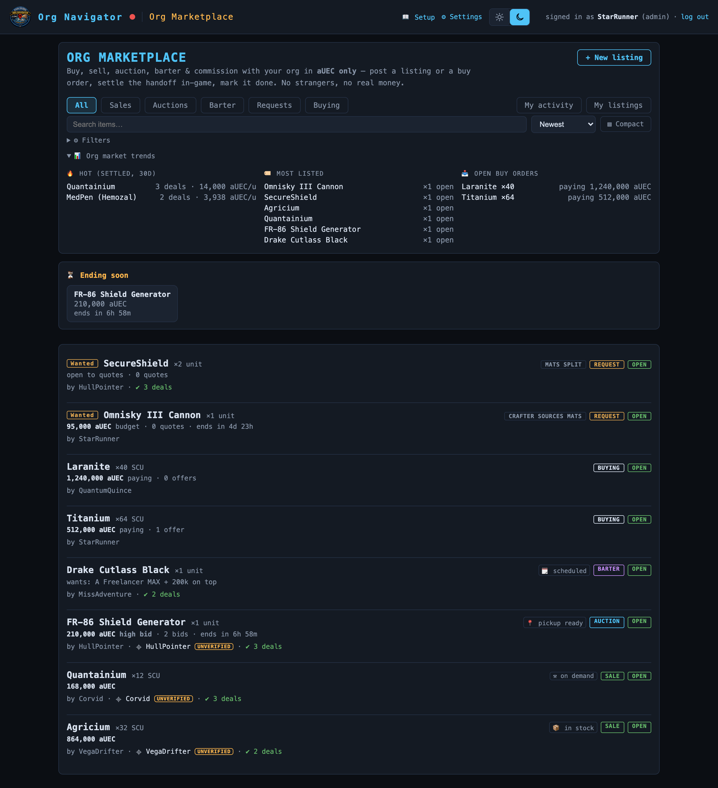
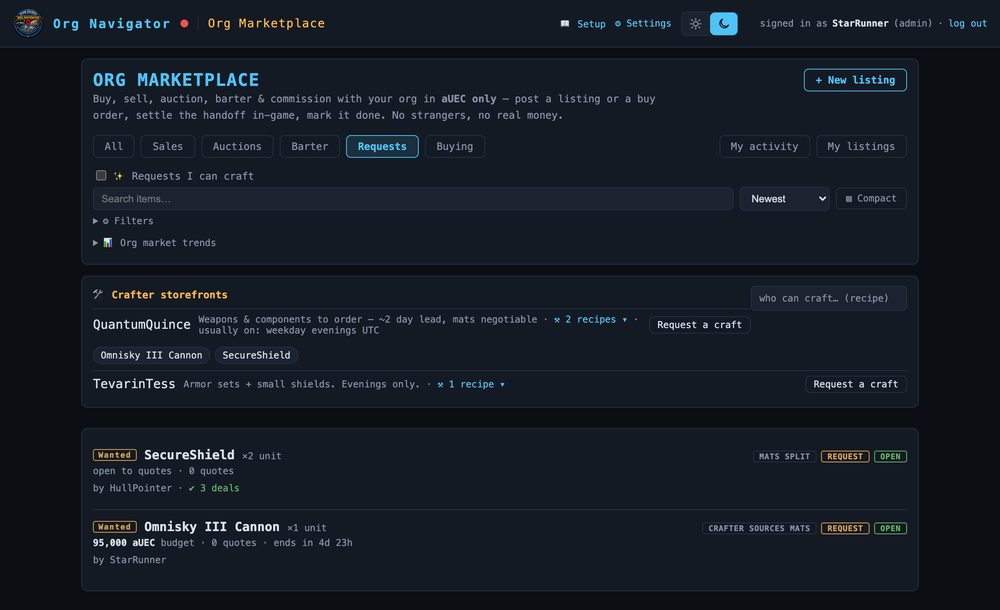

# Marketplace

> Sell, auction, barter, commission & post buy orders with your org — priced in aUEC only. Post a listing, buy or bid, then settle the handoff in-game. **Route:** `#/market` · **Launcher group:** Run the Org

  

## What it is

Star Citizen has no built-in auction house. Org trading today happens as a
scroll of scattered Discord messages — "WTS Titanium 40 SCU," "anyone have a
spare Cutlass part," "will pay to have this armor crafted" — that gets buried
within a day and leaves nobody sure who actually has what, what a fair price
is, or whether a deal ever closed.

Marketplace is a single shared board where any member can **sell**, run a
timed **auction**, propose a **barter**, post a **commission** — "build me
this, to this spec, for this price" — or put up a **buy order** — "I want
this, paying this much" — for an item, priced in **aUEC only, never real
money**. Every listing runs through the same lifecycle: someone posts it,
someone else buys, bids, offers, or quotes on it, the poster picks a taker,
and the two of you finish the deal **in-game** — you hand over the crate,
they hand over the aUEC, and then you both tap **Confirm** here so the board
(and everyone's reputation count) reflects reality.

Because it's gated behind the same Discord sign-in as the rest of the suite,
it's a closed, trusted market: no strangers, no outside scams, and no
real-money line to police. It also isn't a bolt-on — it shares the same item
catalog as [Resource Manager's](resource-manager.md) inventory/goals system,
so a listing references the exact same items your org already tracks, and a
commission's blueprint spec builder reuses the same recipe data that powers
the Resource Manager's blueprint library.

## How to use it

### Post a listing

1. Open **Marketplace** from the launcher (`#/market`) and click
   `+ New listing`.
2. Pick an **item** from the shared catalog picker (type to search
   commodities, ships, equipment, crafted/blueprint items, or a custom item
   name) and a **quantity**.
3. Pick a **mode** — `Sale`, `Auction`, `Barter (trade)`,
   `Craft request (commission)`, or `Buy order (WTB — I'm buying)`. The
   form's fields change to match; see the mode breakdown below for what each
   one asks for.
4. If the item has a known in-game price, a **Market value** hint appears
   (buy/sell aUEC pulled from the live commodity/item feeds) with a one-click
   `use` button — and once your org has settled deals for the item, a second
   **Sold in-org** line shows what it *actually* went for between orgmates
   (last + median per unit, with its own `use` button). Real deals beat
   asking prices as an anchor.
5. Say when and where the goods change hands: an **Availability** dropdown
   (`In stock now` · `Ready for pickup` · `On demand (will gather / craft)` ·
   `Scheduled`) and an optional **pickup / handoff location** with POI
   autocomplete. Buyers plan play sessions around these two facts, so they
   ride every board card as a chip.
6. Optionally record a **crafted item's quality** — if you're selling
   something you made under SC 4.8's crafting system, open the quality
   editor to advertise an overall **Quality (1–1000)** and/or **Band (1–8)**,
   plus up to a handful of free-form stat rows (`+ Add stat`) like "Damage
   Mitigation: +8%." A shared `ⓘ What do Quality and Band mean?` explainer
   sits right on the form if you need the primer.
7. Add an optional **note**, tick **announce to Discord** if your org has the
   marketplace webhook configured (posts have their own opt-in in this box —
   see below), and save. Your listing appears on the board immediately under
   `My listings`.

### Sale, Auction, Barter, and Buy orders

| Mode | You set | How it settles |
|---|---|---|
| **Sale** | A fixed **price** in aUEC | A buyer clicks `Buy now · N aUEC` and the listing moves straight to `pending` with them as buyer. |
| **Auction** | A **starting price**, an **end time**, and an optional **buyout** | Members place bids (`Place bid`, at or above the next minimum); the highest bid at the end time wins, or anyone can end it instantly with `Buy out · N aUEC` if you set one. Ties go to whoever bid first. Once bids exist the end time can only be *extended*, never shortened. |
| **Barter** | A **want** — free text or another catalog item you're after | Members counter with `Make offer` (an item + note describing what they're offering); you review the offers and `Accept` the one you like. |
| **Buy order (WTB)** | The item you want and what you're **paying** for the lot | The direction flips: sellers respond with `Offer to sell` (their price + a "stock on hand, where" note) and *you* pick one — never automatic, since nobody can verify stock. Posting a buy order also automatically pings members whose [Resource Manager](resource-manager.md) holdings carry that item, so your order finds the stashes. |

### Craft requests (commission)

A commission flips the usual direction: you're not selling something, you're
*paying to have something made*.

1. Pick `Craft request (commission)` as the mode, then search for a
   **blueprint** by name (the same recipe feed behind the Resource Manager's
   blueprint library — over 1,500 craftable weapons, armor, and ship
   components). Picking a recipe mounts the full **spec builder** below the
   field.
2. The spec builder shows the recipe's **materials manifest** — every
   resource (by SCU) and every item-kind ingredient like crafting gems (by
   count), scaled to your quantity, plus any minimum input quality the
   recipe demands. Set **who sources the materials**: `Crafter sources them`,
   `I supply them`, or `We split them` — this changes the job's real cost
   more than anything else, so it's front and center.
3. For any stat the recipe can actually influence (say, Damage Mitigation or
   Coolant Rating), the builder shows **which input slot drives it** and a
   per-input **quality slider** with a live estimate of the resulting stat —
   so you can ask for "≥ Q700 on the Shell" and see roughly what that buys
   you before you post. Slider positions are saved as **materials quality
   needed** minimums a crafter can see on the listing.
4. Set an overall target **Quality (1–1000)** / **Band (1–8)** if you want a
   single headline number too, an optional **Budget** (leave blank for "open
   to quotes"), and an optional **needed by** date/time.
5. Post it. Interested crafters browse the `Requests` tab, read your spec and
   manifest, and submit a **quote** — their own price and a note (ETA,
   proposed quality, material questions) — via the listing detail's offer
   box. You review quotes and click `Accept quote` on the one you want; every
   other quote flips to `lost` and the listing moves to `pending` with that
   crafter as the accepted party. If the accepted crafter can't deliver
   ("can't source the Riccite"), they can `Withdraw from job` and the request
   reopens for other quotes — nothing is lost.
6. On the board and detail view, roles read as **Requester** (you, the
   poster) and **Crafter** (the accepted quote) instead of Seller/Buyer, and
   commission cards carry a **materials-sourcing chip** so browsers instantly
   see whether mats are included.

### Crafter storefronts & directed requests

  

Broadcasting to the board works when you don't care who builds it. When you
*do*, storefronts close the loop:

- Any member can open a **storefront** by setting a blurb in
  `Settings → Profile` ("Taking weapon component orders — ~2 day lead").
  Storefronts appear in a panel on the `Requests` tab with the crafter's
  recipe-library size, completed-deals count, and their "usually on" play
  window.
- Click **`⚒ N recipes`** on any storefront to expand their actual recipe
  list, or use the panel's **"who can craft…"** filter — pick any recipe and
  the panel narrows to exactly the storefronts that hold it.
- **`Request a craft`** on a storefront opens the commission form **directed
  to that crafter**: the blueprint picker shows *only their library* (focus
  the empty field to browse it), and if you arrived via the recipe filter,
  the blueprint arrives pre-picked with the spec builder already loaded.
- A directed request is board-visible but badged `🎯 Directed to <name>` —
  **only that crafter can quote it**, they get a direct Discord ping, and the
  server refuses a directed request for a recipe outside their library, so
  you can never send someone a job they can't build. (You can always switch
  a request back to the whole board from the form.)

### The dual-confirm handshake

There's no in-game escrow and no way for this app to move goods or aUEC — so
every deal, in every mode, closes the same way once a buyer/bidder/crafter is
locked in:

1. The listing moves to `pending`. Both sides see "arrange the handoff
   in-game" plus each other's handle, if it's on file.
2. You meet up in-game and actually trade — the item for the aUEC.
3. Both sides come back to the listing detail and click `Confirm handoff`.
   Once **both** confirmations are in, the listing flips to `completed` and
   both parties' **completed-deals count** — the only reputation signal the
   app tracks — ticks up.
4. Either side can cancel or dispute before both confirm, sending the
   listing back to `open` (or `cancelled`) instead of stranding it.

### Search, filter, and sort

At any real volume you want to *find*, not scroll, so the board leads with a
search bar:

- The mode tabs (`All` · `Sales` · `Auctions` · `Barter` · `Requests` ·
  `Buying`), a **`My activity`** toggle (every listing you hold a live bid,
  offer, or quote on, plus pending deals awaiting your confirm — with badges
  like `📈 outbid — you: 150,000` and `⚡ confirm your handoff`), and a
  `My listings` toggle sit above a live **item-name search** box.
- A **sort** dropdown covers `Newest`, `Oldest`, `Price ↑`, `Price ↓`, and
  `Ending soon`.
- An `⚙ Filters` disclosure adds **item type** (Commodities / Ships /
  Equipment / Crafted (blueprint) / Custom), **availability** (in stock /
  pickup / on demand / scheduled), a **price range**, and — for crafted
  goods — a **quality range**, **band**, and a **stat name/value** search.
- On the `Requests` tab, a `✨ Requests I can craft` checkbox narrows the
  board (server-side, across every page) to commissions matching blueprints
  in your own library (see [Resource Manager](resource-manager.md)).
- A **📊 Org market trends** disclosure shows the org economy's pulse: hot
  items (settled deals in the last 30 days with per-unit medians), the
  most-listed items, and open buy orders as one-click links.
- An **ending soon** strip surfaces open auctions closing within 24 hours
  above the main list, with countdowns that tick live, so a deadline doesn't
  get buried on page four.
- Open listings that sit untouched past your org's staleness window get an
  amber `⏳ stale` badge; the seller clears it with one click
  (`↻ Still available`) so the board keeps leading with live offers.
- Results page with a `Load more` button, and you can toggle between a roomy
  card grid and a dense `▤ Compact` row layout — your choice is remembered.
- Clicking a seller's name on any listing filters the whole board to
  `Listings from <name>`, one click to `clear ✕`.

## Features

- **Five listing modes on one board** — sale, timed auction (with optional
  instant buyout, tie-break-by-earliest-bid, and an extend-only end time
  once bids exist), barter, craft commission, and WTB buy orders — all
  sharing the same catalog, offer/bid mechanics, and dual-confirm
  settlement.
- **aUEC-only, always disclosed** — a persistent banner on the board and the
  listing form states the rule outright: in-game aUEC only, never real
  money; the app only records that two members agreed on terms.
- **Notifications for every moment that matters** — color-coded Discord
  embed cards (no bot needed) for: your auction sold / expired, **you won**,
  you've been **outbid**, auction **ending within the hour**, offer
  accepted / declined, deal cancelled with your offer standing, crafter
  withdrew, commission expired with quotes waiting, a buy order **matching
  your inventory**, and the confirm-handoff nudges. Directed pings honor a
  per-member "don't @-ping me" preference, and sends are paced under
  Discord's rate limit so a busy day never drops messages.
- **Crafter storefronts** — an opt-in directory of members taking craft
  orders, browsable and filterable by recipe, with **directed commissions**
  only the chosen crafter can quote (and a guarantee you can't ask for
  anything outside their library).
- **Org price memory** — every listing shows what the item last settled for
  *between orgmates* (last + median per unit, from real confirmed deals, not
  asks), and the posting form suggests it. The org's own price index, built
  automatically as deals close.
- **Availability & pickup on every listing** — in stock / ready for pickup /
  on demand / scheduled, plus a handoff location with POI autocomplete;
  chips on the board, a filter to match.
- **Crafted-goods identity** — any listing whose item is a known blueprint
  (posted directly or through a completed commission) carries a **spec
  panel**, an **expected-stats** estimate interpolated from the recipe's
  quality modifiers, and a **materials-cost estimate**, so a buyer can judge
  a crafted item on more than a headline quality number.
- **Blueprint spec builder** — per-material quality sliders that drive a
  live, per-stat effect preview, a materials-sourcing three-way toggle, and
  a blueprint-availability note (unlocked by default, or which missions
  grant it) so a requester knows how rare their ask is before posting.
- **Market-value hints** — a reference buy/sell price drawn from the live
  UEX commodity/item feeds beside the org's own settled-price history, each
  with a one-click fill.
- **Reputation, kept honest** — a completed-deals count per member (shown on
  seller lines *and* beside every offer a seller reviews), derived from
  confirmed handoffs; no star ratings, no gaming the number. Sellers also
  get a private, anonymous **view count** on their own listings — a reprice
  signal, not a public score.
- **Discovery at scale** — server-side search, item-type / availability /
  price / quality filters, sort, paging, a live-ticking ending-soon strip,
  the org trends panel, a staleness badge with one-click renew, a
  **My activity** tab for buyers, and a card/compact view toggle.
- **Lifecycle without dead ends** — sellers can **decline** offers instead
  of letting them dangle, **relist** a closed listing without retyping, and
  admins can hard-delete abusive listings; cancelling a pending deal
  notifies the bound counterparty instead of vanishing silently.
- **Opt-in Discord announces** — posting a listing can shout to your org's
  marketplace channel ("🏷️ FOR SALE" / "🔨 AUCTION" / "🛠️ WANTED" /
  "📥 BUYING") with a deep link, on a per-member cooldown so it can't be
  spammed.

## Works with the rest of the suite

Marketplace and [Resource Manager](resource-manager.md) are siblings over one
**shared item catalog** (`GET /api/catalog`) — the same commodities, ships,
equipment, and blueprint entries the inventory ledger and procurement goals
use, so a listing's item is always a real, recognizable thing rather than a
seller-typed guess. Crafted-item identity ties directly into Resource
Manager's **blueprint library**: the same recipe feed backs the commission
spec builder here and the "My blueprints" picker there, and a request's
`✨ Requests I can craft` filter matches against that library. New listings and
craft requests can push an opt-in message to your org's Discord via the same
per-category webhook system used by the Event Planner's manifest export, the
Danger Board's warnings, and Group Finder's posts.

## Tips

- Set a **Market value** hint by picking a catalog item first — if the item
  has feed pricing, the "use" button saves you from guessing an ask out of
  thin air; once the org has settled deals for it, prefer the **Sold in-org**
  median — it's what people here actually pay.
- Can't find a seller? **Post a buy order** instead of asking in chat — it
  pings everyone whose Resource Manager stash holds the item, and it sits on
  the Buying tab (and in the trends panel) until someone bites.
- If you craft, open a **storefront** (`Settings → Profile`) and keep your
  blueprint library current — directed requests can only ask for recipes in
  your library, so the library *is* your menu.
- Set **availability** honestly: "on demand" manages expectations for
  gather-to-order sales, and a **pickup location** saves the "where are you?"
  DM every deal otherwise starts with.
- For a commission, drag the per-material quality sliders *before* typing an
  overall Quality/Band number — the overall figure auto-tracks your lowest
  slider (the weakest input bounds the whole build), so setting sliders
  first keeps the headline number honest.
- If you're the accepted crafter on a job and something falls through,
  `Withdraw from job` is safer than silently going dark — it reopens the
  request for other quotes instead of leaving the requester stuck on a dead
  `pending` listing.
- A barter's "want" can be a specific catalog item *or* free text — use the
  catalog item when you want offers to be comparable, free text when you're
  genuinely flexible.
- Both sides have to click `Confirm handoff` before a deal counts — if a
  trade partner goes quiet after the in-game handoff, nudge them; nothing
  completes (and nobody's deal count rises) on a single confirmation.
- The `⚙ Filters` panel remembers active filters across visits to the
  board, so a saved quality/price search doesn't need to be rebuilt every
  session.

---
Part of the <a href="./README.md">SC Org Navigator app suite</a>. Design/reference spec: <a href="../marketplace.md">docs/marketplace.md</a>.
