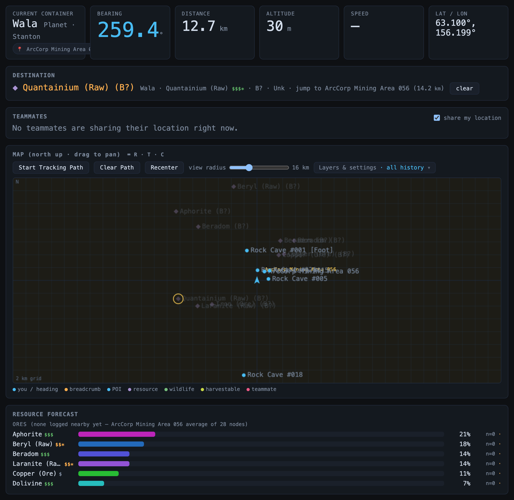
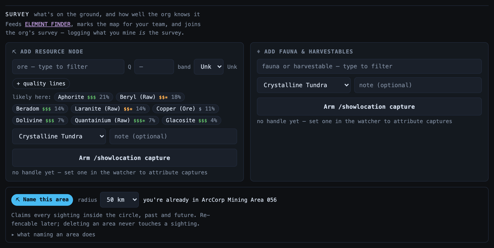
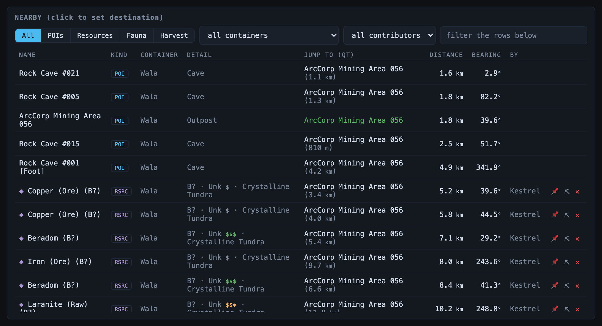

# Resource Navigator

> Live turn-by-turn navigation from your in-game position to any POI, resource node, or piece of wildlife — the core the whole suite is built on. **Route:** `#/nav` · **Launcher group:** Out in the 'Verse

  

## What it is

Star Citizen doesn't give you a HUD marker for "the cave three org-mates found
last week" or "the Laranite node someone logged an hour ago." The in-game map
shows official points of interest, but everything your own org has actually
found lives nowhere — until someone remembers roughly where it was and tries
to eyeball it from orbit.

The Resource Navigator closes that gap. A tiny watcher script on your gaming
PC watches `Game.log`; when you run `/showlocation`, it forwards your raw
coordinates to the server, which resolves them into your container, your
latitude/longitude/altitude, and a live bearing, distance, and ETA to your
destination — then pushes all of it over WebSocket to a browser on a second
device, a laptop or phone next to your keyboard, so you get real navigation
without alt-tabbing out of the game.

It's also where the org's shared knowledge lives. Every resource node,
harvestable, or wildlife sighting anyone captures here becomes searchable,
mappable, and — for ores — priced, so the next miner who opens the app sees
not just "a node was here" but "a node was here, and it's worth chasing."

## How to use it

### Live position and destination guidance

1. Open the app (it's the default view — `#/nav`, also reachable as `#/main`)
   on a second device while you're in-game.
2. Run `/showlocation`. The watcher on your gaming PC picks up the clipboard
   copy and posts it to the server automatically — nothing to type in the
   browser.
3. The **readouts** row fills in: `CURRENT CONTAINER`, `BEARING`, `DISTANCE`,
   `ALTITUDE`, `SPEED`, and `LAT / LON`, updating live as new positions arrive.
4. Click a row in `NEARBY`, `SEARCH`, or the element finder to set it as your
   `DESTINATION`; the panel shows the target name and a `clear` button.
5. Run `/showlocation` again as you travel — `BEARING` and `DISTANCE`
   recompute against your new fix so you can steer toward the target live.

### The map

The `MAP` panel is a north-up canvas centered on your last known position —
drag to pan, and use the `view radius` slider to zoom from half a kilometer
out to 50 km. `Start Tracking Path` / `Clear Path` draw a breadcrumb trail as
you move; `Recenter` snaps back to your live position. The **Layers &
settings** panel holds the rest:

- **Layers** — `path`, `POIs`, `resources`, `wildlife`, `harvestables`,
  `teammates`, and `survey areas` (the circles of any named area that reaches
  your view).
- **labels** — a slider that scales the node markers and their text, for when
  the map is on a small screen across the desk.
- **Filters** — `fresh only`, `this shard`, `survey marks` and `show mined`
  (see NEARBY below).
- **heatmap** — shades the map by the most-likely ore or harvestable, built
  from the org's all-time sightings.

Keyboard shortcuts while the map has focus: `R` recenter, `T` toggle path
tracking, `C` capture a POI at your current position.

### Where you are

The `CURRENT CONTAINER` readout names your body and system. Standing inside
a named survey area adds a `📍` chip with the area's name and sighting count —
click it to open that area's card in Prospector's ATLAS. Out in deep space
the same spot shows a `☄` chip when you're inside an asteroid belt (an Aaron
Halo band in Stanton, or a Glaciem Ring pocket in Nyx), which links straight
to Prospector's FIELD tab.

### Capturing: SURVEY and NAVIGATION

The capture forms are split into two bands, because they record two
different things.

**SURVEY** — *what's on the ground, and how well the org knows it.* It sits
right under the map and the forecast, because surveying is a back-and-forth:
read the forecast, log what you actually found, look again.

1. **`⛏ ADD RESOURCE NODE`** — pick the ore. The picker is a type-to-filter
   list that puts the ores the forecast says are likely here first, each with
   its percentage, and the top few also appear as one-tap chips under the
   form. Any name you type is accepted, even one the feed has never heard of.
2. Enter the ore's quality as **`Q`** (0–1000), read off the ore's own line in
   the rock scan — "74.45% QUANTANIUM (RAW) 344" is Q344. The **`band`**
   (1–8) fills in from it automatically; pick a band by hand only for an older
   scan, or leave it `Unk`.
3. If the scan lists the same ore more than once at different qualities,
   click **`+ quality lines`** and enter each line's share and Q (`+ line` adds
   another). The headline Q becomes their share-weighted average, so two
   members reading the same rock record the same number. Only lines of the
   node's own ore go here — another ore on the same scan isn't a sighting of
   that ore.
4. Pick the **biome** (the list narrows to your current body, and inside a
   named area the biomes logged there come first, with the most-chosen one
   preselected), add an optional note, and click **`Arm /showlocation
   capture`**. The button turns gold once there's an ore to capture.
5. Run `/showlocation` in-game. The next position fix becomes the node's
   location — no coordinates to type. The form shows `ARMED — run
   /showlocation` until then; `cancel` backs out.

  

**`⚘ ADD FAUNA & HARVESTABLES`** works the same way with one picker for both
creatures and plants — its "likely here" shortlist keeps harvestables and
fauna in separate groups.

**Naming an area.** On a planet or moon, the SURVEY band ends with **`⛏ Name
this area`** and a `radius` choice (5, 10, 25 or 50 km). Naming a circle
claims every node, plant and creature anyone has *ever* logged inside it, and
it keeps collecting on its own afterwards — there's nothing to tag and
nothing to arm, so normal mining *is* the survey. The area then shows up in
Prospector's ATLAS with what's in it, a value tier per lane, and how well
it's covered. If you're already standing in one, the block says so instead.
Deleting an area never touches a sighting.

**NAVIGATION** — *places you'll come back to.* **`ADD CUSTOM POI`** takes a
name, a type (Outpost, Cave, Derelict, Wreck, Orbital Marker…) and an
optional note, then the same `Arm /showlocation capture` → `/showlocation`
flow. Flag it `QT marker` if routes may quantum-jump to it, or `🔒 private`
to keep it to yourself.

Every form ends with a credit line: `captures credited to <your handle>`. The
watcher reads the account you're signed in as straight out of `Game.log`, so
there's normally nothing to set up. If the handle it reports is already
bound to another member, the line warns you that captures stay unattributed
and links to Settings, where an admin can sort it out.

### NEARBY and SEARCH

  

`NEARBY` lists every POI, resource, fauna sighting, and harvestable close to
your last fix, filterable by kind (`All` / `POIs` / `Resources` / `Fauna` /
`Harvest`), container, contributor, or free text; click a row to set it as
your destination. `SEARCH` runs the same lookup across everything the org has
ever recorded, not just what's nearby — the filter bar only narrows the rows
already on screen.

Each node row has two actions besides delete:

- **`📌` pin** — a personal bookmark. A pinned node stays in your NEARBY list
  and on your map so you can fly back to it, and carries a 📌 in its name.
  Only you see your pins.
- **`⛏` mark mined** — shared with the whole org. A depleted node drops off
  everyone's live NEARBY list and map. Tick `show mined` in Layers & settings
  to bring them back in browse/search, where you can un-mark one.

The other filters in Layers & settings govern what NEARBY and the map show by
default. **fresh only** hides resource, fauna and harvestable sightings older
than the org's freshness window (Star Citizen respawns them, so stale hits
mislead you) — uncheck to see the full history. **this shard** hides nodes
seen on a different server than yours; untagged older sightings stay visible
either way. **survey marks** shows Prospector's belt-survey marks, which are
hidden by default so hundreds of them don't swamp real POIs.

### Resource forecast and element finder

`RESOURCE FORECAST` ranks the ores and harvestables most likely nearby, each
with a likelihood bar, a sample count, and a value chip. It weighs what's been
logged close to you first; for the wider picture it uses the named area
you're standing in, or the whole body when you're not in one. Each section's
header says which (for example "3 nodes nearby · 41 in <area name>"), and a
small dot marks rows with fewer than four samples.

`ELEMENT FINDER` flips the question: pick an ore or harvestable and get a
ranked table of where to find it — `LIKELIHOOD`, nearest known spot (`GO
TO`), nearest QT marker (`JUMP TO (QT)`), `TRAVEL` distance, `TYPICAL BAND`,
and `SAMPLES`, ordered by `most likely`, `nearest`, or `best value (from
here)`. Belt ores with no fixed POI get an `IN THE BELTS` section of
org-measured survey clusters instead.

## Features

- **Live bearing/distance/ETA** to any POI, resource node, or wildlife
  sighting, recomputed on every `/showlocation` — no manual math, no alt-tab.
- **North-up map** with pan, zoom, label scaling, breadcrumb path tracking,
  per-layer visibility, heatmaps, and keyboard shortcuts.
- **One-click capture** for resource nodes, fauna/harvestables, and custom
  POIs — armed in the browser, placed by your next live position fix.
- **Real scan quality** — record the Q straight off the rock scan, or every
  quality line of the ore; the band is worked out for you.
- **Forecast-first pickers** — the ore and fauna/harvestable fields lead with
  what's likely right where you're standing, and biomes logged in your area
  come first.
- **Named survey areas** — claim a circle of ground and every past and future
  sighting inside it rolls up into an area the whole org can compare in
  Prospector's ATLAS.
- **Pin and mark mined** — personal bookmarks to fly back to, and a shared
  "this one's depleted" flag that clears it off everyone's map.
- **Fresh-only, shard-aware filtering** — ephemeral sightings age off
  automatically and are scoped to the shard they were actually seen on, so
  NEARBY never points you at a node that respawned elsewhere or despawned.
- **Area-aware resource forecast** — ranked "what's likely nearby," built
  from local sightings and the area (or body) you're on.
- **Element finder** — reverse lookup: pick an ore or species, get a ranked,
  travel-costed list of where to find it, including belt survey clusters for
  ores with no fixed location.
- **Ore value `$`-badges** — resource and harvestable names carry a `$`/`$$`/
  `$$$` chip (per-category value tier, from live UEX sell prices) on
  forecast rows, NEARBY, the element finder, and the capture forms, so you can
  weigh "worth a detour" at a glance. A trailing `*` marks a refined-value
  basis; no badge just means unpriced, never worthless.
- **Live teammate presence** — a `TEAMMATES` roster and map markers for
  org-mates currently online, with a `share my location` opt-out (you still
  see theirs).
- **Automatic attribution** — the watcher reads your in-game handle from
  `Game.log`, so captures are credited to you without typing a name.

## Works with the rest of the suite

The Resource Navigator's live position feed is the backbone every other
"Out in the 'Verse" app reads from: the Cargo Planner and Trade Route Planner
use your current position to plan and replan legs, and Prospector's
post-drop refine loop and its belt-survey marks reuse the same
`/showlocation` capture flow used here — those marks then roll up into Org
Intel's Surveying stats. Areas you name here appear in Prospector's ATLAS,
and the Resource Manager can turn one into a survey goal for the org. Everything here rides the app suite's single
WebSocket, so a teammate's capture or position update shows up on your screen
without a refresh.

## Tips

- Keep the watcher running in the background during a session — every
  `/showlocation` you already run for orbital navigation doubles as a live
  position update here, no extra steps.
- Toggle `fresh only` off when hunting for something rare that hasn't
  respawned recently, to see the full sighting history instead of just
  recent hits.
- If NEARBY looks sparse right after a shard hop, check `this shard` — nodes
  on your old shard are hidden by design, not missing.
- Mining in the same patch every session? Name it once with `⛏ Name this
  area` — from then on everything you and your org-mates log there counts
  toward it automatically, and the forecast starts reasoning about that
  ground instead of the whole moon.
- Fill in `Q` rather than picking a band — it's the number the scan actually
  prints, and it keeps the band honest.
- Pin a good node before you leave to refuel; mark it mined when it's gone so
  nobody else flies out to an empty rock.
- A `$$$*` badge (with the asterisk) is still a strong signal, but sell it
  refined, not raw — the raw ore has no direct market row.

---
Part of the <a href="./README.md">SC Org Navigator app suite</a>. Design/reference spec: <a href="../product-overview.md">docs/product-overview.md</a>.
