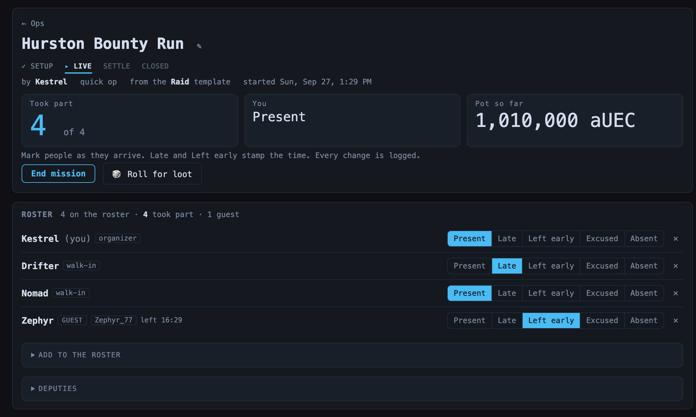
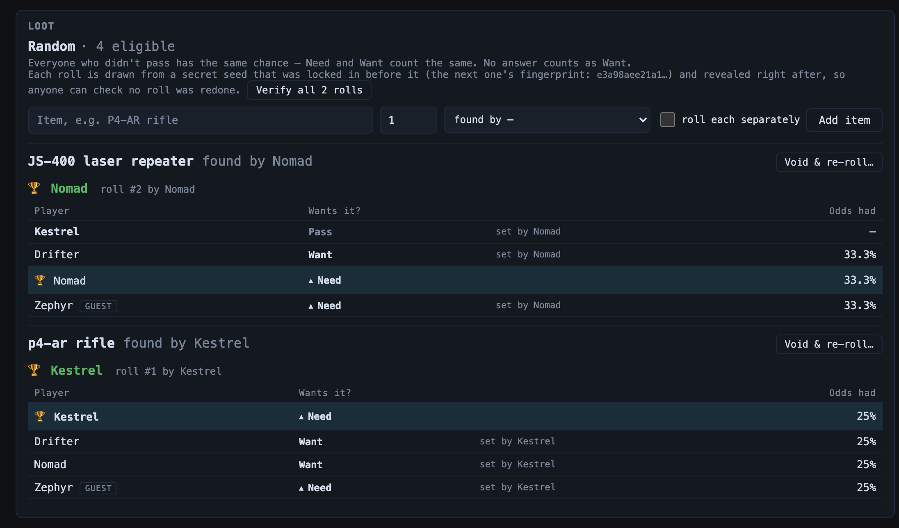
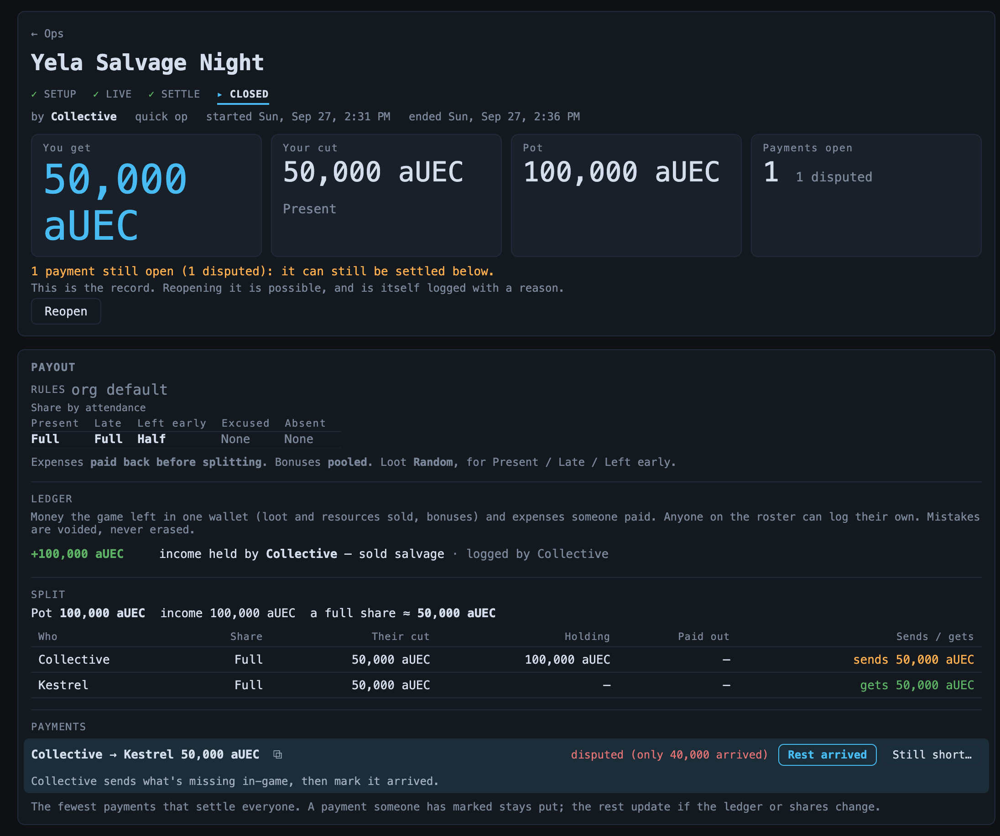

# Ops

> Run a mission and keep an honest record — check people in, add guests,
> split the money, roll the loot, and log every change so nobody argues about
> who was there. **Route:** `#/ops` · `#/ops/<id>` · **Launcher group:** Rally the Org

  

## What it is

The [Event Planner](event-planner.md) gets people to sign up. What actually
happens on the night is a different question: who turned up, who came late or
left early, who brought a friend from outside the org, how much the op made,
who's holding it, who gets the rare drop. That usually lives in someone's head
and a Discord argument the next day.

Ops is the running instance of a mission and its permanent record. It moves
through four phases — **Setup → Live → Settle → Closed** — and each phase
shows only the tools for that job. The organizer (and any deputies) mark
attendance as people arrive; anyone on the roster logs the money they're
holding or spent; the app works out each person's cut and the fewest payments
that settle everyone; and loot is rolled on the spot in a way anyone can check
afterwards. Every change, by whom and when, goes in an append-only **LOG**
that can't be edited.

An op is either **event-linked** — started with **Run mission** on an event,
so the signups, contracts and payout rules are already there — or a
**quick op** for a spur-of-the-moment run with no event behind it. There's
also a standalone **Loot roll** for a rare drop when no op is running.

## How to use it

### Start an op

1. **From an event**: on the event page, the organizer or an admin clicks
   `Run mission`. The op opens with everyone who signed up (going,
   waitlisted, maybe) and the organizer on its roster, tagged with how they
   signed up, plus the event's contracts and payout rules.
2. **Quick op**: open **Ops** from the launcher (`#/ops`). Under
   **Quick op**, type a name (e.g. `Tuesday salvage`), optionally pick a
   template (its name, contracts and payout rules come with it), and click
   `Start quick op`.
3. The Ops home lists what's **Running now**, what's **Settling up**, any
   payments **Waiting on you**, and **RECORDS** (`All` or `Mine`). Quick ops
   also appear on the Event Planner's board and calendar.

### Setup — build the roster

- Open **Add to the roster**: search an **Org member** (type 2+ letters), or
  add a **Guest (not in the org / not on Discord)** with an optional RSI
  handle, then `Add guest`. Guests share money and loot like anyone else but
  don't get stats until they join the org. Members who hide from the
  directory won't show in the search; they can add themselves.
- **Walk-ins**: anyone not on the roster sees `I'm here — add me`. It puts
  you on the roster; the organizer still marks your attendance.
- **Deputies** (organizer or admin): add co-leads who can run the op with you
  — mark attendance, add people, change phase.
- Set the **Payout rules** (`Change`) and add **CONTRACTS** now if you
  didn't on the event.
- When ready, `Start mission`. Nothing counts as attendance before this.
  A setup op that never started can be thrown away with `Discard`.

### Live — mark attendance and log as you go

1. Mark each person `Present`, `Late`, `Left early`, `Excused` or `Absent`.
   `Late` and `Left early` stamp the time. When the rest are all one way,
   use `Mark the N unmarked Present` (`…or Absent`) — it never touches marks
   already made.
2. **CONTRACTS**: everyone on the roster ticks `I have it` for each contract;
   the row shows `N/M have it`, and hovering it names who still needs it.
   Contracts are paid by the game in equal cuts to everyone who has them, so
   they sit beside the pot as a checklist, never in the split.
3. **Ledger** (in **PAYOUT**): log money as it happens — `Income` (loot or
   resources sold), `Bonus` (achievement bonus cash) or `Expense` (with a
   category), the amount, who holds or paid it, and a note, then `Log it`.
   Anyone on the roster can log their own; the organizer can log for anyone.
   A mistake is voided with `✕` and stays on the record, struck through.
4. Readouts at the top show how many are unmarked (or took part), your own
   status, and the **Pot so far**.
5. `End mission` when the op is over.

### Loot

  

1. A manager adds an item (`Add item`) — name, quantity, who found it, and
   `roll each separately` for a stack. Mid-mission, `🎲 Roll for loot` in the
   header jumps straight to it.
2. Everyone eligible taps `Need`, `Want` or `Pass` on their own row (a
   manager can set it on someone's behalf, and the row says so). Every answer
   is visible to everyone. No answer counts as Want; people not yet marked
   can't roll until they are.
3. The manager clicks `Roll`. The confirm shows everyone's answer and odds,
   and answers lock. The winner shows with a 🏆 and the roll number.
4. How the winner is picked is part of the payout rules (**Loot rolls**):
   - **Random** — everyone who didn't pass has the same chance.
   - **Weighted** — Need counts for more than Want (`Need weighs` ×1 to ×2),
     and so does recent attendance, capped at ×2 so a newcomer always has a
     real chance.
   - **Round robin** — items go in turn order to the next person who didn't
     pass. Passing keeps your place; the winner goes to the back. Name the
     **Rotation** (e.g. "Friday bunkers") to carry the turn order to the next
     op.
   - **Who can roll** picks which attendance statuses are eligible.
5. **Verifiable rolls**: each random or weighted roll is drawn from a secret
   seed whose fingerprint is shown before the roll and revealed right after.
   Anyone can click `Verify all N rolls` and their browser recomputes every
   roll from the revealed seeds. A roll that has to be redone (say, lost to a
   server crash) uses `Void & re-roll…` with a reason: the old roll stays
   struck through on the record.

### Settle — the split and the payments

  

1. Finish marking anyone unmarked — an unmarked person gets no share. Edits
   in this phase need a reason, which goes in the log.
2. **Split**: the pot (income, minus expenses if they're paid back first),
   each person's share by attendance, their cut, what they're holding and
   what they've paid out, and whether they send or get. A loss is shared the
   same way a profit would be. A manager can override one person's share
   (Full / Half / None) from their roster row, with a reason shown to all.
3. **Payments**: the fewest payments that settle everyone. Copy an amount
   with `⧉`, send it in-game, then `Mark sent`. Only the **recipient** can
   `Confirm received`. If it didn't all arrive, they click `Dispute…` and
   enter how much did — the row then shows what's still owed, and once the
   rest arrives the recipient clicks `Rest arrived` (or `Still short…`).
   A payment someone has marked stays put; the rest re-plan if the ledger or
   shares change.
4. `Close the record` once everyone is marked. Open payments stay open and
   can still be settled after closing. `Resume mission` (with a reason)
   takes the op back to Live if you went back in.

### Payout rules and amendments

The rules come from the event (or template), or your org's defaults set by an
admin in Settings › Apps (**OPS PAYOUT DEFAULTS**). Chips beside **Rules**
show how this op differs from the org default. They can be changed freely in
Setup; after the mission starts, a change is an **amendment** — it needs a
reason, bumps the rules version, and everyone sees a "Rules amended mid-op"
banner.

### Closed — the record

- The closed op is the record: attendance, the split and the loot. Closing an
  event-linked op marks its event completed.
- If an admin has set up a Discord channel for Ops (or, failing that,
  Events), closing posts a summary there: who attended by status, the pot and
  a full share, open payments, and loot winners. It pings nobody. Reopening
  posts a note, and closing again posts as an update.
- `Reopen` (with a reason) brings a closed record back to Settle. Every
  reopen is in the log.

### Loot roll (no op needed)

On the Ops home, **🎲 LOOT ROLL** rolls for a single drop: say what dropped,
add who's in (org members and guests), pick the mode, and `Start roll`. Share
the page with `Copy link` so everyone picks Need, Want or Pass on their own
screen. It uses the same rules and Verify as an op's loot. `Done` closes it
(it can be reopened with a reason); open and recent rolls are listed under
the tool.

### Your ops and the org's

- **Settings › My ops** (only you see it): how many closed ops you attended,
  how many you ran, how often you showed up when you'd signed up Going, any
  payments waiting on you, and a list of your closed ops.
- **Org Intel › Leaderboards › Attendance**: ops attended, counted from closed
  records. It's a count only — no public surface shows a no-show rate.
- **Admins** see each member's op figures (attended, run, showed up when
  signed up) in Org Intel's member directory, and
  **OPS GUESTS → MEMBERS** in Settings › Members links someone who ran ops as
  a guest to their member account once they join. It suggests matches by
  name or RSI handle, but nothing is linked until you click; their share,
  payments and loot move with them and each op logs the link.

## Features

| Area | What you get |
|---|---|
| Two ways in | Event-linked ops (signups, contracts and rules carried over) or a quick op with an optional template. |
| Phases | Setup → Live → Settle → Closed, each showing only its tools; Resume and Reopen need a reason. |
| Attendance | Present / Late / Left early / Excused / Absent, arrival and leave times, bulk-mark the rest, walk-in self-add, guests with RSI handles, deputies. |
| Money | Ledger of income, bonuses and expenses; shares by attendance; per-person overrides with reasons; a split that adds up exactly; the fewest payments, confirmed by the recipient, with disputes that record how much arrived. |
| Contracts | A per-op checklist of who has each contract shared, with advertised and actual amounts, kept apart from the split. |
| Loot | Need / Want / Pass in the open; Random, Weighted or Round robin with named rotations; verifiable seeded rolls; void-and-re-roll with a reason. |
| Record | An append-only log of every change, a closed record per op, and a Discord summary on close. |
| Stats | Private My ops figures, a count-only Attendance leaderboard, admin guest linking. |

## Works with the rest of the suite

Ops picks up where the [Event Planner](event-planner.md) leaves off: the event
page shows the op's phase and links to it, the board and calendar include quick
ops and mark days with a record, and closing the op completes the event.
Templates and payout defaults are shared between the two apps. Member search
uses the org's member directory, honouring its hide-me setting. Closed records
feed the Attendance leaderboard in [Org Intel](org-intel.md).

## Tips

- Agree the payout rules on the event before people sign up — once the
  mission starts, a change is a public amendment.
- Mark people as they arrive rather than at the end; `Late` and `Left early`
  only stamp the time while the mission is live.
- If someone was expected but didn't come, mark them `Absent` rather than
  removing them — that's the honest record.
- Log money in the wallet it's actually in. The payments list then tells
  each holder exactly who to send what.
- Recipients: confirm a payment as soon as it lands, so the payer's row
  clears and the record can read as settled.

---
Part of the <a href="./README.md">SC Org Navigator app suite</a>. Design/reference spec: <a href="../event-operations.md">docs/event-operations.md</a>.
