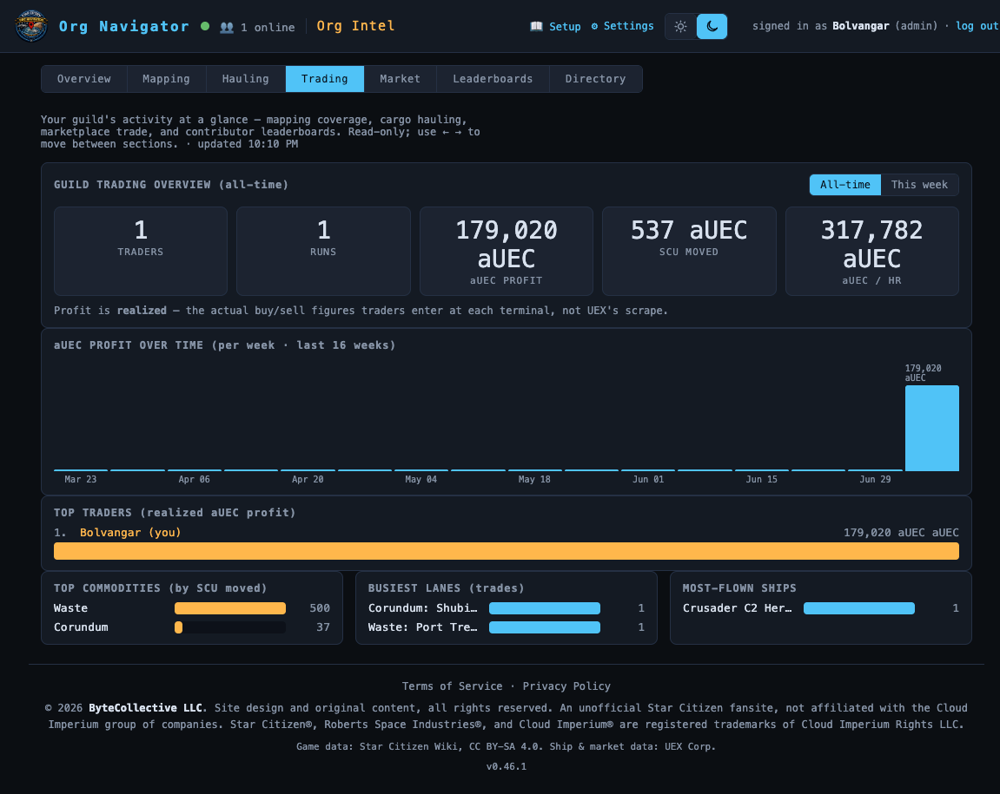
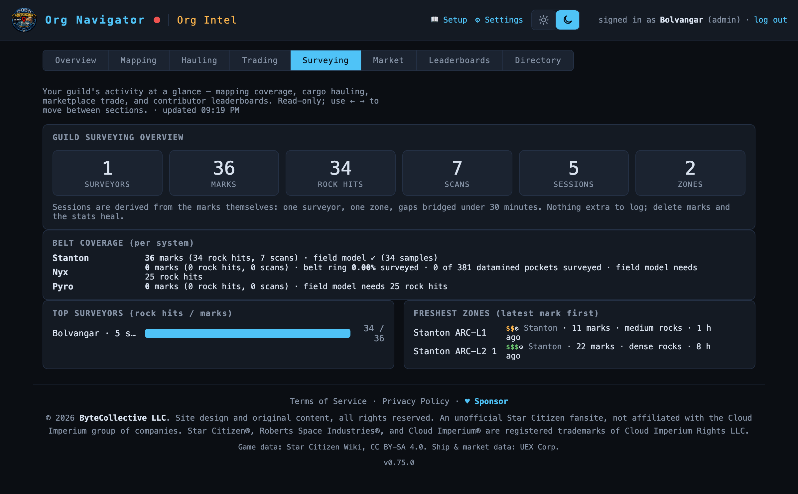

# Org Intel

> Your org's analytics deck — mapping coverage, hauling and trading activity,
> marketplace, surveying, and the contributor leaderboards, all in one place.
> **Route:** `#/intel` · **Launcher group:** Run the Org

  

## What it is

Every other app in the suite is where the org *does* things — captures a
resource node, hauls a contract, trades a commodity, surveys a belt, lists an
item on the marketplace. None of that work is worth much to the org as a whole
if it just evaporates into one member's history. Org Intel is where all of it
comes back together: a single, read-only dashboard that answers "how's the org
actually doing?" without anyone having to ask around Discord or dig through
someone else's session.

It's built entirely from data the rest of the suite already has. There's no
separate reporting step, no form to fill out, no admin who has to compile
numbers — you play the game, use the tools, and the deck updates itself. Open
`#/intel` and you get org-wide totals for mapping coverage, cargo hauling,
trade-route profit, belt surveying, marketplace volume, and per-contributor
leaderboards, plus (if you're an admin) a member directory that cross-walks
Discord identity to in-game handles.

The deck is organized as eight sections you move between along one shared
masthead, each pulling from the same live server the rest of the suite talks
to. Nothing here is editable — it's a lens on activity that already happened,
refreshed every time you open or revisit a section.

## How to use it

1. Open the app launcher and pick **Org Intel** under *Run the Org*, or go
   straight to `#/intel`.
2. Move between sections using the tab strip (`Overview`, `Mapping`,
   `Hauling`, `Trading`, `Surveying`, `Market`, `Leaderboards`, and — admins
   only — `Directory`), or just press **← / →** to step through them without
   reaching for the mouse. Each section keeps its own sub-route (e.g.
   `#/intel/surveying`), so you can bookmark or share a direct link to one.
3. The intro line under the tabs restates what the deck covers and stamps
   when the current section's data was last pulled (`updated H:MM PM`).
4. If your org hasn't recorded anything yet, Overview shows a plain
   "Your org's story starts here" message with a link back into the
   navigator instead of a wall of zeros.

### Overview (`#/intel`)

The front page: one primary number and three secondary ones, each a deep
link into the section that explains it.

- **GUILD RECORDS MAPPED** — the hero figure: every POI, resource node,
  fauna sighting, and harvestable your org has logged, combined. Click it
  (or its **See the mapping breakdown →** link) to jump into `Mapping`.
- **aUEC HAULED**, **aUEC TRADED**, and **CONTRIBUTORS** ride below as
  smaller stat links into `Hauling`, `Market`, and `Leaderboards`
  respectively.
- A footer line names the current top contributor, top hauler, and top
  trader, so you can see who's carrying each category at a glance without
  opening the leaderboards.

### Mapping (`#/intel/mapping`)

Reuses the suite's dataset **Statistics** view under the Intel masthead:
a **DATASET OVERVIEW** panel (totals + a note on how much of the catalog is
your org's own vs. the imported starmap/wiki catalog), a **SIGHTINGS OVER
TIME** weekly activity chart (last 16 weeks), a **MOST-MAPPED BODIES**
breakdown stacked by POIs / Resource Nodes / Fauna / Harvestables, and
further panels breaking resource nodes down by ore, by quality band, and
fauna by species.

### Hauling (`#/intel/hauling`)

The Cargo Planner's guild-wide picture: a **GUILD HAULING OVERVIEW** panel
(All-time / This week toggle) with total aUEC earned, SCU moved, and
aUEC/hour, an **aUEC EARNED OVER TIME** weekly chart, and breakdowns of
**TOP COMMODITIES** (by SCU moved), **BUSIEST LANES** (by run count), and
**MOST-RUN SHIPS**.

### Trading (`#/intel/trading`)

The Trade Route Planner's equivalent, shown in the hero screenshot above: a
**GUILD TRADING OVERVIEW** with traders, runs, realized aUEC profit (what
was actually bought and sold at the terminal, not UEX's scraped estimate),
SCU moved, and aUEC/hour, a weekly profit chart, a **TOP TRADERS** ranking,
and **TOP COMMODITIES**, **BUSIEST LANES**, and **MOST-FLOWN SHIPS**
breakdowns.

### Surveying (`#/intel/surveying`)

The newest section: the org's belt-survey campaign (Prospector's ATLAS tab)
rolled up into one overview. It's derived entirely from the survey marks
themselves — there's no separate log to keep, and deleting a bad mark heals
the stats automatically.

  
   GUILD SURVEYING OVERVIEW for a young campaign: 1 surveyor has logged 36 marks
  (34 rock hits, 7 scans) across 5 sessions and 2 zones so far.

- **GUILD SURVEYING OVERVIEW** — six stat cards: surveyors, marks, rock
  hits, scans, sessions, and zones. A session is inferred from the marks
  themselves — same surveyor, same zone, gaps under 30 minutes bridge
  automatically.
- **BELT COVERAGE (per system)** — one line per system's belt: mark/rock-hit/scan
  counts, plus whichever coverage metric fits that belt's geometry — an
  exact swept-arc percentage for a ring belt (Nyx), a datamined-pocket
  fraction, or a "field model needs N rock hits" readout until there's
  enough data to fit one.
- **TOP SURVEYORS (rock hits / marks)** — ranked contributors.
- **FRESHEST ZONES (latest mark first)** — the most recently active zones,
  each tagged with its value tier, mark count, rock density, and how long
  ago it was last touched.

### Market (`#/intel/market`)

The Marketplace's guild-wide activity: a **GUILD MARKETPLACE** overview
(All-time / This week), an **aUEC TRADED OVER TIME** weekly chart, a **TOP
SELLERS** ranking by confirmed aUEC, and **MOST-TRADED ITEMS** by quantity.

### Leaderboards (`#/intel/boards`)

A toggle between two contributor rankings: **Contributors** (mapping —
**CONTRIBUTION TOTALS** cards plus a **WHO'S ADDING WHAT** chart stacked by
POIs / Resource Nodes / Fauna / Harvestables) and **Earners** (hauling —
**TOP EARNERS** by total aUEC delivered and **MOST EFFICIENT** by aUEC/hour
on timed runs).

### Directory (admins only, `#/intel/directory`)

Hidden from the tab strip for everyone else. Lists every member who's
signed in, cross-walking their Discord identity (nick/display name and
username) to their watcher-verified in-game handle(s) and declared
playstyle tags. A member who's opted out of member-facing directory views
(from `Settings`) still shows here with a `hidden` flag — admins always see
everyone; the opt-out only hides them from other members.

## Features

- **Zero-input analytics** — every number on the deck is derived live from
  activity in the other apps (captures, hauls, trades, survey marks,
  listings). There's nothing to log specifically for Intel.
- **Eight sections, one masthead** — `Overview · Mapping · Hauling · Trading
  · Surveying · Market · Leaderboards · Directory`, each with its own
  bookmarkable sub-route and an **← / →** keyboard accelerator to step
  between them.
- **All-time / This week toggles** on Hauling, Trading, and Market, so you
  can separate long-run totals from what's happened recently.
- **Deep-linked Overview** — the hero and stat cells aren't just numbers,
  they're links straight into the section that explains them.
- **Realized figures, not scraped estimates** — Hauling and Trading totals
  are built from what members actually confirmed at the pickup/buy/sell
  terminal, not UEX's live-quoted prices.
- **Admin-only Member Directory** with a privacy-respecting opt-out: members
  can hide themselves from other members' view of the directory; admins
  always retain full visibility, and the UI says so plainly on the panel.
- **Belt-survey campaign scoreboard** — the Surveying section turns
  Prospector's ATLAS data into an org-wide "how much of this belt have we
  actually covered" readout, per system.

## Works with the rest of the suite

Org Intel doesn't generate any data of its own — every section is a read
model over tables the other nine apps already write: custom POIs and
observations from the Resource Navigator, completed runs from the Cargo
Planner, realized trade legs from the Trade Route Planner, survey marks from
Prospector, and confirmed deals from the Marketplace. The **Directory**
section reuses the same Discord-identity and handle-binding data that
powers seller handles on the Marketplace and player labels on the
leaderboards, so a name you see in Intel is the same name (and handle) you'd
see anywhere else in the suite.

## Tips

- Bookmark a specific section's URL (e.g. `#/intel/surveying`) if that's the
  one you check most — the deck opens straight to it.
- Use **← / →** instead of clicking tabs; it's faster once you're used to
  jumping between Hauling and Trading to compare the two haulers-vs-traders
  pictures.
- Coverage numbers in Surveying are conservative by design — a belt's
  percentage or "needs N rock hits" readout only counts what's actually
  been marked, so a quiet week shows up honestly as no progress.
- If a section looks empty right after your org starts using the tool,
  that's expected — every panel needs at least one real activity of that
  kind before it has anything to show.
- Members worried about privacy should check `Settings` for the "hide me
  from the member directory" toggle — it's honest about the fact that
  admins can still see everyone.

---
Part of the <a href="./README.md">SC Org Navigator app suite</a>. Design/reference spec: <a href="../product-overview.md">docs/product-overview.md</a>.
