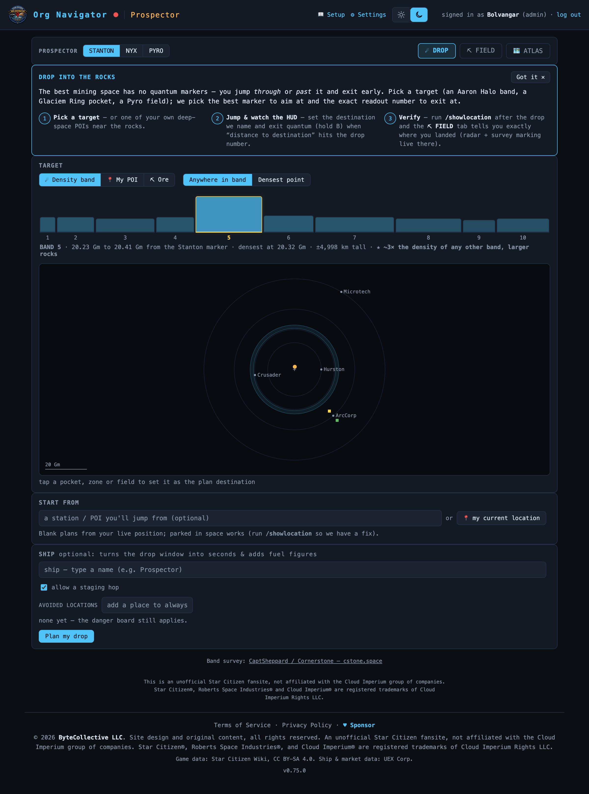
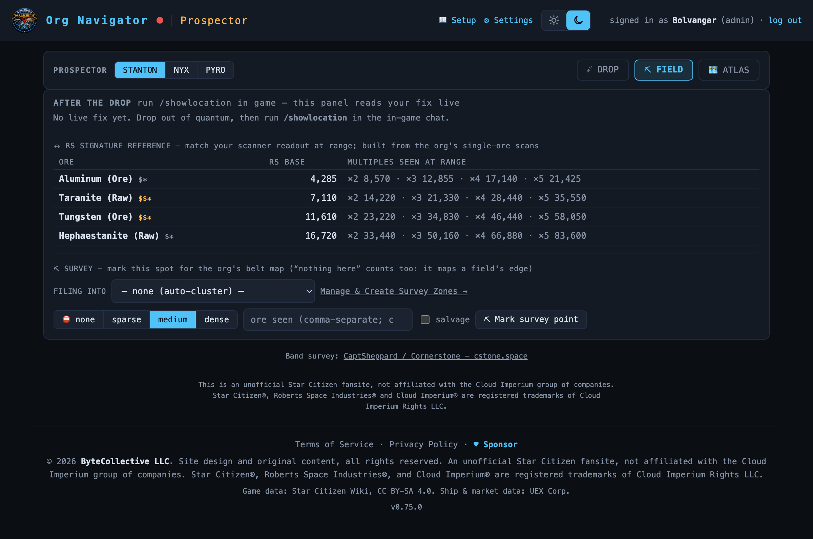
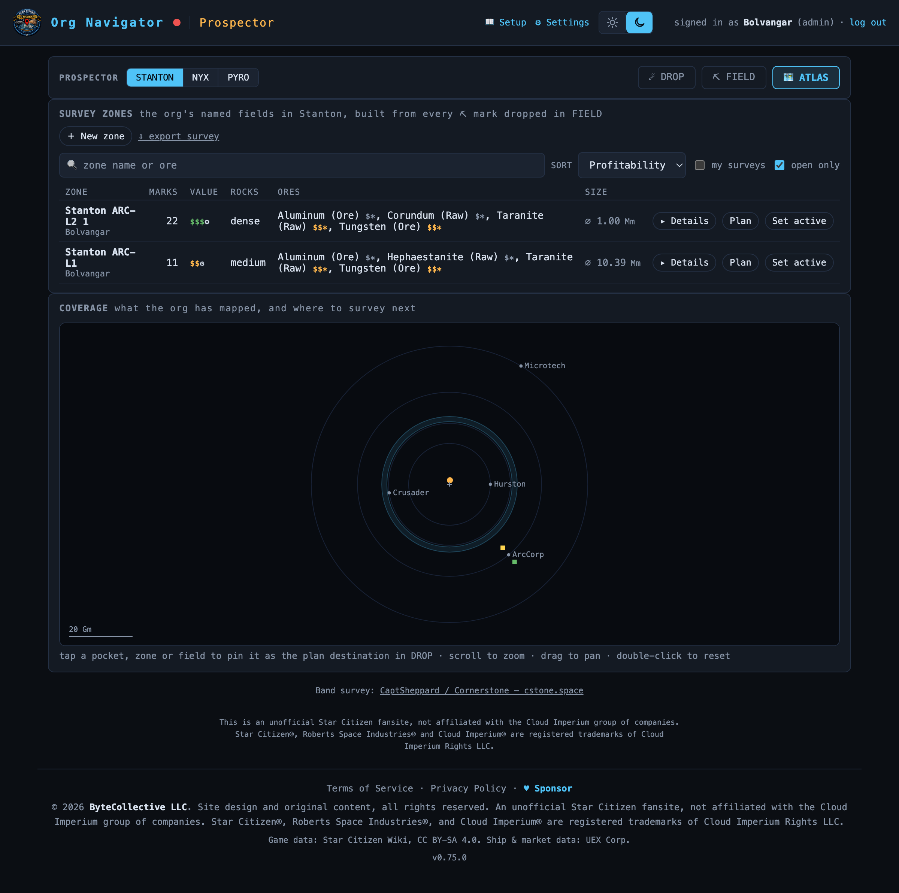

# Prospector

> Drop into unmarked rock space, navigate and survey it live, and build the org's shared belt atlas. **Route:** `#/halo` (tabs `#/halo/field` · `#/halo/atlas`) · **Launcher group:** Out in the 'Verse

  

## What it is

The best mining and salvage space in the 'verse has no quantum markers. The Aaron Halo circles all of Stanton, the Glaciem Ring circles Nyx, Pyro's resource fields hang in deep space — and you can't set a quantum destination to *any* of them. You jump *through* or *past* them on a route between two ordinary markers, watch your HUD, and hold **B** to drop out early at exactly the right moment. Miss the number and you're floating in empty space 20 gigametres from anywhere with no compass to fix it.

The community solved this for one belt with hand-drawn charts (CaptSheppard's Cornerstone survey of the Aaron Halo). Prospector generalises it. Because the tool already knows every quantum marker's true 3D position — and your live position the instant you run `/showlocation` — it can pick the best marker to aim at from *wherever you are*, compute the exact "distance to destination" readout to exit at, route around the star and planets, and then verify where you actually landed after the drop.

Prospector is three jobs in one app, split across three masthead tabs. **DROP** plans the jump. **FIELD** is the live cockpit surface after you arrive — it tells you exactly where you are and lets you ⛏ mark what you find. **ATLAS** is the org's shared belt map, built from everyone's marks: named survey zones ranked by profitability, a coverage map of what's mapped and what isn't, and an export. Formerly "Halo Finder," the app was renamed Prospector because ~90% of what the org ends up mapping is ore.

Across all three tabs, a **STANTON | NYX | PYRO** system segment in the masthead scopes everything you see.

## How to use it

Open **Prospector** from the launcher (or the `#/halo` hash). Pick your system in the masthead segment first — the target pickers, maps, zones, and export all follow it.

### ☄ DROP — plan the jump

This is the default tab (`#/halo`). It answers one question: *set destination X, jump, and exit quantum when your "distance to destination" readout hits D.*

1. **Pick a target** with the `☄ Density band` / `📍 My POI` / `⛏ Ore` segment:
   - **Density band** (Stanton) — tap a bar on the density strip to choose one of the 10 Aaron Halo bands. Band 5 is the visibly dominant jackpot (~3× the peak density of any other band). Then set the aim segment: `Anywhere in band` (a forgiving, wide drop window) or `Densest point` (a tighter window that puts you on the bullseye — best flown with a slow drive or a shallow crossing). On Nyx you pick a Glaciem Ring pocket; on Pyro you pick a named field.
   - **My POI** — target a deep-space custom POI you tagged earlier (the wreck, the good rock). No chord will hit it exactly, so the planner minimises *miss distance* and reports it honestly ("drops you ~9,400 km from POI 'Big Q Rock'"). Getting within radar range is the product.
   - **Ore** — start from an ore and let the org's survey data rank the fields that hold it.
2. **Set a `START FROM`** — type a station or POI you'll jump from, or hit `📍 my current location` to plan from your live position (it arms and uses your next `/showlocation` fix). Leaving it blank plans from your live position; parked in deep space works too.
3. **(Optional) add a ship** in the `SHIP` panel. It turns the drop window into *seconds at your quantum drive's speed* and adds fuel figures. Leave `allow a staging hop` checked so that when no clean direct jump crosses your target — blocked by the star, or you're off-plane — the planner hops you to an intermediate marker and drops you from there.
4. Press **`Plan my drop`**. You get a plan card: any staging legs, then the **DROP leg** as a big monospace readout — `Set destination CRU-L4 → jump → EXIT at 14,292,609 km` — with the enter/peak/exit window, window-seconds for your drive, a patch-proof fallback ("or watch your distance to the Stanton marker and exit at 20,320,000 km"), a copy button, and 2–3 alternate markers you can promote with one tap. A true-scale top-down system map draws the belt, your chord, and the drop zone.
5. Hit **`⛏ FLY IT →`** to pin this plan into the FIELD tab, ready for when you arrive.

### ⛏ FIELD — verify & survey after the drop

  

 FIELD reads your live <code>/showlocation</code> fix, tells you exactly where you landed versus the target, and turns every fix into a one-tap ⛏ survey mark.

When you drop out of quantum, run **`/showlocation`** in the in-game chat. The FIELD tab (`#/halo/field`) reads that fix live — and if you were on another tab when it arrived, a nudge dot lights up on the FIELD tab so you know to come back.

1. **Read the verdict.** The `AFTER THE DROP` panel classifies your fix against the belt: *"You're in band 5, 12,400 km inside, 800 km below plane,"* or *"in the 3→4 void, 22,000 km short of band 4,"* or on Nyx *"in pocket Wtn-022, 3,400 km from center."* In POI mode it shows your actual miss and offers **Refine** — re-plan from where you now are, converging over a hop or two. This verify-and-refine loop is the killer feature: the in-game compass is useless in deep space, so knowing exactly where you are is what makes the trip pay.
2. **Steer by the `⌖ POCKET RADAR`.** It's a top-down radar of your position inside the pocket — steer so the drift arrow points at the centre dot, re-running `/showlocation` as you move. Heat layers (`ROCKS` / `ORES`) tint it with the org's accumulated survey density.
3. **Match scanner readings with the `⌖ RS SIGNATURE REFERENCE` table.** Every material has a base radar signature and every rock reads an integer multiple, visible from ~25 km. The table is built from the org's own single-ore scans — it's the identify-at-a-distance cheat sheet you keep open while scanning.
4. **⛏ Mark what you find.** In the `⛏ SURVEY` block, set density (`⛔ none` / `sparse` / `medium` / `dense`), type any ores you see, tick `salvage` if relevant, and hit **`⛏ Mark survey point`**. It records your exact position as an org-visible survey mark. **"Nothing here" counts** — a `⛔ none` mark maps a field's *edge*, which is exactly the information blind drops lack. Marks file into whatever survey zone is active (the `FILING INTO` selector), or auto-cluster by proximity if none is. After a mark lands, an optional `＋ scan detail` row lets you transcribe the scanner's mass and composition percentages onto it for a real value estimate.

### 🗺 ATLAS — the org's shared belt map

  

 ATLAS gathers the org's survey data: named zones ranked by profitability with $ value tiers, and a coverage map showing what's mapped and where to survey next.

ATLAS (`#/halo/atlas`) is the data surface — useful even with no live position, even out of game.

1. **Browse `SURVEY ZONES`.** Every named field the org has mapped in the current system, built from everyone's ⛏ marks. Each row carries `$$$` / `$$` / `$` value tiers (priced from the same ore-value machinery the rest of the suite uses, refined-basis marked with an asterisk), its ores, and its size. Filter by name or ore, sort by `Profitability` / `Name` / `Most marks`, and narrow to `my surveys` or `open only`. Tap a zone for its detail card: mark timeline, contributors, ore breakdown, and the RS-multiples table.
2. **Create and manage zones.** `＋ New zone` names a field once; from then on it's your active zone in FIELD and every ⛏ mark auto-files into it — deliberate grouping, no proximity guessing. Rename, close (keeps it but off the default target list), or delete (untags its marks, never destroys them) any time. A zone works anywhere: Keeger, open Nyx, or the dead space between Glaciem's datamined pockets.
3. **Read the `COVERAGE` map.** The system overview tinted by value, with unmapped-gap arcs and a NEXT GAP hint so an expedition knows where to point next.
4. **`Plan a drop here`** on any zone or pocket pins it as the DROP target and switches you to the DROP tab — no re-typing.
5. **`⇩ export survey`** downloads the current system's marks plus the fitted model as versioned JSON — the org's own citable dataset, the Cornerstone moment industrialised.

## The three systems

Prospector plans into three genuinely different kinds of rock space, one per system-segment position:

- **Stanton — the Aaron Halo.** A continuous ring of 10 concentric density bands between Crusader's and ArcCorp's orbits, mapped by CaptSheppard/Cornerstone's 2022 survey. Because it's continuous, the "exit where your route crosses radius R" technique works and DROP offers true band targeting with a density strip. Band 5 is the jackpot.
- **Nyx — the Glaciem Ring + the Keeger Belt.** The Glaciem Ring is 96% empty: the rocks live in 381 discrete pocket containers, so aiming at a random ring crossing almost always drops you into nothing. Prospector aims chords at *pocket centres* (all 381 datamined, exact coordinates). The **Keeger Belt** at 48 Gm has no datamined geometry at all — so the org maps it itself, from ⛏ survey marks.
- **Pyro — deep-space fields.** No belt exists; instead there are ~102 unmarked resource fields (the PYR L-point fields and the RMB derelict mining sites) plus the Akiro Cluster. Each is a single fixed target, planned in POI/closest-approach mode.

## The crowd-sourced survey concept

Cornerstone mapped the Aaron Halo with 1,746 hand-taken photo samples. Prospector takes the same measurement as a one-tap side effect of normal play. Every ⛏ mark is a player-taken, in-game `/showlocation` fix at a real spot — ground truth, not an estimate. Marks aggregate immediately: a single rock-positive mark is instantly a plannable, org-wide target; more marks merge and sharpen the field's centroid and extent; around 25 marks the app fits a full field model (radial width, thickness, angular coverage) that's exportable and promotable.

Two things make this work where naïve mapping fails. **Negative marks are first-class** — a `⛔ none` "nothing here" mark maps a field's boundary as informatively as a dense one does, and the app makes it a single tap, not a failure case. And **the geometry is always derived, never stored** — recomputed from the marks, so deleting a bad mark heals the fit automatically.

## Features

- **Three target modes** — density band (Stanton), fixed-POI closest-approach, and pocket/field mode over a target set (Nyx/Pyro), all in one solver.
- **Drop *windows*, not points** — enter/peak/exit readouts robust to reaction time and server lag, plus window-seconds at your specific quantum drive's speed.
- **Obstruction-aware routing** — the star and planets are modelled as hazard volumes; when a direct chord is blocked or you're off-plane, the planner inserts a staging hop and renders it as ordinary jump legs with fuel chips.
- **Alternate markers** — 2–3 full alternate plans returned with every solve, promotable with one tap and no re-plan.
- **Verify-and-refine** — post-drop the fix is classified against the belt; POI/pocket mode offers a Refine re-plan that converges over a hop or two.
- **Live pocket radar** with rocks/ores heat layers and a drift-arrow you steer by in a compass-less void, plus a drift nudge when you leave your own coverage.
- **RS signature reference** — a per-ore radar-signature cheat sheet, built from the org's own single-ore scans, for identifying rocks at range.
- **Named survey zones** — deliberate, anywhere, org-shared; auto-tag every mark; ranked by profitability with $ value tiers.
- **Coverage map + NEXT GAP** so surveying stops being aimless wandering.
- **Export** — versioned JSON of marks + fitted model, the org's citable dataset.

## Works with the rest of the suite

Prospector shares the whole suite's live substrate. It reads your position from the same watcher + `/showlocation` + WebSocket pipeline as the Resource Navigator — no typing coordinates. Survey marks are ordinary custom POIs, so anything you ⛏ mark becomes searchable and mappable across the suite, and ore names flow through the same `$$$` value-badge machinery used everywhere else. When a Prospector fix lands inside a belt, the Navigator shows a passive "where you are" chip; capturing a rock anywhere annotates its band/pocket automatically.

The survey data also feeds **Org Intel's Surveying section** — totals, ranked contributors, per-belt coverage, and freshest zones — and threshold-crossing milestones fire **Discord** pings (opt-in, like the LFG and danger-board announcements), so an evening's mapping expedition shows up where the org coordinates.

## Tips

- **Slow drive for bullseyes.** At full cruise a 200 ms reaction can cost 10,000–57,000 km. `Anywhere in band` forgives that; `Densest point` wants a slow drive or a shallow (grazing) crossing.
- **Trust the fallback number.** The "distance to the system marker" readout works on any belt-crossing route and survives patches — use it when the named-marker guidance feels off.
- **Nyx is about pockets, not the ring.** Only ~4% of the Glaciem Ring holds rocks. Always let Prospector aim at a pocket; a bare ring crossing is a coin-flip into empty space.
- **Mark the emptiness.** A `⛔ none` mark is not a wasted tap — negative marks are what let the org draw a field's true edge.
- **Name a zone before a survey run.** With an active zone every ⛏ mark auto-files into it; without one, marks auto-cluster by proximity and two adjacent fields can silently merge.
- **On Keeger, fly station-approach chords.** With few Nyx markers, the plannable sweet spot is rocks along a station approach; a deep-belt mark far from any marker chord has no honest drop plan and Prospector will say so rather than fake one.

---
Part of the <a href="./README.md">SC Org Navigator app suite</a>. Design/reference spec: <a href="../survey-app-restructure.md">docs/survey-app-restructure.md</a>.
