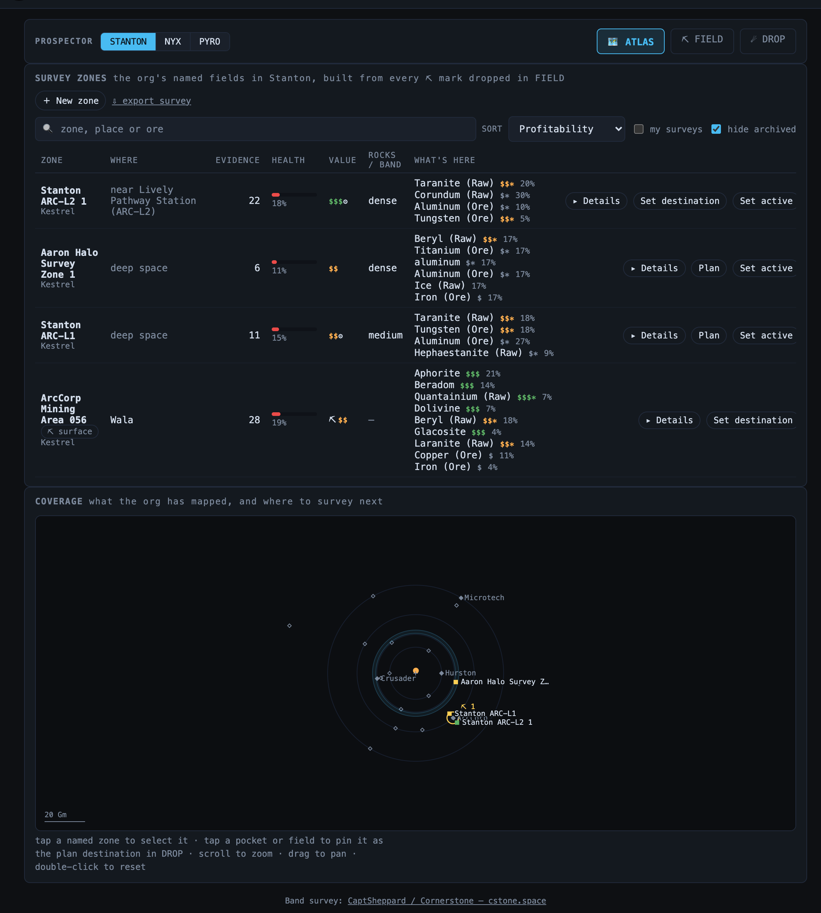
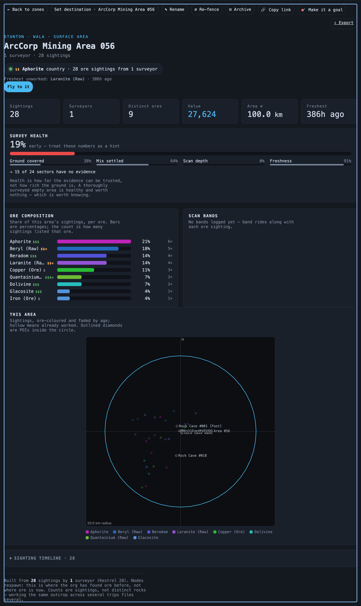
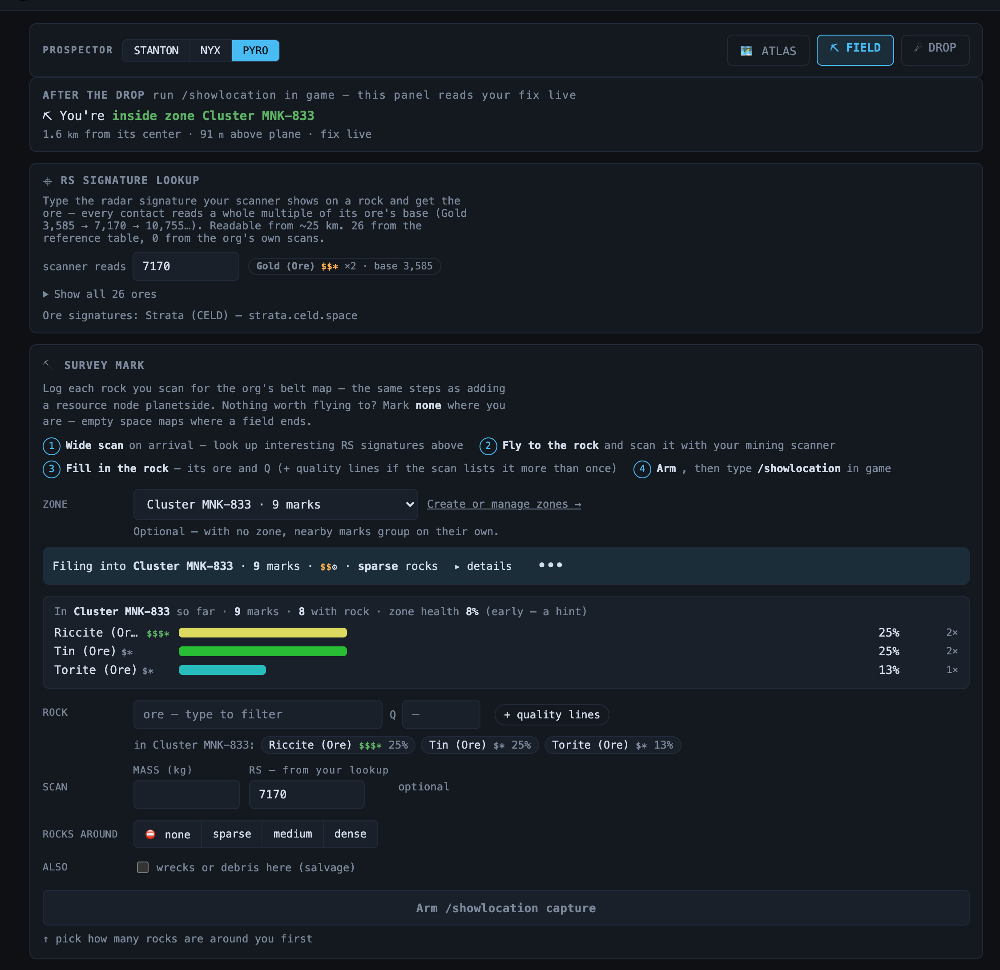
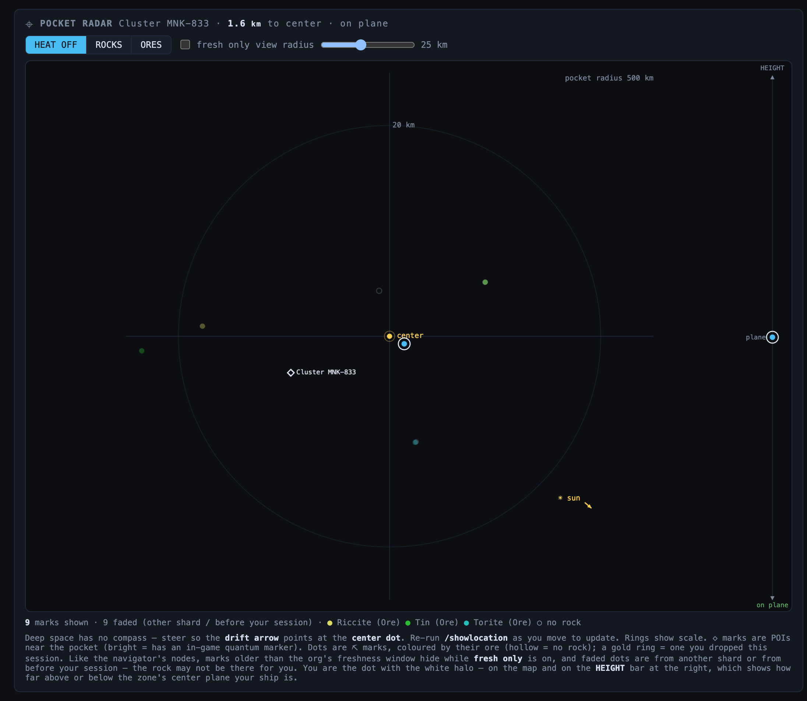
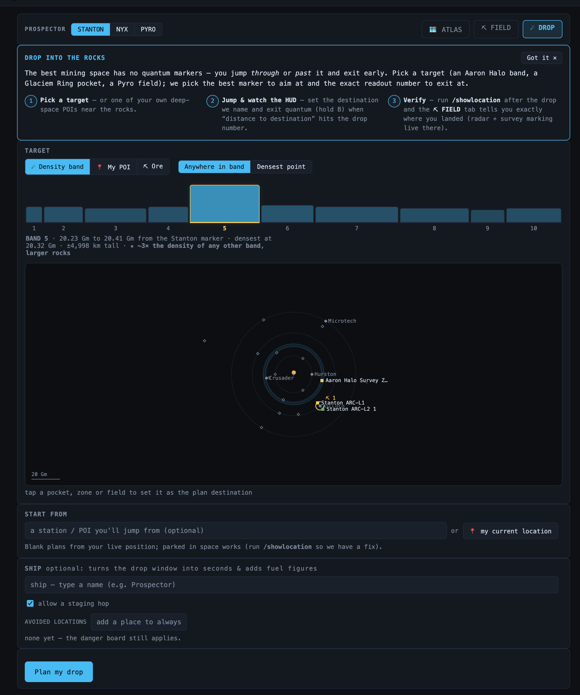

# Prospector

> The org's shared survey atlas — named areas on moons and in the belts, ranked by what's in them and how well they're known — plus a live surveying cockpit and drop planning into unmarked rock space. **Route:** `#/halo` (ATLAS) · `#/halo/field` (FIELD) · `#/halo/drop` (DROP) · **Launcher group:** Out in the 'Verse

  

## What it is

Mining knowledge in Star Citizen is mostly folklore: "there's good Quantanium somewhere south on that moon," "the rocks are past the second station." Prospector turns it into a shared map. Every time anyone in the org logs a resource node, a plant, a creature or a belt rock, the evidence lands in a **named area** that the whole org can see — with what's in it, what it's worth, and an honest read on how far the numbers can be trusted.

It also solves the belt problem. The best mining and salvage space has no quantum markers. The Aaron Halo circles all of Stanton, the Glaciem Ring circles Nyx, Pyro's resource fields hang in deep space — and you can't set a quantum destination to *any* of them. You jump *through* or *past* them between two ordinary markers and hold **B** to drop out at the right moment. Because the tool knows every marker's true 3D position — and your live position the instant you run `/showlocation` — it can pick the best marker to aim at from wherever you are, give you the exact "distance to destination" number to exit at, and then tell you where you actually landed.

Three masthead tabs, ordered by how many sessions use them:

- **🗺 ATLAS** (the landing tab, `#/halo`) — the org's survey: every named area, on the ground and in the belts. It answers *where is worth going*, and works with no live position, even out of game.
- **⛏ FIELD** (`#/halo/field`) — the cockpit once you're there: where you are, what that rock on your scanner is, and a ⛏ mark that files it into the org's map.
- **☄ DROP** (`#/halo/drop`) — plans the jump into unmarked rock space. Belts only: there is no quantum drop onto a moon, so a lot of surveying never touches this tab.

A **STANTON | NYX | PYRO** segment in the masthead scopes everything you see on all three tabs.

## How to use it

Open **Prospector** from the launcher (or `#/halo`). Pick your system in the masthead segment first — the zone list, maps, target pickers and export all follow it.

### 🗺 ATLAS — the org's survey

ATLAS lists two kinds of area side by side:

- **Surface areas** (tagged `⛏ surface`) — a named circle on a planet or moon. You name one from the **Resource Navigator**, not here: standing where you found the ore, use **`⛏ Name this area`** in the navigator's SURVEY band, pick a radius (5, 10, 25 or the default **50 km**), and you're done. Membership is **geometric and retroactive**: every node, plant and creature anyone has *ever* logged inside the circle joins the moment you name it, and it keeps collecting by itself afterwards — nothing to tag, nothing to arm.
- **Belt zones** — a named asteroid field. Create one here with **`＋ New zone`**; it becomes your active zone and every ⛏ mark you drop in FIELD files into it. A belt zone works anywhere: Keeger, open Nyx, or the dead space between Glaciem's pockets.

1. **Read the `SURVEY ZONES` table.** One row per area:
   - **WHERE** — the body, or "near <marker>" for a belt zone anchored to a quantum marker.
   - **EVIDENCE** — how many sightings or rock marks back it. A surface area splits the total by lane: ⛏ mining, ⚘ gathering, 🐾 fauna.
   - **HEALTH** — *can I trust these numbers yet?* (see below). A **`pre-<patch>`** chip here means everything was logged before the current game patch — a patch can move where ore spawns, so treat the picture as history until someone logs fresh evidence there.
   - **VALUE** — `$$$` / `$$` / `$` tiers. A surface area gets **one chip per lane** — mining and gathering are each ranked against their own kind, because a single gem sighting would otherwise outprice a whole iron patch. Fauna is never valued: nothing in the game prices an animal.
   - **ROCKS / BAND** — a belt zone's density and the average band of its scanned rocks; a surface area's average band.
   - **WHAT'S HERE** — the top finds in each lane, labelled, with their share. Ores rank by how likely you are to find them *and* what they sell for, so the list reads like the value chip broken down.
2. **Filter and sort.** Search by zone, place (a body name, or "space") or ore — it searches every lane, so typing a plant finds the area that has it. **SORT** by `Profitability`, `Name`, `Most marks`, or **`Needs surveying`** (least-trusted first — the expedition list). Tick `my surveys` or untick `hide archived`.
3. **Open the detail card** with **`▸ Details`**. A surface area shows its verdict, tiles (Sightings, Surveyors, Distinct ores, Value, Area ⌀, Freshest), the ore-composition and scan-band charts, a panel per extra lane ("What grows here", "What lives here") and the sighting timeline; a "Freshest unworked" line offers **`Fly to it`**. A belt card shows marks, rock hits, the ore chart, quality bands, the RS card and the mark timeline (with `＋ scan` to attach a readout to any mark). A belt zone anchored to a marker adds a **From <marker>** tile, a **"Freshest rich rock (B6+)"** line with **`Fly to it`**, and **`Set destination · <marker>`** — you jump to the marker and fly the last leg.
4. **Read the Survey health bar.** The card breaks the score into four bars — **Ground covered**, **Mix settled**, **Scan depth**, **Freshness** — and ends with what to do next ("14 of 24 sectors have no evidence," "the evidence is ageing — a revisit would refresh it"). Health is not value: a thoroughly surveyed empty area is healthy and worth nothing, which is worth knowing. A "nothing here" mark still covers its sector, so logging the blank ground honestly is exactly how the number goes up.
5. **Act on it.** From a row or card: **`Set destination`** (surface areas point the navigator at the nearest QT marker), **`Plan` / `Plan a drop here`** (belt zones — pins it as the DROP target), **`Set active`** (belt zones — file your FIELD marks here), **`🔗 Copy link`** (a deep link straight to the card, for Discord), **`🎯 Make it a goal`**, and **`⇩ Export`**.
6. **Manage it.** The creator or an admin gets a **`•••`** menu: **`✎ Rename`**, **`⌀ Re-fence`** (surface areas — change the radius; membership re-counts immediately), **`⊟ Archive`** / **`↻ Reactivate`** (keeps the evidence but takes it off the picker, maps and suggestions), and **`✕ Delete`** — which never touches a sighting or mark, and offers **`↩ Undo`** for 15 minutes.
7. **Read the `COVERAGE` map.** The system overview, belts and surveyed pockets tinted by value. Tap a named zone to select it (a bar names it and carries its actions); tap a pocket or field to pin it in DROP. Tap a body — or select a surface area — to open that body's own equal-area map, with heat cells, the named areas and a `view radius` slider (**`← Back to system`** returns). On Nyx the caption tracks how much of the Keeger arc is surveyed, draws unmapped gaps in amber, and offers **`⛏ Survey the next gap`**.
8. **`⇩ export survey`** downloads the current system's marks plus the fitted model as versioned JSON — the org's own citable dataset.

  

### 🎯 Survey goals

**`🎯 Make it a goal`** opens a Resource Manager goal of kind **`⛏ Survey an area`**, pre-filled with the area. Set a target in `sightings` or `different surveyors`. It counts only what's logged **after** you post it, so ground the org already works doesn't start at 100%; progress follows the area as it is now, so a re-fence moves it.

### ⛏ FIELD — scan, mark, steer

  

 FIELD in the order you work: where you are, what that contact is, then mark the rock.

FIELD (`#/halo/field`) reads your live `/showlocation` fix. If a fix arrives while you're on another tab, a dot lights up on the FIELD tab. It follows how a belt session actually goes — at range your ship shows only an RS signature and a distance, so you identify first, fly to the rock, then mark it.

1. **Read `AFTER THE DROP`.** It classifies your fix against the belt: "in band 5," "in the 3→4 void," or on Nyx "in pocket …, 3,400 km from center." After a POI or pocket drop it shows your miss and offers **`🎯 Refine from here`** — re-plan from where you now are. A plan pinned from DROP sits at the top of the tab with its drop number.
2. **Identify contacts with `⌖ RS SIGNATURE LOOKUP`.** Type the number your scanner shows next to `scanner reads` and it names the ore — every rock reads a whole multiple of its ore's base signature, readable from ~25 km. `Show all … ores` opens the full table. Where your deployment carries the published reference table, its rows come from there and the org's own scans are checked against them (agree, disagree, or org-only); the source's attribution line is printed under the table. Ship mining only — hand and ROC mining read one flat signature per category.
3. **Fill the `SURVEY MARK`.** It's the planetary **ADD RESOURCE NODE** form, control for control:
   - **ZONE** — the belt zone to file into, or `No zone — group by proximity`. With an active zone, a live panel shows what it has turned up so far — marks, rock hits, zone health and the ore mix — and marks rows that grew with ▲.
   - **ROCK** — *one* ore (the zone's likeliest ores sit one tap away under the box), its **Q** off the scan, and **`+ quality lines`** if the scan lists that ore more than once at different Q (the Q becomes their share-weighted average).
   - **SCAN** (optional) — `MASS (kg)` and `RS`, pre-filled from your lookup.
   - **ROCKS AROUND** — `⛔ none` / `sparse` / `medium` / `dense`. **"Nothing here" counts**: a `⛔ none` mark maps a field's edge, exactly what blind drops lack.
   - **ALSO** — `wrecks or debris here (salvage)`.
4. **Press `Arm /showlocation capture`**, then type `/showlocation` in game. The button reads **WAITING FOR /showlocation** until the fix lands (**`✕ Cancel`** backs out), then **✓ MARKED**. Got it wrong? **`↩ Undo this mark`** deletes the mark you just dropped — fix it and mark again. Sweeping a uniform field, **`↻ same as last mark`** re-fills the density (it never arms on its own).
5. **Steer by `⌖ POCKET RADAR`.** A top-down plot of you inside the pocket or zone — steer so the drift arrow points at the centre dot, re-running `/showlocation` as you move. ⛏ marks show as dots coloured by their ore (hollow = no rock; a gold ring = one you dropped this session). Like the navigator's nodes, **`fresh only`** hides marks older than the org's freshness window, and faded dots come from another shard or before your session — the rock may not be there for you. The **`view radius`** slider runs from `auto` (follows your path) out to the whole pocket; the **HEIGHT** bar on the right shows how far above or below the zone's centre plane you are. `HEAT OFF` / `ROCKS` / `ORES` tints it with the org's survey density, and a nudge appears when you've drifted well past your last mark.

  

### ☄ DROP — plan the jump

  

DROP (`#/halo/drop`) answers one question: *set destination X, jump, and exit quantum when "distance to destination" hits D.* **`? Intro`** in the masthead re-shows the three-step primer.

1. **Pick a `TARGET`** with `☄ Density band` / `📍 My POI` / `⛏ Ore`:
   - **Stanton** — tap a band on the Aaron Halo density strip, then `Anywhere in band` (a forgiving window) or `Densest point` (tighter — fly it with a slow drive or a shallow crossing).
   - **Nyx** — `GLACIEM RING` aims at a pocket (leave it on `AUTO — best pocket` or type one; `include mission pockets` adds the contract-gated arcs). `KEEGER BELT` aims at the org's own surveyed pockets.
   - **Pyro** — type a field (the Akiro Cluster, Lagrange fields, derelict mining sites); it plans the closest fly-by.
   - **📍 My POI** — a deep-space POI you tagged; it minimises the miss and says so honestly.
   - **⛏ Ore** — name an ore and it targets the org's best surveyed source for it, skipping fresh "mined out" reports.
2. **`START FROM`** — a station or POI, or **`📍 my current location`**. Blank plans from your live fix.
3. **`SHIP`** (optional) turns the drop window into seconds and adds fuel figures. Keep `allow a staging hop` on so a blocked or off-plane jump hops via another marker first.
4. **`Plan my drop`** — staging legs, then the DROP leg as a big readout with the enter/peak/exit window, a fallback number off the system marker, and alternates you can promote with one tap. A top-down map draws the chord.
5. **`⛏ FLY IT →`** pins the plan in FIELD, next to the live verdict and radar.

## The three systems

- **Stanton — the Aaron Halo.** Ten concentric density bands from CaptSheppard/Cornerstone's survey (credited under the tab). Continuous, so true band targeting works.
- **Nyx — Glaciem Ring + Keeger Belt.** Only ~4% of the Glaciem Ring holds rocks, in 381 datamined pockets, so Prospector aims at pocket centres. The **Keeger Belt** has no rock map in the game data — the org builds one from ⛏ marks, and every rock mark becomes a jumpable pocket. Its datamined mission arcs (violet outlines on the map) are believed contract-gated and unverified; you can pin one by key, but no marker chord passes near them, so reach one via its mining contract and ⛏ mark what you find.
- **Pyro — deep-space fields.** No belt; ~100 unmarked resource fields plus the Akiro Cluster, each planned as a closest fly-by.

## Works with the rest of the suite

Surface areas are built from the **Resource Navigator**'s node, harvestable and wildlife captures, and named from its SURVEY band; ⛏ marks are ordinary custom POIs, searchable suite-wide. Ore names carry the same `$$$` value chips used everywhere. **Org Intel → Surveying** reports totals, contributors and coverage (ore only — harvestables and fauna are contract material, not priced cargo). With a **Surveying** Discord channel set, a new belt zone can be announced (`📣 Announce it on Discord` when you create it), and milestones post when a belt zone hits 25 rock-positive marks, a belt fits its first field model, or a surface area crosses 25, 100, 250 or 500 sightings.

## Tips

- **Sort by `Needs surveying` before a run.** The weak health bar tells you whether to drive somewhere new or scan deeper where you are.
- **Mark the emptiness.** A `⛔ none` mark is coverage — it's how a field's edge and an area's health get drawn.
- **Watch for `pre-<patch>`.** One fresh sighting or rock mark after a patch clears it.
- **Name a belt zone before a survey run.** Without one, marks cluster by proximity and two adjacent fields can merge.
- **Slow drive for bullseyes.** `Densest point` wants a slow drive or a grazing crossing; trust the system-marker fallback number when the named-marker one feels off.

---
Part of the <a href="./README.md">SC Org Navigator app suite</a>. Design/reference specs: <a href="../survey-app-restructure.md">docs/survey-app-restructure.md</a> · <a href="../survey-zones-surface.md">docs/survey-zones-surface.md</a>.
