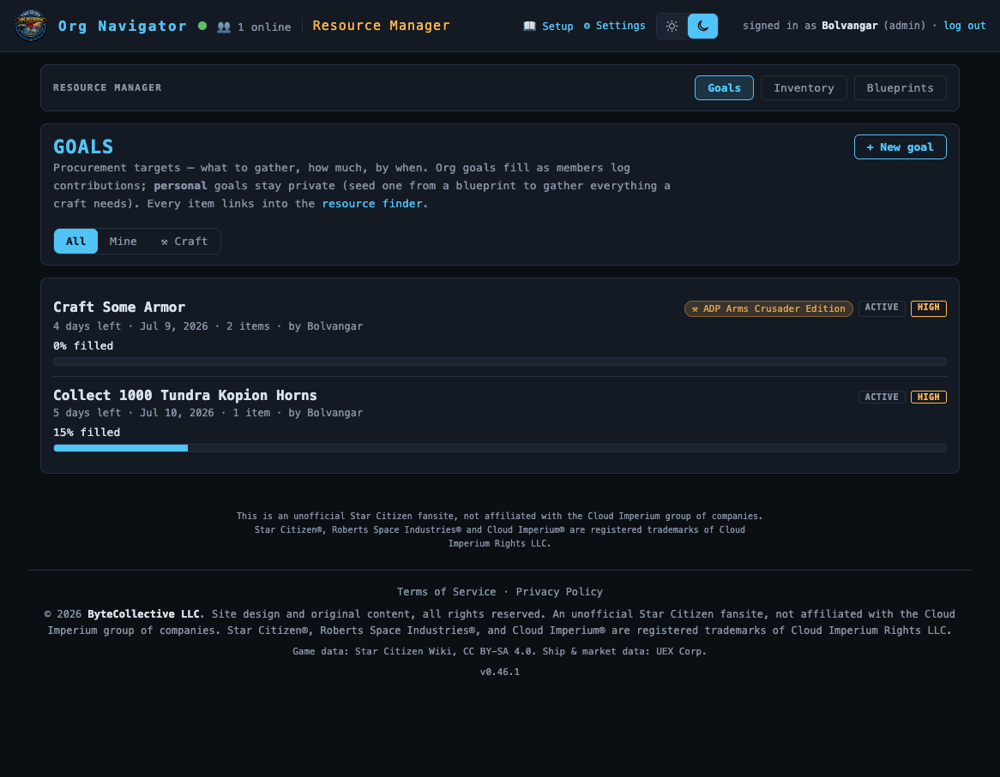
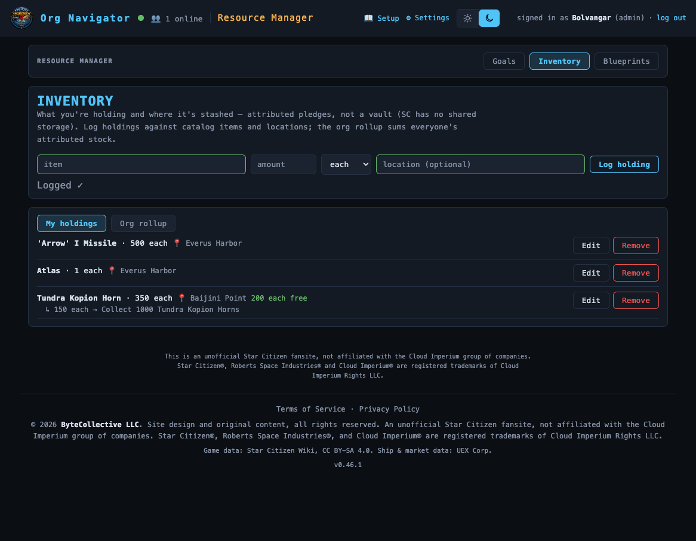
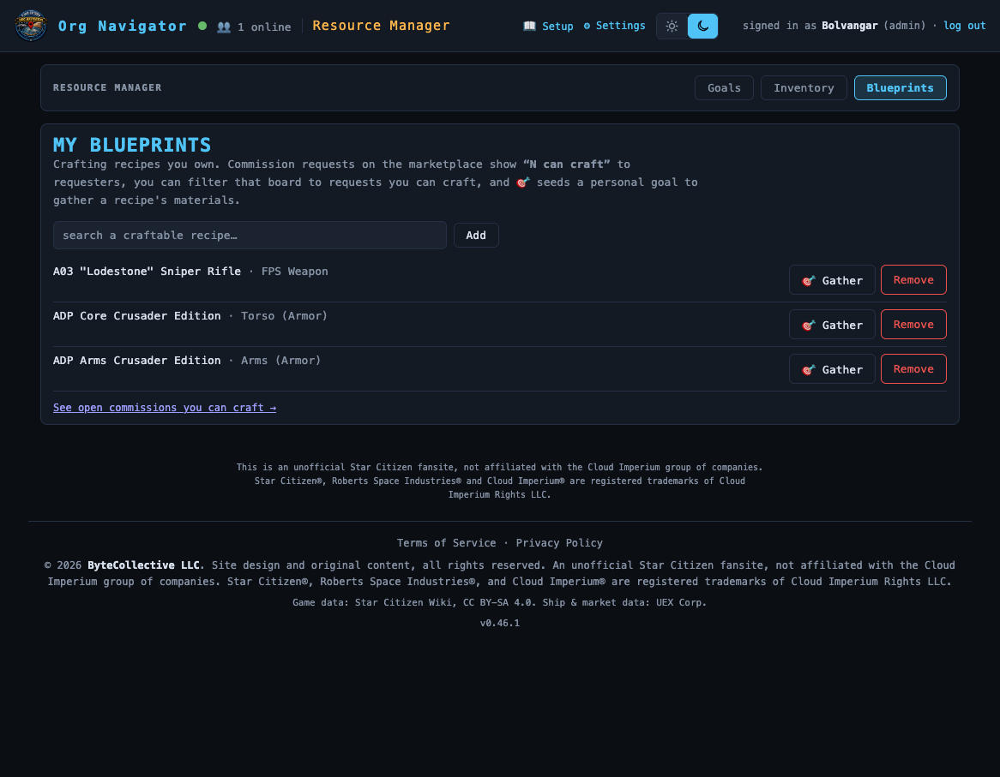

# Resource Manager

> Set procurement goals, track your holdings and where they're stashed, and keep your craftable-blueprint library. **Routes:** `#/goals` · `#/inventory` · `#/blueprints` · **Launcher group:** Run the Org

  

## What it is

Star Citizen has no shared org storage. Whatever the guild "has" lives
scattered across individual members' hangars, ship holds, and personal
inventories — there's no org bank to check and no API to read it with. So
when someone asks "do we have enough Titanium for the Hull-C yet?" the
honest answer usually requires a Discord poll.

Resource Manager turns that into a real, queryable ledger — a ledger of
*pledges*, not an escrow vault, since trust here is social. It's three peer
sections sharing one item catalog: **Goals** are procurement targets — what
to gather, how much, by when, filled from members' logged holdings so
progress is real instead of a vibe. **Inventory** is a per-member holdings
ledger — what you're personally holding and where it's stashed.
**Blueprints** is your personal library of craftable recipes, which can seed
a goal with an exact materials shopping list.

## How to use it

All three sections share one masthead with **Goals · Inventory ·
Blueprints** tabs, so you're never more than a click from any of them.

### Goals — set a procurement target

1. Open **Resource Manager** from the launcher (lands on `#/goals`) and click
   **Create the first one →** (or the new-goal link) to open the form.
2. Give it a title, optional description, a **Priority** (1–10, 1 = highest),
   and an optional **Deadline date/time**.
3. Choose visibility: an **org** goal is visible to everyone and fills from
   anyone's contributions; a **personal** goal stays private — the natural
   choice for gathering materials for your own craft.
4. Click **+ add item** per line — a catalog item (commodity, ship,
   component, or custom item) and the quantity needed — then **Create goal**.

**Seeding a craft goal from a blueprint:** instead of hand-typing line items,
pick a recipe from **My Blueprints** (see below) and click **🎯 Gather**. The
new-goal form opens pre-seeded as a personal goal with every input material
the recipe needs — resources *and* countable item ingredients (crafting
gems) — each carrying a per-slot **quality ask** (`≥Q700`, approximate band)
drawn from the recipe's quality sliders, plus a **materials-cost estimate**.

**Contributing to a goal:** open a goal card for its detail view — a fill
bar per line item (`Titanium 320/500 SCU`), an overall percentage, and a
per-contributor breakdown. Enter an amount (and optional location) under a
line item and click **Contribute**. This doesn't create a second inventory
row — it draws an **allocation** against your existing holding, topping it
up first if you're committing more than you'd logged. A goal auto-flips to
**met** once every line item's contributions reach its target, and every
line item's name links straight into the Resource Navigator's element
finder for that commodity.

### Inventory — your holdings ledger

1. Switch to the **Inventory** tab (`#/inventory`). It defaults to **My
   holdings** — the day-to-day view, not a report — with **Org rollup** one
   click away, showing everyone's holdings summed per item and expandable to
   a per-member, per-location breakdown.
2. To log a holding: pick an item from the catalog, enter an **amount**, and
   optionally a **location** (free text — "Area18 hangar" — autocompletes
   from the POI dataset). Click **Log holding**.
3. Your holdings list shows each one with its committed allocations nested
   underneath and the free remainder still available. Edit or delete your
   own rows any time — deleting a holding withdraws its allocations.

  
   
  Inventory defaults to My holdings — log what you have and where, allocate it toward goals as you commit.

### Blueprints — your craftable recipe library

1. Switch to the **Blueprints** tab (`#/blueprints`).
2. Search and **Add** any craftable recipe from the game's blueprint catalog
   (armor, weapons, components — everything the marketplace's commission
   spec builder knows about).
3. Each saved recipe shows its category and unlock availability. From here
   you can **🎯 Gather** it into a new craft goal or **Remove** it.

Your library is live data the rest of the suite reads: on the Marketplace's
commission board, a request you have the recipe for is tagged **"N can
craft,"** with a filter for **requests I can craft** — a footer link jumps
straight there. Goal seeding and the marketplace's spec builder share the
same **per-slot quality slider** model (Frame, Emitter, Aperture Iris…):
each input gets its own 0–1000 target, overall Quality/Band tracks the
weakest slider, and a materials bill totals SCU and item counts per slot.

  
   
  My Blueprints — the recipes you own, ready to seed a gather-goal or match you to a commission.

## Features

- **One shared catalog, three views.** Every commodity, ship, component, and
  custom item lives in one searchable catalog that goals, inventory, and the
  Marketplace's listing forms all draw from.
- **Allocations, not duplicate rows.** A contribution is drawn from your
  existing holding, never a second ledger entry — the org rollup never
  double-counts a holding that's partly pledged and partly free.
- **Priority + deadline goal board.** Goals sort by priority (color-ramped
  1→10 chip) then deadline, with a live countdown ("4 days left," overdue in
  red) and an overall fill bar per card.
- **Per-contributor accountability.** Every goal's detail view breaks down
  who contributed what — the payoff of an attributed ledger over a fungible
  total.
- **Personal vs. org goals, and craft seeding.** Keep a goal private for
  solo gathering or share it org-wide, and seed either kind straight from a
  blueprint with real per-slot quality asks and a materials-cost estimate.
- **My holdings by default.** Inventory opens on your own ledger, not the
  org report — the day-to-day screen is the one you land on.

## Works with the rest of the suite

The item catalog, and the **My Blueprints** library, are shared directly
with the **Marketplace** — a custom item added here shows up there, and your
library powers the commission board's "N can craft" tags and craftable
filter. Every goal's commodity line item deep-links into the **Resource
Navigator**'s element finder, turning a procurement target into "go get it"
with one click.

## Tips

- Log a holding's **location** even when it doesn't seem to matter yet — it's
  what makes the org rollup useful for logistics later.
- Contributing more than you've logged on hand tops up your holding
  automatically — no separate log-then-contribute step needed.
- Build your Blueprints library before you need to quote a commission — "N
  can craft" only counts crafters who've already added the recipe.
- A goal auto-flips to **met** the moment every line item is covered, but
  nothing stops you from reopening it for another round.

---
Part of the <a href="./README.md">SC Org Navigator app suite</a>. Design/reference spec: <a href="../rm-restructure-and-profile.md">docs/rm-restructure-and-profile.md</a>.
