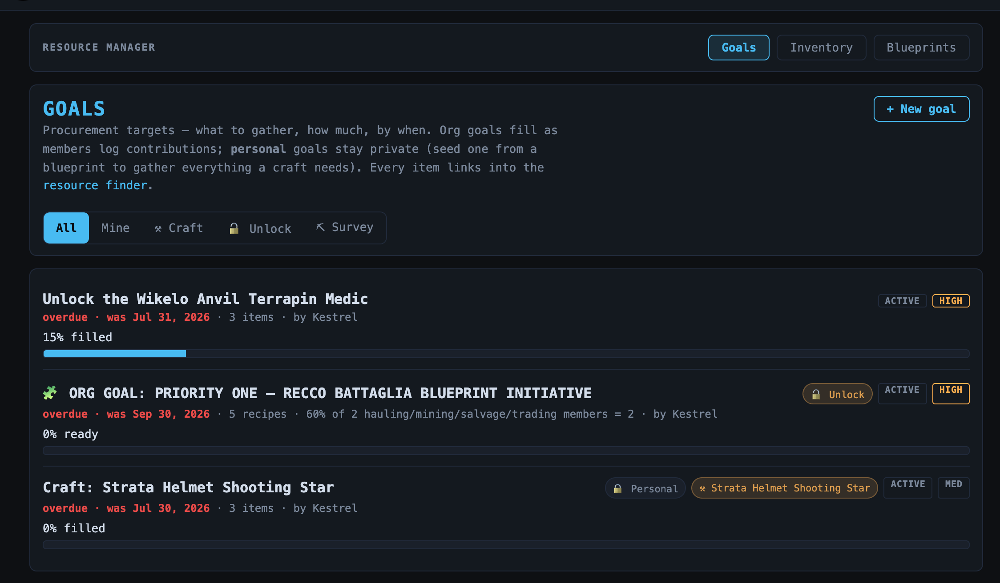
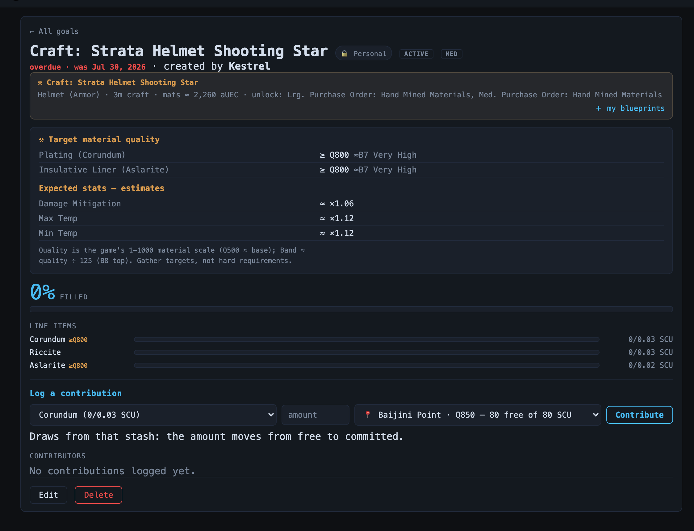
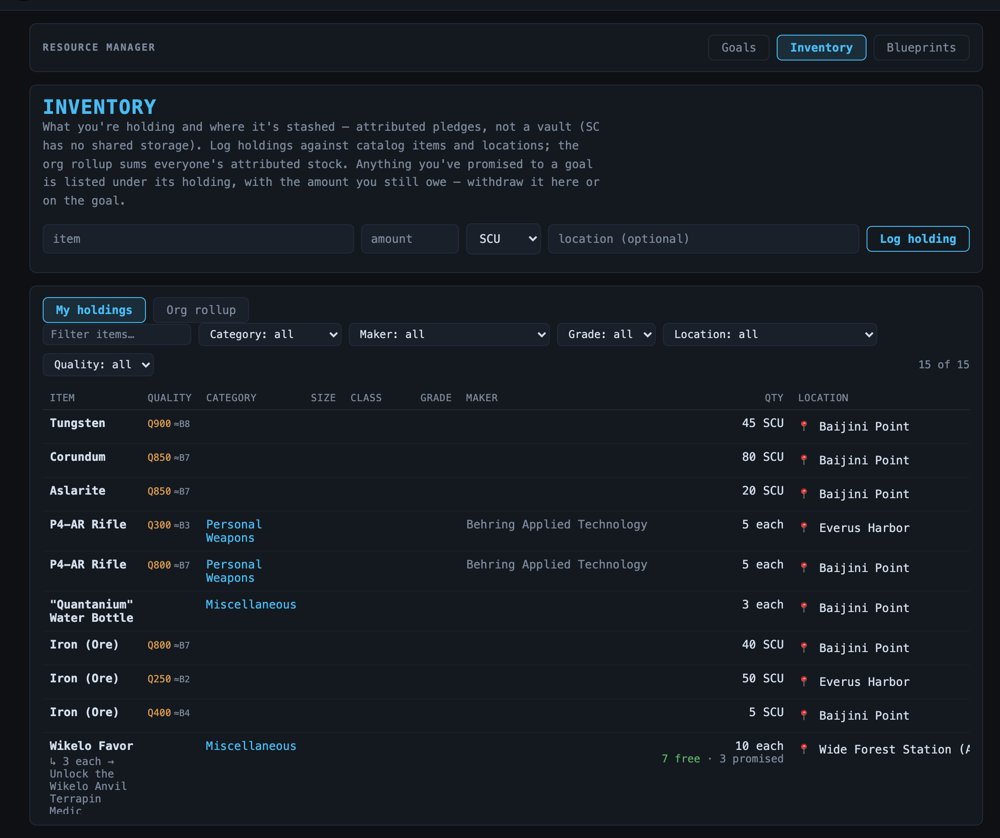
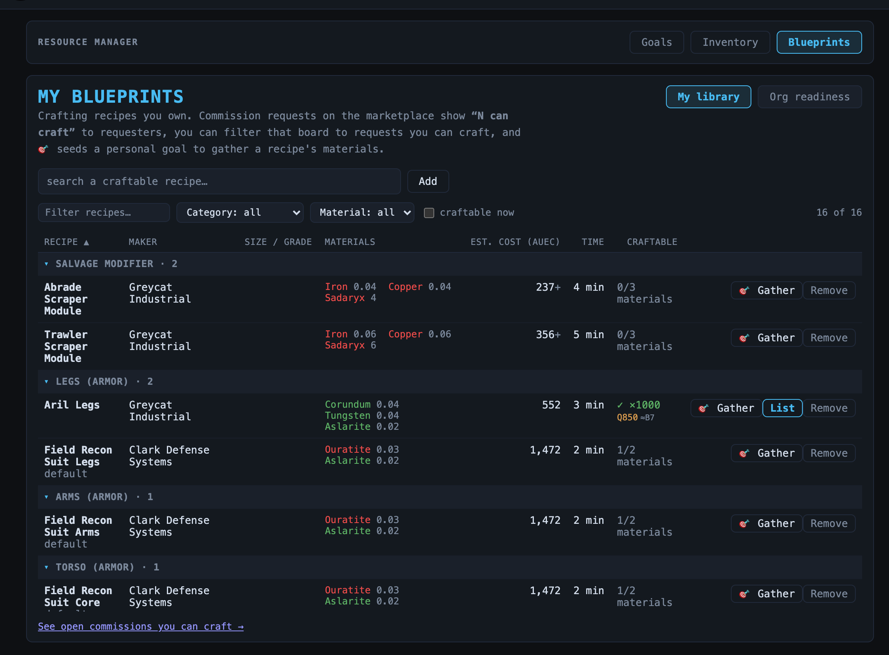
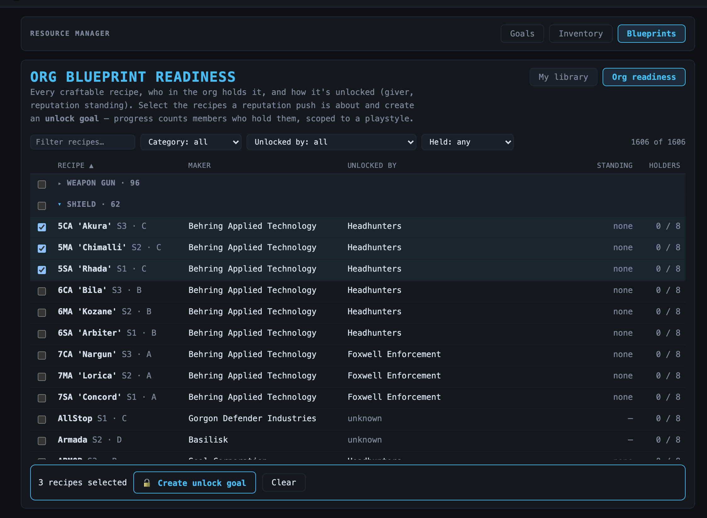

# Resource Manager

> Set org goals, track your holdings (and their quality) and where they're stashed, and keep your craftable-blueprint library. **Routes:** `#/goals` · `#/inventory` · `#/blueprints` · **Launcher group:** Run the Org

  

## What it is

Star Citizen has no shared org storage. Whatever the guild "has" lives
scattered across individual members' hangars, ship holds, and personal
inventories — there's no org bank to check and no API to read it with. So
when someone asks "do we have enough Titanium for the Hull-C yet?" the
honest answer usually requires a Discord poll.

Resource Manager turns that into a real, queryable ledger — a ledger of
*pledges*, not an escrow vault, since trust here is social. It's three peer
sections sharing one item catalog:

- **Goals** are org targets. Most are materials goals (what to gather, how
  much, by when). You can also set a **blueprint unlock** goal (get enough
  members holding a set of recipes) or a **survey** goal (log a set amount of
  evidence inside a named area).
- **Inventory** is a per-member holdings ledger: what you're holding, where
  it's stashed, and at what **quality**.
- **Blueprints** is your library of craftable recipes, laid out as a table
  that checks each recipe against your own free stock. It has a second view,
  **Org readiness**, showing who in the org holds every recipe.

## How to use it

All three sections share one masthead with **Goals · Inventory ·
Blueprints** tabs, so you're never more than a click from any of them.

### Goals: pick a kind

1. Open **Resource Manager** from the launcher (lands on `#/goals`) and click
   **+ New goal**.
2. Give it a **Title** and an optional **Description**, then pick a **Goal
   kind**: `Gather materials`, `🔓 Blueprint unlock`, or `⛏ Survey an area`.
3. Choose **Visibility**: `Org — shared` is visible to everyone and fills
   from anyone's contributions. `Personal — only me` stays private, which
   suits gathering for your own craft.
4. Set a **Priority** (`High` · `Med` · `Low`) and an optional **Deadline
   date** and **Deadline time** (a blank time means end of day).
5. For an org goal, tick **📣 Announce to the org's Discord** to post it and
   its lines to the goals channel. It pings nobody. Add **Include the full
   description** if you want the whole text and not just the first 280
   characters. Then **Create goal**.

The board filters to `All`, `Mine`, `⚒ Craft`, `🔓 Unlock`, or `⛏ Survey`.
Each card shows its priority, a deadline countdown, and an overall fill bar.

**Materials goals.** Under **Line items — what to gather & how much**,
click **+ add item** for each line: a catalog item, the quantity needed, and
an optional **min Q** quality floor (0–1000). Only lots at or above the
floor count toward that line, which suits contract hand-ins that demand a
grade. Every line's name links into the Resource Navigator's element finder
for that commodity.

**Craft goals from a blueprint.** Use **Seed from a blueprint** in the form,
or click **🎯 Gather** on a recipe in your library. Pick how many to craft,
and the form fills in every input material as a line item. The recipe's
per-slot quality sliders raise each material's gather target. The goal page
then shows **⚒ Target material quality** for each slot and **Expected stats
— estimates** at those qualities. Once members pledge rated lots, a **What's
pledged would feed** table appears. It shows the quality each slot would
really get, calls out the weakest slot and any slot below its ask, and adds a
second stats column, **with what's pledged**.

**Blueprint unlock goals.** Add the **Recipes to unlock** and set a
**Target**, either a number of `members` or a `% of scope`. **Scope** is
optional playstyle tags (from Settings › Profile); pick several to cover a
division. The goal is met when every recipe is held by that many members in
scope. Its page lists each recipe with **Held by**, **Still needed from**,
and **How it's unlocked**. If you've unlocked one, click **+ I've unlocked
it — add to my library**. The goal progresses the moment you do.

**Survey goals.** Pick a **System** and an **Area** (named in Prospector ›
ATLAS), then a **Target** of `sightings` or `different surveyors`. Only what
gets logged *after* you post the goal counts, so ground the org already
works doesn't start at 100%. Editing the goal never resets the count. You can
also start one from an area card in Prospector with **🎯 Make it a goal**.

### Goals: contribute, pledge, withdraw

Open a materials goal for its detail view. You'll see a fill bar per line
item (`Titanium 320/500 SCU`), an overall percentage, and a **Contributors**
breakdown. Under **Log a contribution**, pick the line, enter an amount, and
choose where it comes from:

- **One of your logged stashes.** These are listed by location, quality, and
  how much is free. The amount moves from free to committed on that holding.
  No second inventory row is created.
- **I have these — not logged yet.** This logs the stock into your inventory
  at the location you give (plus a quality, if it has one), then commits it.
- **I'll gather these — pledge.** This records a promise. It counts toward
  the goal, but shows as **⏳ gathering** (a hatched tail on the fill bar)
  until you log the stock.

Then click **Contribute**. If you go past what a line needs, the app asks
before it accepts. It also asks before taking a lot below the line's quality
floor. That lot is still logged against the goal, but it shows as `⚠ below
Q…` and doesn't count. Lots with no quality logged do count, and they're
flagged as **unrated**.

**My contributions** groups your commitments by location. Each one has
**Change amount** and **Withdraw**. Withdrawing hands the amount back to your
inventory as free stock, and you can also do that from the holding itself in
`#/inventory` (`✕ withdraw`). A goal flips to **Met** on its own once every
line is covered. Its creator can **Edit**, **Delete**, or re-post it to
Discord with **📣 Post to Discord**, which posts the *current* fill.

  
   
  A craft goal: pledges versus stock on hand, quality floors per line, and what the pledged lots would actually build.

### Inventory: your holdings ledger

1. Switch to the **Inventory** tab (`#/inventory`). It opens on **My
   holdings**, with **Org rollup** one click away.
2. To log a holding, pick an item, enter an amount, and optionally a
   **quality 0–1000** (shown for everything except ships) and a location
   (free text that autocompletes from the POI list). Click **Log holding**.
3. **Logging adds.** If you already have a lot of that item at the same place
   and quality, the amount is added to it ("Added 4 SCU … now 12 SCU ✓").
   To set an exact figure, use **Edit** on the row.

**Quality and lots.** A holding is one *lot*: item, location, and quality.
Ten SCU of Q800 Iron and ten of Q300 at the same station are two rows.
Leave quality blank when it's unknown (**unrated**). `Q0` is the game's
station-bought value, shown as `Q0 bought`, not a low grade. Each lot shows
its approximate band (`Q344 ≈B3`).

Each row in My holdings shows **Quality**, **Qty**, and **Location**. Any goal
commitments are nested under the item with the free remainder and anything
still `⏳ to gather`. The row actions are:

- **Edit**: change the amount, unit, location, or note. Once part of a lot is
  pledged to a goal, its quality is locked so the goal's progress can't
  silently move.
- **Split**: move part of the free stock into a lot at a **New quality**
  and/or location. ("Of my 100 SCU, 40 turned out to be Q900.") It's also the
  way to re-rate stock that backs a pledge, because the pledged part stays
  put.
- **Sell**: open a marketplace listing pre-filled with this lot's free
  quantity, quality, and location.
- **Remove**: delete the holding (any goal contributions from it are
  withdrawn too).

A filter bar (**Filter items…** plus Category, Maker, Class, Grade, Size,
Location, and Quality dropdowns) narrows either view. **Org rollup** sums
everyone's holdings per item with **Total** and **Holders** columns. Expand a
row for its per-member and per-location breakdown, plus how much sits in each
quality band.

  
   
  My holdings: one row per lot (item, place, quality), with goal commitments nested underneath.

### Blueprints: your recipe library

1. Switch to the **Blueprints** tab (`#/blueprints`). It opens on **My
   library**.
2. Search a craftable recipe and click **Add**.
3. Your library is a table grouped by category. You can sort it by **Recipe**,
   **Maker**, **Size / Grade**, **Materials**, **Est. cost (aUEC)**, **Time**,
   or **Craftable**. Narrow it with **Filter recipes…**, a Category or
   Material dropdown, or the **craftable now** checkbox.
4. The **Craftable** column checks the recipe against your *free* stock
   (anything not pledged to a goal). `✓ ×3` means you could craft it three
   times now, at the quality your lots would give; the weakest input sets
   that quality. Otherwise it shows how many materials you're covered for.
   Each material chip is marked as covered or short.
5. Click a row to open its recipe card. The card has the **Materials** table
   (slot, needed per craft, **Held (free)**, and the quality your stock would
   feed), **Expected stats** with your stock, and **Unlocked by** (who gives
   the recipe and the standing it needs).
6. The row actions are **🎯 Gather** (seed a craft goal), **List** (shown when
   you can craft it now; opens a marketplace listing for the crafted item at
   the quantity and quality you can make, with its expected stats filled in),
   and **Remove**.

**Org readiness.** Flip the view to **Org readiness** to see every craftable
recipe, how it's unlocked (**Unlocked by**, **Standing**), and how many
members hold it (**Holders**, out of the org total). Filter by Category,
Unlocked by, or **Held** (`nobody holds it` / `held by someone`). Tick
recipes (or a whole category), then click **🔓 Create unlock goal** to open
the goal form with them pre-selected.

  
   
  My library: every recipe you own, checked against your free stock.

  
   
  Org readiness: who holds what, and one click from a selection to an unlock goal.

## Features

- **One shared catalog, three views.** Every commodity, ship, component, and
  custom item lives in one searchable catalog that goals, inventory, and the
  Marketplace's listing forms all draw from.
- **Three goal kinds.** Gather materials, get recipes unlocked across a
  playstyle division, or survey a named area. Each one fills from real
  activity, not a vibe.
- **Pledges you can take back.** Promising to gather is legitimate, so a
  contribution can exceed what you've logged. The gap is shown as
  ⏳ gathering until the stock exists, and any contribution can be withdrawn.
- **Quality all the way through.** Lots carry the game's 0–1000 quality.
  Goal lines can set a floor and report under-floor stock without counting
  it. Craft goals preview the build that the pledged lots would actually
  produce.
- **Allocations, not duplicate rows.** A contribution draws from your
  existing holding, so the org rollup never double-counts a holding that's
  partly pledged and partly free.
- **Per-contributor accountability.** Every goal's detail view breaks down
  who contributed what.
- **A library that knows your stock.** The blueprint table tells you what
  you can craft right now, how many times, and at what quality, and it can
  list the result on the Marketplace in one click.
- **Discord posts on request.** Org goals can be announced when created and
  re-posted with their current fill. These posts ping nobody; only the
  "goal met" notice does.

## Works with the rest of the suite

The item catalog and your blueprint library are shared directly with the
**Marketplace**. A holding's **Sell** button and a recipe's **List** button
open a pre-filled listing. The listing form offers your free lots of the
picked item. Buy orders ping members whose holdings carry the item. Your
library powers the commission board's "N can craft" tags and the **Requests
I can craft** filter. Goal lines deep-link into the **Resource Navigator**'s
element finder, and survey goals count evidence logged in **Prospector**
areas.

## Tips

- Log a holding's **location** and **quality** even when they don't seem to
  matter yet. They're what make the rollup, quality floors, and craft
  previews useful later.
- Logging the same lot again adds to it. Use **Edit** when you want to set
  the exact amount.
- Found out part of a lot is a different grade? **Split** it; don't edit
  the whole row.
- Build your Blueprints library before you need to quote a commission. "N
  can craft" only counts crafters who've already added the recipe, and a
  directed request can only ask for recipes in your library.
- A goal auto-flips to **Met** the moment every line is covered, but
  nothing stops you from setting it back to Active for another round.

---
Part of the <a href="./README.md">SC Org Navigator app suite</a>. Design/reference specs: <a href="../org-inventory-goals.md">goals &amp; inventory</a>, <a href="../inventory-quality.md">lot quality</a>, <a href="../blueprint-library.md">blueprint library</a>, <a href="../blueprint-readiness.md">org readiness &amp; unlock goals</a>.
