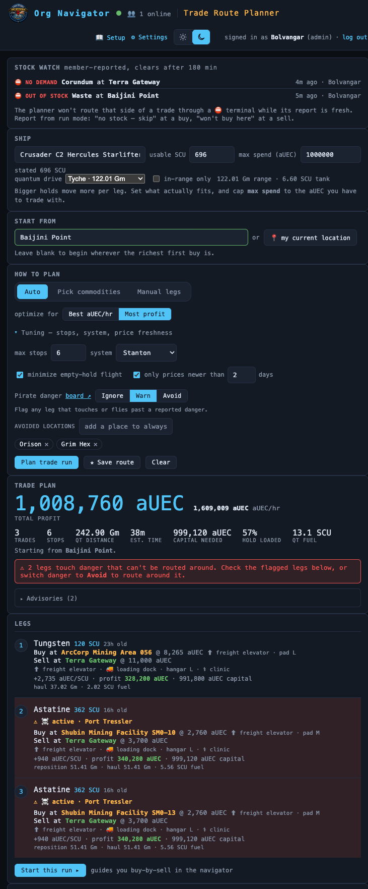

# Trade Route Planner

> Buy-low/sell-high multi-leg planner on live UEX commodity prices — the most
> profitable buy→sell loop your ship can carry, planned and run leg-by-leg.
> **Route:** `#/trade` · **Launcher group:** Out in the 'Verse

  

## What it is

Commodity trading in Star Citizen is a constantly moving target: what's cheap
at one terminal and rich at another changes as often as UEX's own scrapes
update. Working it out by hand means tabbing between a price site, a star map,
and your own memory of where your hauler can even land — then doing it all
again the moment a pirate knocks you off course or a terminal turns out to be
sold out when you actually get there.

The Trade Route Planner turns that into one tool. It pulls **live per-terminal
buy/sell prices** from the same UEX feeds the rest of the suite already
trusts, chains them into a profit-maximizing loop sized to your ship's usable
cargo, and then **runs** that plan with you — tracking which leg you're on,
capturing what you actually paid and got paid, and re-solving on the fly from
your live position if something goes wrong. It's not a bare price lookup: it
already knows where you are (the same watcher feed that drives the Resource
Navigator), what ship and cargo capacity you fly, and what the org's Danger
Board is warning about right now — so the "best" route it hands you is one you
can actually fly with the hull you brought.

Because it shares plumbing with the rest of the suite — ship profiles, the POI
catalog, the live WebSocket, Discord notifications — a plan is one tap from
your current position, and a finished run feeds straight into guild-wide
Trading stats.

## How to use it

1. Open the app launcher and pick **Trade Route Planner** under *Out in the
   'Verse*, or go straight to `#/trade`.
2. Pick your **ship** — usable SCU fills in automatically from your saved
   ship profile (the same one the Cargo Planner uses). If your ride is one of
   the five dock-only haulers (Hull C/D/E, Kraken, Kraken Privateer), the
   `Stops` control auto-flips to `Cargo dock` with an explanatory hint — see
   **Stop kinds** below.
3. Set your **start** — type a POI, or tap `📍 my current location` to seed
   the plan from your live in-game position.
4. Choose a **mode** (`Auto`, `Pick commodities`, or `Manual legs` — tabs at
   the top of the planner; each is its own subsection below) and tune the
   shared knobs: stop budget, system lock, minimize empty-hold flight, and
   the price-freshness filter (on by default, only prices newer than a set
   number of days).
5. Set `Stops` (any / stations only / cargo dock) and `Pirate danger`
   (ignore / warn / avoid) to match your ship and risk tolerance.
6. Click **Plan trade run**. The result is an ordered list of legs — buy here,
   sell there — each showing live buy/sell price, profit, running aUEC total,
   and SCU used, plus a route-level summary (total profit, total time,
   aUEC/hour).
7. Like the plan? Click **★ Save route** to store the setup in **SAVED
   ROUTES** for one-tap reload later (see **Favorites**), or **Start this
   run ▸** to begin executing it.

### Auto mode

Give the planner your ship, start, and a stop budget (default 6); it picks
**both** the commodities and the route for you — the fully hands-off option.
Use `Optimize for` to bias toward total profit or profit/hour, and the
system-lock toggle to stay in your current system rather than pay
jump-gate travel time on a cross-system leg.

### Pick commodities

Same solver as Auto, but restricted to commodities you choose from the
typeahead (chips accumulate as you add them — e.g. "just Gold and Agricium").
Use this when you already know what you want to haul and just want the best
buy/sell pairing and ordering for it.

### Manual legs

You pick every buy and sell terminal yourself, one leg at a time — no solver
involved. The tool's job shrinks to showing you live prices and running
profit/SCU as you build the chain. A manual plan is a first-class plan: it can
be saved as a favorite and run exactly like an auto-solved one.

### Running a plan

1. From a feasible plan, click **Start this run ▸**. The active leg's buy POI
   becomes your live destination — bearing/distance/ETA/QT-marker guidance
   works exactly like the Resource Navigator.
2. At the buy terminal, confirm the purchase (pre-filled price/SCU from the
   plan, editable to match what actually happened) or use the leg's stock
   controls if something's wrong (see **Stock & demand reports**).
3. Once bought, guidance retargets to the sell POI. Confirm the sale the same
   way; the run advances to the next leg.
4. If you get pulled off course — pirates, a detour, anything — hit **↻
   re-plan from here**. The planner re-solves from your live position. Any
   cargo you're currently holding carries forward as a constraint (a
   sell-first leg to your nearest reachable buyer), never optimized away.
5. **abandon** ends the run early; a completed run rolls straight into
   **RECENT TRADES** and the guild **Trading** stats.

## Features

- **Live per-terminal pricing** — buy/sell aUEC per commodity per terminal,
  refreshed on the same schedule as the rest of the suite's UEX feeds, with
  a per-price "as of" freshness label and a staleness filter/badge.
- **Three planning modes**, side by side:

  | Mode | Tab label | You choose | Planner chooses |
  |---|---|---|---|
  | Auto | `Auto` | ship, start, stop budget, knobs | commodities *and* route |
  | Filtered | `Pick commodities` | + one or more commodities | route among your picks |
  | Manual | `Manual legs` | every buy/sell terminal | nothing — you build the chain |

- **Run mode with live re-plan** — active-leg guidance via the same
  `compute_state`/WebSocket loop as the navigator; **↻ re-plan from here**
  re-solves from your current position and folds any held cargo in as a
  sunk-cost constraint rather than discarding it.
- **Actual buy/sell capture** — confirming a leg records the real price and
  SCU on each side, not just the UEX-scraped plan estimate, so realized
  profit reflects what actually happened at the kiosk.
- **History + stats** — the **RECENT TRADES** panel replays completed runs
  and personal realized-profit stats (session and recent scopes, with a
  session-reset option); Org Intel's **Trading** section
  (`#/intel/trading`) rolls the whole org's runs into totals, a weekly
  sparkline, top commodities/lanes/ships, and a top-traders leaderboard.
- **SAVED ROUTES (favorites)** — `★ Save route` stores the plan's *inputs*
  (ship, start, mode, filters, stop kind, danger handling), not a frozen
  route — reloading a favorite always re-solves against current live
  prices, so it never goes stale. Up to 40 saved per member.
- **STOCK WATCH** — org-shared, time-limited reports on whether a terminal's
  supply/demand actually matches what UEX's scrape claims:

  | Report | Filed from | Effect |
  |---|---|---|
  | `⛔ no stock to buy — skip & report` | buy phase, confirm-gated | skips the leg; files a supply-`out` report; solver avoids buying there while fresh |
  | `⛔ won't buy here — report & re-plan` | sell phase, confirm-gated | does **not** advance (cargo stays aboard); files a demand-`out` report; auto-triggers re-plan-from-here excluding that buyer |
  | Auto low-stock | any confirmed buy/sell under 50% of planned SCU | files a `low` report, zero extra clicks — badges future legs, doesn't block them |

  Reports age off after a configurable window (default 180 minutes,
  adjustable in ORG SETTINGS) and are visible to the whole org in the
  planner's **STOCK WATCH** panel.
- **Stop kinds (`Any` / `Stations only` / `Cargo dock`)** — some ships
  physically can't land planetside; a Hull C/D/E, Kraken, or Kraken
  Privateer can only moor at a station with a cargo dock. Picking one of
  those ships auto-selects `Cargo dock`. The two filters are independent
  axes — Levski is a planetary landing zone that still has a cargo dock, so
  `Stations only` drops it while `Cargo dock` keeps it. Manual legs are
  never silently dropped for this — a bad stop gets a ⛔ badge on the leg
  instead, since a hand-picked leg is your call.
- **Amenity chips** — stops carry `⚓ docking` and other wiki-sourced
  amenity chips right on the leg, in both the plan and run views.
- **Hazard-aware routing** — `Pirate danger` (`Ignore` / `Warn` / `Avoid`,
  defaulting to `Avoid`) pulls live warnings straight from the **Danger
  Board**: `Avoid` detours around hazard volumes or flags a leg `blocked`,
  `Warn` flies through with a per-leg ⚠ badge, and a personal avoid-list
  (shared with the Cargo Planner) lets you blacklist specific POIs
  yourself. A live new-danger alert on an active run surfaces a re-route
  nudge.
- **Budget cap, minimize-deadhead, and price-freshness knobs** on the solver
  itself, beyond the stop-budget default of 6.

## Works with the rest of the suite

Ship and usable-SCU come straight from the same `user_ships` profile the
Cargo Planner uses — there's no separate ship picker to maintain. Live
position and guidance reuse the exact WebSocket/`compute_state` loop that
drives the Resource Navigator, and `Pirate danger` handling reads directly
from the **Danger Board**'s warning board, including its snare-detour
routing. A finished run's realized profit rolls into Org Intel's guild
**Trading** section alongside the Cargo Planner's Hauling stats, giving the
org one shared analytics picture across both planners.

## Tips

- Leave the price-freshness filter on — a route built on week-old prices can
  quietly stop being profitable by the time you fly it.
- `Cargo dock` isn't just a suggestion for a Hull-series ship — it's the only
  mode that reflects what your ship can physically do. Move it back to `Any`
  only if you're flying something smaller mid-session.
- If a leg's sell terminal keeps rejecting your cargo, don't just skip it —
  file `⛔ won't buy here — report & re-plan` so the org (and your own
  re-plan) stop routing through it.
- Favorites store the *setup*, not the route — expect the legs to change
  slightly each time you reload one as prices move.
- A manual plan is a real plan: you can save it as a favorite and run it with
  full guidance and re-plan support, same as an auto-solved one.

---
Part of the <a href="./README.md">SC Org Navigator app suite</a>. Design/reference spec: <a href="../trade-route-planner.md">docs/trade-route-planner.md</a>.
