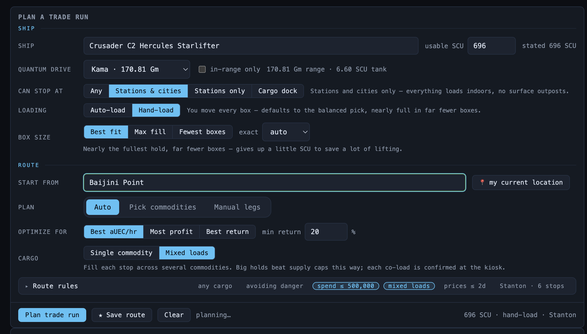
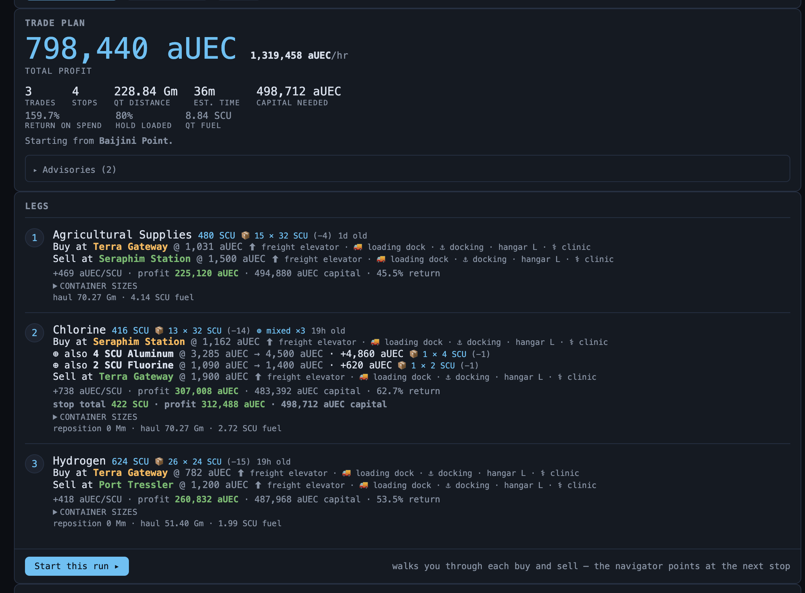
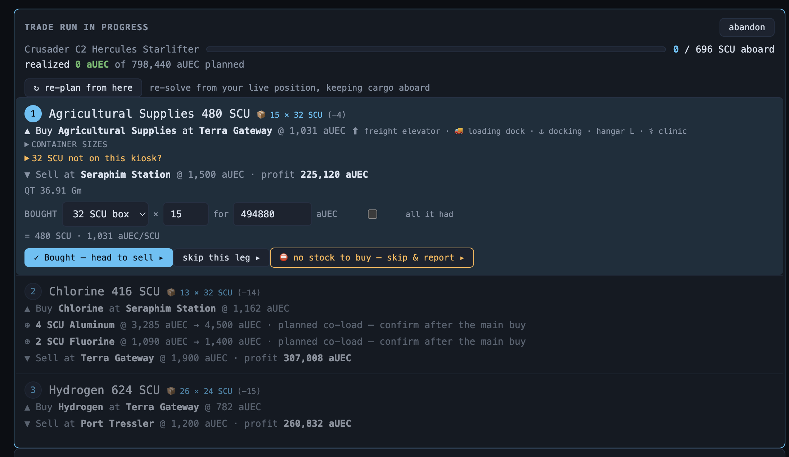

# Trade Route Planner

> Buy-low/sell-high multi-leg planner on live UEX commodity prices — the most
> profitable buy→sell loop your ship can carry, planned and run leg-by-leg.
> **Route:** `#/trade` · **Launcher group:** Out in the 'Verse

  
   
  The planner console: ship facts on top, route strategy below, durable policy folded into Route rules.

## What it is

Commodity trading in Star Citizen is a constantly moving target: what's cheap
at one terminal and rich at another changes as often as UEX's own scrapes
update. Working it out by hand means tabbing between a price site, a star map,
and your own memory of where your hauler can even land — then doing it all
again the moment a pirate knocks you off course or a terminal turns out to be
sold out when you actually get there.

The Trade Route Planner turns that into one tool. It pulls **per-terminal
buy/sell prices** from the same UEX feeds the rest of the suite already
trusts — overlaid with fresher prices your own org members actually paid —
chains them into a profit-maximizing loop sized to your ship's usable cargo
and the containers the kiosk really sells, and then **runs** that plan with
you: tracking which leg you're on, capturing what you actually paid and got
paid, and re-solving on the fly from your live position if something goes
wrong. It already knows where you are (the same watcher feed that drives the
Resource Navigator), what ship you fly and where it can physically stop, and
what the org's Danger Board is warning about right now — so the "best" route
it hands you is one you can actually fly with the hull you brought.

A finished run feeds straight into your own RECENT TRADES and the guild-wide
Trading stats.

## How to use it

### Set up the run

Everything lives in one **PLAN A TRADE RUN** panel, split into a **SHIP**
section (facts about your ship and how it loads) and a **ROUTE** section (how
you want to trade). Hover any row label for a one-line explanation.

1. Open the app launcher and pick **Trade Route Planner** under *Out in the
   'Verse*, or go straight to `#/trade`.
2. **Ship** — type your ship's name; usable SCU fills in from your saved ship
   profile (the same one the Cargo Planner uses). If the ship has a known
   quantum-drive profile, a **Quantum drive** row appears with an
   `in-range only` checkbox (see **Fuel & range** below).
3. **Can stop at** — `Any`, `Stations & cities`, `Stations only`, or `Cargo
   dock` (see **Stop kinds**). Picking a dock-only hauler sets `Cargo dock`
   for you.
4. **Loading** — `Auto-load` (the kiosk stows the hold) or `Hand-load` (you
   move every box). **Box size** — `Best fit`, `Max fill`, or `Fewest boxes`,
   plus an `exact` size select to pin one container size (see **Containers**).
5. **Start from** — type a place, tap `📍 my current location`, or leave it
   blank to begin wherever the richest first buy is.
6. **Plan** — choose `Auto`, `Pick commodities`, or `Manual legs` (each is
   its own subsection below).
7. **Optimize for** — `Best aUEC/hr`, `Most profit`, or `Best return`, with
   an optional `min return` % floor. **Cargo** — `Single commodity` or
   `Mixed loads`.
8. Open **Route rules** for the policy knobs: `Max spend`, `Cargo legality`,
   `Danger`, your **AVOIDED LOCATIONS** list, `max stops` / `system` /
   `minimize empty-hold flight`, and `only prices newer than` N days. While
   it's collapsed, its chips show which rules differ from the defaults.
9. Click **Plan trade run**. Use **★ Save route** to keep the setup in
   **SAVED ROUTES**, or **Clear** to reset.

### Read the plan

  

**TRADE PLAN** leads with **TOTAL PROFIT** and aUEC/hr, then TRADES, STOPS,
QT DISTANCE, EST. TIME, and CAPITAL NEEDED — the aUEC you must front at the
worst point of the run. A smaller row adds RETURN (or RETURN ON SPEND when
you set a max spend), HOLD LOADED, and QT FUEL when a drive is known.
Danger detours and legs that touch danger are called out right under the
headline; price age, over-range legs and the reminder that UEX prices are a
scrape fold into an **Advisories** strip.

Each card under **LEGS** shows the commodity and SCU, a `📦 N × size SCU`
container chip, a price-age badge (`⚡` when it includes an org-reported
price), `Buy at …` / `Sell at …` with the price and facility chips (`🚚 loading
dock`, `⬆ freight elevator`, `⚓ docking`, pad/hangar size), and the leg's
profit per SCU, profit, capital, and `% return`. Badges flag anything worth
knowing before you fly: `☠ illicit`, a member stock report, `⚡ sized to
member-reported stock`, `⊕ mixed ×N`, a surface-outpost hand-load heads-up,
or a danger on the leg. Cross-system legs show the jump gate they use.

When it looks good, click **Start this run ▸**.

### Auto mode

Give the planner your ship, start, and a stop budget (`max stops`, default
6); it picks **both** the commodities and the route for you. Use the
`system` select to stay in one system rather than pay for a jump-gate
crossing.

### Pick commodities

Same solver as Auto, but restricted to commodities you add (chips accumulate
as you add them — e.g. "just Gold and Agricium"). Use this when you already
know what you want to haul and just want the best pairing and order for it.

### Manual legs

You pick every buy and sell terminal yourself with `+ add leg` — no solver
involved. Each row shows the live margin per SCU as you build it, or `not
sold there` / `not bought there` when the terminal doesn't trade that
commodity. A manual plan is a first-class plan: it can be saved and run
exactly like a solved one. Rules you've set (stop kinds, legality, min
return) badge a manual leg instead of dropping it — a hand-picked leg is
your call.

### Running a plan

  

1. Click **Start this run ▸**. **TRADE RUN IN PROGRESS** shows SCU aboard,
   realized profit against the plan, and each leg as a ▲ Buy then ▼ Sell
   step. The active terminal becomes your live destination, with the same
   bearing/distance/QT-marker guidance as the Resource Navigator.
2. At the buy kiosk, fill the **bought** row the way the kiosk works:
   container size × how many, `for` the **total** aUEC the screen showed.
   The app works out SCU and price per SCU itself, so there's no per-unit
   field to get wrong. Tick `all it had` only if the kiosk ran out — that
   files a low-stock report for the org. Click **✓ Bought — head to sell ▸**.
3. At the sell kiosk, each commodity aboard gets a row: SCU and the **aUEC
   total** received, with price per SCU worked out beside it, and a `max?`
   tick if that's all they'd take. Click **✓ Sold ▸** on each.
4. If a figure you type is wildly off the plan's own quote, the app asks
   **Price looks off — record it?** before saving it. Buy kiosks quote per
   container while sell kiosks quote per SCU, and mixing them up would skew
   your profit figures by the box size.
5. Knocked off course? **↻ re-plan from here** re-solves from your live
   position. Cargo already aboard is kept as a sell-first leg, never thrown
   away. If no buyer can be reached, the run card says the cargo is `Still
   aboard with no known buyer` instead of quietly dropping it.
6. Before buying you can **skip this leg ▸**. Once anything is bought, sell it
   (even short) or re-plan. **abandon** ends the run. A completed run shows
   **TRADE RUN COMPLETE** and lands in RECENT TRADES.

### Terminal reported (watcher)

If your watcher is running, it spots the kiosk's buy/sell in your game log.
The run card then shows **⚡ Terminal reported: BOUGHT/SOLD …** with the SCU,
box makeup and price, and fills the active form with those numbers.
Confirming the leg records them. It never confirms by itself — you still
press the button — and if the log shows a different container size than the
plan assumed, it suggests re-fitting the leg.

### Containers

Kiosks sell whole cargo containers (1, 2, 4, 8, 16, 24, 32 SCU), so a fill is
always a box count. **Box size** picks the trade-off: `Best fit` gives up a
little SCU to save a lot of boxes, `Max fill` fills the hold whatever the
count, `Fewest boxes` moves the fewest even if the hold goes out short, and
`exact` pins one size. `Auto-load` starts on `Max fill`, `Hand-load` on
`Best fit`; you can change either. Every leg's `container sizes` table lists
each size's box count and shortfall, with `✓` for sizes members have seen
offered and `✗ absent` for ones reported missing for that commodity.

Your watcher reports which sizes each kiosk sells for each commodity, and the
planner won't pick a size that's reported missing. If you're at the kiosk and
the planned size isn't there, open **N SCU not on this kiosk?** on the buy
step and pick the size you can actually buy. That leg re-fits and re-prices
where you stand, and the org's planner learns the size is missing.

### Mixed loads and top-ups

A big hold often outruns one commodity's supply. With **Cargo → Mixed
loads**, the planner fills each stop with several commodities bought and sold
at the same two terminals; the leg shows `⊕ also …` lines and a `stop total`.
After the main buy, each planned co-load appears as a prefilled row to
confirm with **✓ Bought — add to leg ▸**. Skip any the kiosk doesn't have;
the run carries on without it.

Short-filled anyway? After buying, **⊕ top up from <terminal> ▸** lists
other cargo you can buy where you're standing that also sells at this leg's
destination, sized to your free SCU, with its profit and return. It's
flagged when more than a quarter of the hold is still empty.

## Features

- **Three planning modes**, side by side:

  | Mode | Tab label | You choose | Planner chooses |
  |---|---|---|---|
  | Auto | `Auto` | ship, start, stop budget, knobs | commodities *and* route |
  | Filtered | `Pick commodities` | + one or more commodities | route among your picks |
  | Manual | `Manual legs` | every buy/sell terminal | nothing — you build the chain |

- **Three ways to rank** — `Best aUEC/hr` (default), `Most profit`, or `Best
  return`. With a `Max spend` set, Best return ranks by the multiple on that
  bankroll; without one it ranks profit per aUEC deployed, which favours
  cheap cargo with a big multiple on very little money (the planner warns
  you). The `min return` floor skips any trade earning less than that % on
  the aUEC it ties up — buy at 100, sell at 163 is a 63% return.
- **Stop kinds** — `Any`; `Stations & cities` (no surface outposts, but the
  big landing-zone cities stay in); `Stations only` (no planet or moon
  landings); `Cargo dock` (only stations with a cargo dock, for a Hull C/D/E
  or Kraken). Picking one of those ships sets `Cargo dock` automatically, and
  any explicit pick overrides it.
- **Cargo legality** — `Any` (illicit legs badged `☠ illicit`), `Legal only`,
  or `Illicit only` (contraband sells at scrapyards and lawless outposts).
  Cargo already aboard can always be sold, so switching to Legal mid-run
  never strands contraband in your hold.
- **Org price overlay** — when a member's real transaction is newer than the
  UEX scrape for a terminal, the plan uses it; the price-age badge gains a
  `⚡` and the tooltip says so.
- **Price freshness** — `only prices newer than` (on, 2 days by default)
  keeps stale terminals out of the plan and the board; every leg shows its
  price age.
- **BEST TRADES RIGHT NOW** — a live board of the top single trades, ranked
  the same way the planner is, honoring your floor, budget, and box
  settings. `use` seeds a manual leg from any row.
- **STOCK WATCH** — org-shared, time-limited reports on whether a terminal's
  supply/demand matches what UEX claims:

  | Report | Filed from | Effect |
  |---|---|---|
  | `⛔ no stock to buy — skip & report` | buy step, confirm-gated | skips the leg; the planner routes buys around that terminal while the report is fresh |
  | `⛔ won't buy here — report & re-plan` | sell step, confirm-gated | cargo stays aboard; the planner stops selling there and re-plans you to a new buyer |
  | `all it had` / `max?` tick | buy or sell actuals | files a low-stock/low-demand report with your figure; plans then size that shelf to it (`⚡ sized to member-reported stock`) |

  A smaller purchase on its own is never treated as a stock report. Reports
  clear after a window set in ORG SETTINGS (180 minutes by default) and show
  in the **STOCK WATCH** panel.
- **Danger avoidance** — `Danger` (`Ignore` / `Warn` / `Avoid`, default
  `Avoid`) reads the **Danger Board**: `Avoid` routes around danger zones on
  a lane and drops camped terminals, `Warn` flags any leg that touches or
  flies past one, and a leg with no way round is marked `☠ destination
  camped`. **AVOIDED LOCATIONS** (shared with the Cargo Planner) is your
  own list of places to always route around. If new danger is posted on
  your route mid-run, a **Re-plan around it ▸** banner appears.
- **Jump gates** — cross-system legs route through the right gate and count
  the crossing as travel time.
- **Fuel & range** — with a known drive, per-leg fuel, a QT FUEL total, a `⚠
  over range` flag, and an `in-range only` option that only plans jumps one
  tank can cover.
- **SAVED ROUTES** — `★ Save route` stores the setup (ship, start, mode,
  filters, rules, loading and box choices), not a frozen route, so reloading
  one always re-solves against current prices. Up to 40 per member; the
  oldest drops off.
- **RECENT TRADES** — your realized-profit stats (`Session` / `Recent`, with
  `↻ start new session`), **FREQUENT LANES** chips that load a manual leg,
  and **LAST RUNS** with `run again`. The `✕` on a run permanently deletes it
  from your history and the org's trading stats, for a run whose kiosk
  figures were entered wrong.
- **Guild Trading stats** — Org Intel's **Trading** section
  (`#/intel/trading`) rolls the whole org's runs into totals, top
  commodities/lanes/ships, and a top-traders leaderboard.

## Works with the rest of the suite

Ship and usable SCU come from the same ship profile the Cargo Planner uses,
and the avoided-locations list is shared between the two planners. Live
position and guidance use the same loop that drives the Resource Navigator,
and the watcher that reports your position also reports kiosk transactions
and container menus. Danger handling reads the **Danger Board** directly. A
finished run's realized profit rolls into Org Intel's **Trading** section
alongside the Cargo Planner's hauling stats.

## Tips

- Enter the kiosk's **total**, not a per-unit price — it's the one number
  both kiosks show you, and the app works out the rest.
- Leave the price-freshness filter on — a route built on week-old prices can
  quietly stop being profitable by the time you fly it.
- `Best return` without a `Max spend` will happily find a huge multiple on
  pocket change. Set the max spend to your real budget first.
- Flying a big hauler? Try `Mixed loads` — and set `Hand-load` (or a box
  size) if you'll be unloading at an outpost yourself, so the box count is
  one you can live with.
- If a sell terminal won't take your cargo, file `⛔ won't buy here — report
  & re-plan` rather than skipping, so the org (and your own re-plan) stop
  routing there.

---
Part of the <a href="./README.md">SC Org Navigator app suite</a>. Design/reference spec: <a href="../trade-route-planner.md">docs/trade-route-planner.md</a>.
