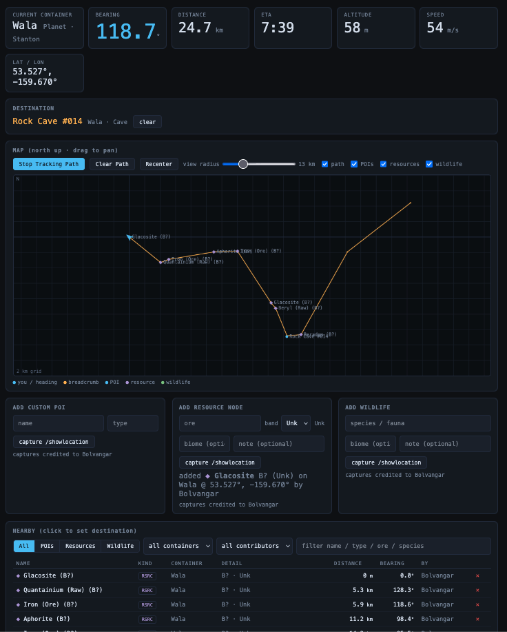

# SC Nav Server

Receives positions from the Windows clipboard watcher, computes navigation
state (container, lat/lon, bearing, distance, ETA) against the
`poi/containers.json` + `poi/poi.json` dataset, serves the browser UI, and
pushes live updates over WebSocket.

```
watcher (Windows PC) ──POST /api/position──▶ this server ──WS──▶ browser (laptop)
```

## Layout



```
server/
  nav_core.py        coordinate math (pure stdlib, unit-tested)
  app.py             FastAPI app (REST + WebSocket + static UI)
  static/index.html  browser UI
  test_nav_core.py   tests — run with: python3 test_nav_core.py
  requirements.txt
  deploy/backup_db.sh  online SQLite backup (usage in the script's comments)
```

## Dataset

The starmap.space catalogs (`poi/containers.json`, `poi/poi.json`) are
**vendored snapshots** — committed, reviewed reference data, never fetched at
runtime. After a game patch, run `python3 tools/sync_containers.py`, review
its diff report (renames, deletions, moved containers — station-class
deletions are flagged loudly), commit, and release. Containers upstream
deleted are kept in `poi/container_tombstones.json` so org data anchored to
them (survey marks, observations) stays resolvable.

The uexcorp price/ship feeds still refresh live (`POST /api/refresh`, or the
scheduled interval in ORG SETTINGS). `GET /api/health` reports
`"source": "snapshot"` for the nav dataset.

Env overrides: `SC_NAV_DATA` (data dir), `SC_NAV_OFFLINE=1` (skip the live
uexcorp fetches; the vendored nav snapshots load either way).

## Custom POIs

Your own POIs live in `custom_pois.json` next to the cached dataset —
deliberately a *separate* file, because the upstream files are overwritten on
every live fetch. Custom IDs start at 1,000,000 so they can never collide
with upstream `item_id`s. If starmap.space later adds a POI you created,
just delete your custom copy. In the Docker deployment this file — along with
`resource_nodes.json` and `handles.json` — sits in the `sc-nav-data` volume,
so all user-contributed data survives image rebuilds and dataset refreshes.

Flow (from the web UI): enter a name and type under **ADD CUSTOM POI**, click
**capture next /showlocation**, walk to the spot in game, and run
`/showlocation`. The server converts that position into the parent body's
rotating frame (same storage convention as upstream POIs) and saves it.
Custom POIs are marked with ★ in lists and can be deleted via the ✕ in
search results. See also **Resource nodes** and **Contributor handles** below.

## Deploy: Docker

The project root has a `Dockerfile` and `docker-compose.yml`. The image bakes
the repo's poi snapshot into a named volume as seed data, fetches live data
on boot, and runs as a non-root user. Configuration comes from environment
variables — copy `.env.example` to `.env` and fill it in (or set the same
variables in your orchestrator's UI; see the comments in `docker-compose.yml`).

On any Docker host:

```bash
git clone https://github.com/ByteCollectiveIO/sc-nav.git && cd sc-nav
cp .env.example .env   # fill in Discord OAuth + secrets
docker compose up -d --build
curl http://localhost:8765/api/health   # expect "source": "live"
```

`restart: unless-stopped` keeps it running across reboots. Update after a
code change with `docker compose up -d --build`; update the dataset without
a restart via `curl -X POST http://<server>:8765/api/refresh`.

The reference deployment runs this compose file as a Portainer git stack
(env vars set in the stack UI, redeploy = pull from `main`) with the bundled
`cloudflared` sidecar exposing it over a Cloudflare Tunnel — no inbound ports.
Both are optional; plain `docker compose up` plus your own reverse proxy works
the same.

### Data persistence & backups

All user data (custom POIs, resource nodes, wildlife, handle registry) lives
in the named Docker volume `sc-nav-data` (mounted at `/data`). It **survives**
a normal redeploy:

```bash
docker compose down            # safe — named volumes are kept
docker compose up -d --build   # new code, data intact
```

The image's seed (`COPY poi/ /data/`) only populates the volume the first time
it's created, so a rebuild never overwrites your data. **The one command that
destroys it is `docker compose down -v`** (the `-v`/`--volumes` flag removes
named volumes) — avoid it unless you intend to wipe everything. (Breadcrumb
trails are the exception — in-memory only, reset on every restart by design.)

Back up the volume any time (do this periodically once you've collected real
finds):

```bash
# backup -> sc-nav-backup.tar.gz in the current directory
docker run --rm -v sc-nav-data:/data -v "$PWD":/backup alpine \
    tar czf /backup/sc-nav-backup.tar.gz -C /data .

# restore into the volume (stop the app first so it's not writing)
docker compose down
docker run --rm -v sc-nav-data:/data -v "$PWD":/backup alpine \
    sh -c "rm -rf /data/* && tar xzf /backup/sc-nav-backup.tar.gz -C /data"
docker compose up -d
```

## Local dev (no Docker)

```bash
cd server
python3 -m venv .venv && .venv/bin/pip install -r requirements.txt
.venv/bin/python test_nav_core.py && .venv/bin/python test_app.py
.venv/bin/uvicorn app:app --host 0.0.0.0 --port 8765
```

NTP matters: planet rotation is computed from wall-clock time, so keep the
host clock synchronized (`timedatectl` should show "System clock
synchronized: yes" — the default on Ubuntu).

## Connect the pieces

- **Gaming PC**: download the pre-configured watcher bundle from the web UI's
  Setup page (it arrives with the server address and your access token filled
  in), or set `SERVER=` in `watcher/run_watcher.bat` by hand — see
  `watcher/README.md`.
- **Any browser**: open the app's URL — live readouts appear after the first
  in-game `/showlocation`.

## Contributor handles & attribution

The watcher stamps each position with the player's handle (`--handle`, or the
`HANDLE` var in `run_watcher.bat`; it's remembered in `watcher_config.json`
after the first run). The server keeps `handles.json`, a registry that assigns
each handle a stable **PlayerID** — and it's that PlayerID, not the raw handle,
that's recorded on captured POIs and nodes, so a character rename keeps a
contributor's history intact. When friends each run their own watcher with
their own handle, attribution is automatic. The UI shows who each entry is
"by" and lets you filter the Nearby table by contributor.

## Observations (resource nodes + wildlife)

User-recorded *observations* are an **append-only log** — because the things
they record are ephemeral and respawn, each capture is a sighting, not an
editable entity, which is what makes later clustering / heatmap analysis
possible. Observations share one capture/store/search/summary path keyed by a
`category` (adding a category is one entry in `nav_core.OBSERVATION_CATEGORIES`
plus a capture endpoint — no new store/search/summary code):

- **resource** (`resource_nodes.json`): ore, band 1–8, quality auto-derived
  from band (1 Lowest, 2–4 Low-Mid, 5–6 Good/High, 7 Very High, 8 Perfect).
  Band may also be **Unk** (the default) — you can't know quality until a node
  is mined — which stores band `null` and quality `"Unk"`. The ore is a
  constrained dropdown (with an "Other…" escape) populated from the uexcorp
  commodities API (`is_raw == 1`), fetched on startup and cached to
  `commodities.json` (falls back to the cache offline).
- **wildlife** (`wildlife.json`): species; no quality. Labelled **Fauna** in
  the UI ("Add Fauna" panel, "Fauna" filter); the category key stays
  `wildlife` internally. The species datalist is populated from a curated
  reference list (`server/fauna.json`, served at `GET /api/fauna`).

Both also record position, auto-captured altitude, optional biome/note, and
the contributor. The **biome** field is a constrained dropdown standardized
from `server/biomes.json` (served at `GET /api/biomes`); its options narrow to
the player's current body (planets and moons are both covered), falling back to
the system's biomes then all if a body isn't listed. An **"Other…"** option
reveals a free-text field so an off-list biome is still recordable while
everything else stays standardized for analytics. Capture mirrors POIs (Add … panel → arm → `/showlocation`).
The Nearby table and map combine POIs + observations with an All / POIs /
Resources / Fauna filter. Observation IDs share one range (≥ 2,000,000).

## Nearest QT marker ("Jump to")

Every POI / resource / wildlife row shows the nearest jumpable **QT marker**
(POIs with `QTMarker == 1`) **and the distance to it** — the place to
quantum-jump to in order to reach it from space, and how far the target is from
that marker. It prefers a marker on the same body (compared in the rotation-
invariant local frame) and falls back to the nearest QT marker elsewhere in the
system. A POI that is itself a QT marker shows its own name (highlighted, 0 m).
Name + distance are precomputed at load and on `POST /api/refresh` (and on each
capture), so the per-frame nav path stays cheap.

## Breadcrumb trail + map

The UI has a north-up local map (no terrain — a metric grid centered on you)
showing your position + heading, logged POIs/resources/wildlife as toggleable
layers, and a breadcrumb trail. **Start / Stop / Clear Path** control tracking;
while on, each `/showlocation` drops a crumb if you're inside a planet/moon
container and have moved ≥ 250 m since the last (gated off in space). The trail
is **in-memory and session-scoped** — it's not persisted and is lost on a
server restart, by design. Crumbs are capped at 5000 points.

## API

| Route | Purpose |
|---|---|
| `POST /api/position` | watcher ingest: `{"x","y","z","handle"}` meters, system frame |
| `GET /api/state` | latest nav state (`nearest_pois`, `nearest_observations`, `path`, `tracking`, destination, capture) |
| `GET /api/pois?q=&system=&container=&type=&owner_id=&limit=` | POI search |
| `GET /api/observations?q=&category=&system=&container=&type=&owner_id=&limit=` | observation search (resource/wildlife) |
| `GET /api/handles` | contributor registry (handle → PlayerID). Member-facing, so `{player_id, handle}` only — the owning `discord_id` is admin-only (see `/api/admin/handles`), or it would defeat the directory opt-out |
| `POST /api/handle {"handle": "…"}` | bind an in-game handle without a position fix (the watcher's startup ping) |
| `GET /api/admin/handles?q=` · `DELETE /api/admin/handles/{player_id}/owner` | admin: view handle→member bindings; unbind a handle stuck on the wrong account |
| `GET /api/raw_commodities` | raw-ore names (uexcorp `is_raw==1`) for the ore datalist |
| `GET /api/fauna` | curated fauna/species names for the Add Fauna datalist |
| `GET /api/biomes` | biome lookups (by_body / by_system / all) for the biome datalist |
| `POST /api/destination {"poi_id": N}` / `DELETE /api/destination` | set/clear destination (POI or observation id) |
| `POST /api/capture/start {"name","type"}` | arm custom-POI capture |
| `POST /api/capture/node {"ore","band","biome","note"}` | arm resource-node capture |
| `POST /api/capture/wildlife {"species","biome","note"}` | arm wildlife capture |
| `POST /api/capture/cancel` | cancel armed capture |
| `POST /api/path/{start,stop,clear}` | breadcrumb tracking control |
| `GET /api/custom_pois` / `DELETE /api/custom_pois/{id}` | list/delete custom POIs |
| `DELETE /api/observations/{id}` | delete an observation (resource or wildlife) |
| `WS /ws` | state pushed on connect and on every update |
| `POST /api/refresh` | re-fetch dataset from starmap.space |
| `GET /api/health` | liveness + dataset counts + data source |

## Calibrating rotation (first real-world test)

Everything was verified against the dataset itself except the **rotation
epoch**, which can only be checked in game. The procedure:

1. Land/stand at a well-known POI on a *rotating* body (e.g. Shubin SCD-1 on
   Daymar — Daymar rotates once per 2.48 h, so errors show up fast).
2. Run `/showlocation` and look at the UI's "nearest POIs".
3. **Correct**: the POI you're standing at shows ~0 km away. **Wrong epoch**:
   it shows km/hundreds-of-km away with latitude correct but longitude off —
   the offset is the rotation phase error.
4. Tune `ROTATION_EPOCH` / `ROTATION_SIGN` at the top of `nav_core.py` until
   the error vanishes. The relationship: 1° of longitude error on Daymar =
   rotation_speed × 3600 / 360 ≈ 24.8 s of epoch error.

Tidally-locked bodies (`RotationSpeedX = 0`) are immune — if nearest-POI looks
right there but wrong on Daymar, it's definitely the epoch.

